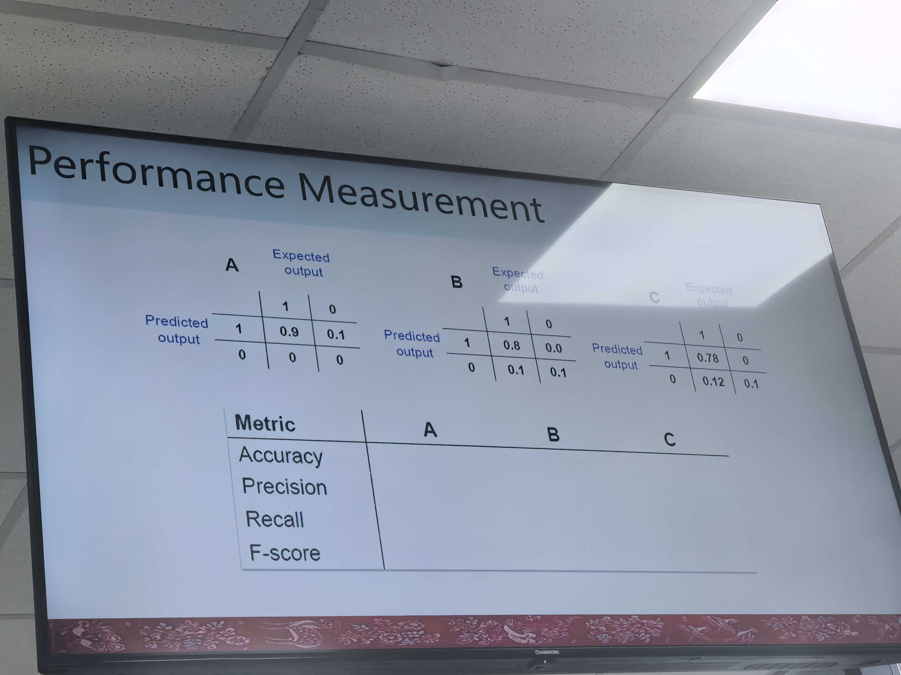
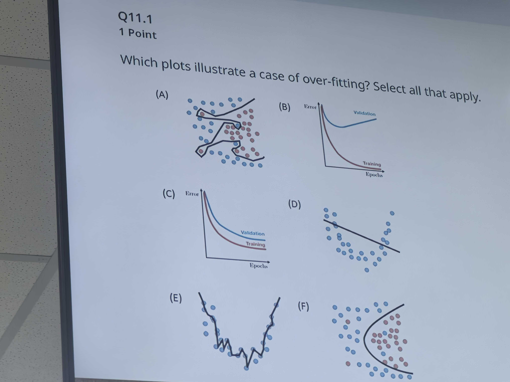
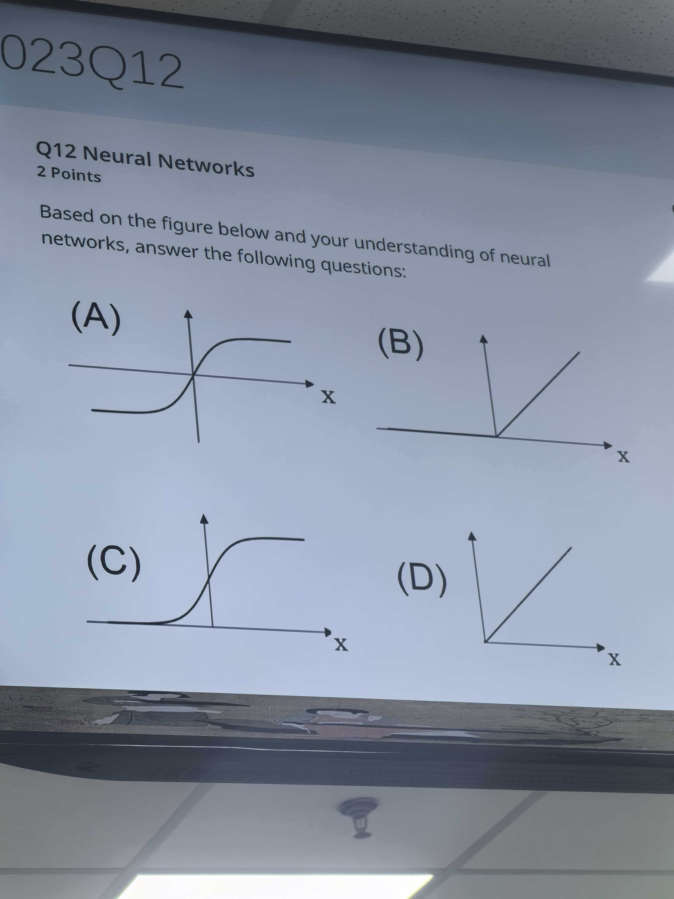

# AI

search methods 5

min-max, alpha beta

decision tree / measurement(recall, precision, accuracy, F-score) 

| Metric | A          | B         | C           |
| ------ | ---------- | --------- | ----------- |
| A      | 0.9        | 0.9       | 0.88        |
| P      | 0.9        | 1         | 1           |
| R      | 1.0        | 0.8/0.9   | 0.78/0.9    |
| F      | 2*0.81/1.8 | 2*0.8/1.8 | 2*0.78/1.78 |

overfiting: ABE

underfitting: D

E: 2 polynomial

sigmoid: C

先验概率，后验概率，Probability Axioms全概率公式，乘法公式推贝叶斯

D 0.0001

\+ | D 0.99

\- | ~D 0.99

D | \+?

D 0.01

+|D 0.9

D | +?

 

Pj|aPm|aPa|-bPa|-eP-bP-e=0.9 0.7 0.001

贝叶斯网络，D-separation
