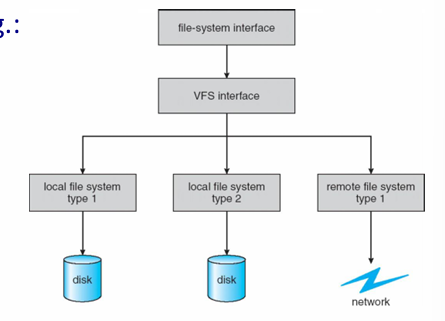
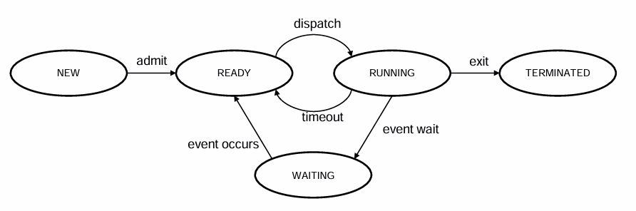
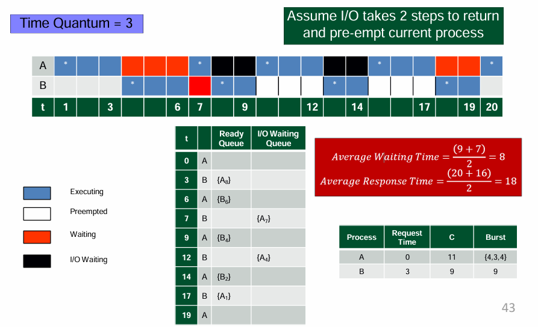
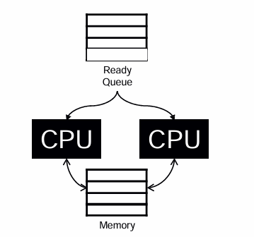
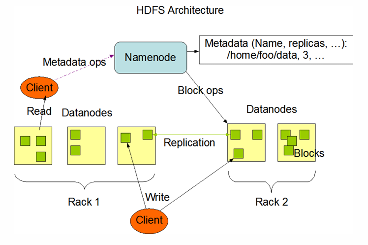

# Operating Systems

[TOC]

# An Introduction


## What is an Operating System

- 计算机系统由**硬件**和**软件**（系统及应用程序）组成。

- **操作系统**是最重要的软件，它管理硬件资源（CPU、内存、I/O设备）并为应用程序提供服务。

- 它充当**资源管理器**，抽象复杂的硬件细节，以实现易用性和高效的资源利用。

    > It presents the user with a simplified machine, much **easier to use**
    >
    > It uses the computer hardware and resources **efficiently**


## OS Basics

- 硬件变得强大而复杂（例如，流水线、超标量CPU、内存层次结构）。

- 没有操作系统，执行是顺序且低效的。

    > Sequential “thread” of execution
    >
    > Not very clever nor efficient 

- 操作系统必须高效管理资源、处理并发、避免死锁，并划分职责边界（例如，错误处理）。

- 操作系统的主要职责：进程管理、内存处理、I/O操作、文件系统、网络、安全和错误恢复。

    > • Start and stop programs 
    >
    > • Manage memory 
    >
    > • Handle input/output 
    >
    > • Overlap I/O with processing 
    >
    > • Handle file systems 
    >
    > • Multiple program running (concurrency) 
    >
    > • Networking 
    >
    > • Security 
    >
    > • Error handling and recovery 
    >
    > • Act as “computer manufacturer’s GUI” … 


## OS History

- **演变历程:** 从1940年代（无OS）到批处理（1950年代）、分时系统（1960年代）、Unix（1970年代）、MS-DOS（1980年代）、Windows/Linux（1990年代）以及移动操作系统（2000年代至今）。

    > • Rich history, 1955→ present 
    >
    > • 1940s – Computers first invented (no OS) 
    >
    > • 1950s – Punch Cards, single task at a time single-stream   batch processing systems (1957, Fortran & 1959 , COBOL) 
    >
    > • 1960s – Multiple jobs at once, context switching and time   share, memory partitioning, spooling 
    >
    > **• 1970s**–Unix, 1971- first intel microchip, 1972 - C, 1973 Ethernet
    >
    > • 1970s – 1976, Apple Founded 
    >
    > **• 1980s** – 1981, MS-DOS (Disk OS); 1985, TOS 
    >
    > • 1990s – Major research into Microkernels, 1992 Windows 3.1; 1994, v1.0 Linux Kernel; 1995, Java 
    >
    > • On 11th May, 1997, IBM's Deep Blue beatsGarry Kasparov 
    >
    > • 2000s – 2000 Symbian OS; 2001 Windows XP; 2002   Blackberry; 2007 iOS; 2008 Android 
    >
    > • 2015, Google’s AlphaGo 28 
    >
    > • Now systems for massive-scale computing, IoT, IoE

- **UNIX:** 模块化、多任务、多用户的操作系统，使用C语言编写；其哲学是提供简单、可组合的工具。

- **Microsoft Windows:** 占主导地位的桌面操作系统，拥有多个版本（家庭版、专业版等）。

- **Mac OS X:** 苹果公司开发的基于Unix、注重图形用户界面的操作系统。

- **Linux:** 开源、可定制，广泛应用于服务器。

- **移动操作系统:** （如iOS、Android）功能不如桌面操作系统强大，但为移动设备优化。

6. 图解关键概念

- **客户端-服务器模型:** 通过微内核和服务器进程提供操作系统服务。
- **微内核:** 最小化的核心操作系统；外部子系统处理驱动程序、文件系统等。
- **挑战:** 未来的操作系统必须处理服务质量（QoS）、数字版权管理（DRM）、人机交互（HCI，如触摸、语音、动作）等问题。


# Task-Level Parallelism on GPU


## Accelerating Training and Inference

- **AI模型与DNN应用**：涵盖了机器学习和深度学习（如计算机视觉、NLP）的各种应用。

- **DNN工作流**：包括**前向传播（推理）** 和**后向传播（学习/训练）** 的基本操作。

    > 1. Define a neural netwok 
    > 2. Training phase: •Forward propagation •Backward propagation •Optimizer update 
    > 3. Inference phase: •Forward progagation

- **模型规模与硬件能力的矛盾**：Transformer等模型参数数量增长远超GPU内存容量增长，导致大模型训练面临内存瓶颈。

    

- **内存层次结构**：介绍了从寄存器到磁带存储的深层内存/存储层次结构及其并发访问机制。

- **高效训练大规模模型的方法**：

    - **算法层面**：知识蒸馏、剪枝、量化等以减少计算量。
    - **系统层面**：数据/模型/张量并行、流水线、通信优化、内核优化等以加速计算。

- **CPU vs GPU**：对比了CPU（擅长串行、低延迟）和GPU（擅长并行、高吞吐、高延迟容忍）的架构特点，并指出**GPU内存有限**是关键瓶颈（如A100 GPU仅40/80GB，而CPU内存可达1-2TB）。

- **硬件介绍**：简要介绍了NVIDIA A100 GPU和集成了Grace CPU与Hopper GPU的NVIDIA Superchip（如GH200），后者通过高速NVLink-C2C互连（900GB/s）实现统一内存。


## Executing Tasks in Parallel on GPU

- **两大挑战**：

    1. **GPU利用率低**：部分计算单元（SM）空闲（例中约40%空闲）。

        > Low GPU Utilization。 Note: SM is a streaming multiprocessor on GPU 

    2. **内存不足（OOM）**：GPU内存耗尽错误。

        > Out-Of-Memory 

- **GPU利用率低的原因**：

    1. GPU是**CPU驱动**的设备，存在调度空闲。
    2. 不同**内核（Kernel）** 需求各异（计算密集型或内存密集型）。
    3. 内核间的**通信**可能成为性能瓶颈。

- **解决方案：任务级并行**

    - 使用**非阻塞的CUDA流（Non-blocking CUDA Streams）** 来并行执行独立的内核和任务（包括CPU操作），避免默认流（Stream 0）的同步开销。
    - 通过**细粒度GPU并行**（如多个流同时处理不同数据的前向、后向、优化器更新步骤）来提升利用率。

- **加速效果**：

    - **训练过程**：加速比达 **1.2x 到 2x**。
    - **推理过程**（批处理、离线）：加速比达 **1.5x 到 3x**。

- **进行中的工作**：

    - 寻找**最佳并行度**（模型并行、数据并行的程度，CUDA流的最佳数量）。
    - 在预热阶段进行分析（Profiling），利用先验信息**动态生成执行计划**。
    - 探索不同的内核并行执行策略（默认串行、多流并行、多流+内核重校准优化）。


## Off-Loading Tasks between GPU and CPU

- **动机**：应对GPU**内存不足（OOM）** 的挑战。
- **策略**：利用**异构资源**（CPU的内存和计算能力），通过**数据和模型分区**（数据并行、流水线并行、张量并行）以及**任务卸载**来扩展可用内存。
- **工作窗口（Working Window）机制**：
    - **前向传播**：异步地将模型的层在CPU和GPU之间滑动加载和卸载进行计算。
    - **后向传播**：类似滑动窗口，异步地进行层加载、卸载、参数更新（**将优化器更新操作卸载到CPU执行**，节省GPU内存）和反向计算。
- **性能效果**：
    - 与最先进的基于卸载的解决方案相比，该方法在32GB V100 GPU上：
        - **可训练模型大小扩大了 1.9x ~ 6.5x**。
        - **训练吞吐量提高了 1.2x ~ 3.7x**。


# Services, System Calls & Structures


## Services


### System Boot

- **Boot（启动）** 是 **Bootstrap（自举）** 的缩写。这是一个将**第一段软件**加载到内存中并由此启动计算机的过程。

    > Boot is short for bootstrap, which is the process to   load the first piece of software into memory that starts   a computer

    - **形象理解**：这个词源于“pull oneself up by one's bootstraps”（靠自己的靴带把自己拉起来），意为一个**自引导**的过程，系统通过一小段初始代码来加载更复杂的自身。

- 由于操作系统（OS）是运行所有其他程序（例如系统程序、应用程序等）所必需的，因此它通常是启动过程中加载的**第一块主要软件**。

- 启动过程还包括加载其他**基本软件**，例如：

    - 硬件驱动程序（Device Drivers）
    - 固件（Firmware）设置
    - 引导加载程序（Bootloader）

- **冷启动 (Cold Boot)**：指计算机从**关闭状态**（断电状态）**开机**。

    > A cold boot is when you turn the computer on from an   off position

- **热启动 (Warm Boot)**：指计算机在**已经开启**的状态下**重新启动**（例如通过操作系统中的“重启”功能）。这个过程通常跳过了一些硬件自检步骤，所以速度比冷启动更快。

    > A warm boot is when you reset a computer that is already on

- 通常，计算机启动后，CPU会从一个**固定的内存地址**开始执行指令。这个地址通常指向存储了初始引导代码的ROM（只读存储器）或固件（如BIOS或UEFI），由它来开始整个启动过程。

### Operating System Services


操作系统提供一系列服务来支持程序执行和用户交互：

- **用户界面 (User Interface)**：

    - 命令行界面 (CLI)

        > - **CLI（命令行界面 Command Line Interface）** 或 **命令解释器** 允许用户进行**直接的命令输入**。
        > - 它的实现方式有两种：
        >     - 直接内置于**操作系统内核**中。
        >     - 作为一个**系统程序**来实现（这是更常见和灵活的方式）。
        > - 存在**多种风格或不同的 shell**（壳程序）。
        >     - **Shell** 是命令解释器的另一种称呼，不同的 shell 提供不同的特性和语法。
        >     - 常见例子：在 Windows 上有 Command Prompt（CMD）和 PowerShell；在 Linux/Unix 上有 Bash, Zsh, Ksh 等。
        > - 它的主要功能是**获取用户输入的命令**并**执行它**。
        > - 命令分为两种类型：
        >     - **内置命令 (Built-in)**：命令的功能由 shell **自身直接实现**（例如 `cd` 改变目录命令）。
        >     - **外部程序 (Names a program on disk)**：命令是**磁盘上的一个可执行程序的文件名**。Shell 会找到这个程序文件，将其加载到内存并执行（例如 `ls`, `ping`, `notepad` 等）。

    - 图形用户界面 (GUI)

        > - **GUI（图形用户界面）** 提供了**用户友好的桌面隐喻界面**。
        >     - **桌面隐喻 (Desktop Metaphor)**：使用熟悉的办公桌元素（如文档、文件夹、垃圾桶）来代表数字对象和操作，使得用户更容易理解和学习。
        > - 其主要交互设备包括：**鼠标、键盘、显示器** 和 **图标**。
        > - 这项技术最初发明于 **Xerox PARC**（施乐帕洛阿尔托研究中心）。
        > - 如今，许多操作系统都**同时包含 CLI 和 GUI 两种界面**，以满足不同用户的需求。
        > - **各操作系统的GUI特点：**
        >     - **Microsoft Windows**：以 **GUI 为核心**，同时提供“命令提示符”（CMD）和 PowerShell 等 **CLI shell** 作为补充。
        >     - **Apple Mac OS X**（现为 macOS）：使用名为 **“Aqua”** 的 GUI 界面，但其底层核心是一个 **UNIX 内核**，并同样提供了终端（Terminal）等 **shell** 访问功能。
        >     - **Unix 和 Linux**：传统上以 **CLI 为核心**，但用户可以**选择安装**各种可选的 GUI 界面，例如 **CDE、KDE、GNOME** 等。

    - 批处理界面 (Batch)

    - 触摸屏界面 (Touchscreen)

- **程序执行 (Program Execution)**：

    - 将程序加载到内存、运行程序、正常或异常结束执行。

- **I/O 操作 (I/O Operations)**：

    - 处理文件和设备I/O，无需用户直接控制。

- **文件系统操作 (File System Manipulation)**：

    - 创建、删除、读写文件和目录，管理权限。

    > 程序需要操作系统提供以下文件操作功能：
    >
    > - **读取和写入 (read and write)**：对文件内容进行读和写操作。
    > - **创建和删除 (create and delete)**：创建新的文件或目录；删除已存在的文件或目录。
    > - **搜索和列表 (search, and list file Information)**：
    >     - **搜索**：在文件系统中查找特定的文件或目录。
    >     - **列表**：列出目录中包含的文件和子目录的信息（如文件名、大小、修改日期等）。
    > - **执行权限管理 (perform permission management)**：管理谁可以访问文件以及可以执行何种操作（例如：设置读、写、执行的权限）。

- **通信 (Communications)**：

    - 同一计算机或网络上的进程间通信（通过共享内存或消息传递）。

    > 进程（Processes）之间可能需要交换信息，这种通信发生在两种场景中：
    >
    > - **在同一台计算机上**的不同进程之间。
    > - 在通过网络连接的**不同计算机**的进程之间。
    >
    > 实现这种通信主要通过两种方式：
    >
    > - **共享内存 (Shared Memory)**：
    >     - 多个进程可以访问共同的同一块内存区域。
    >     - **特点**：速度非常快，但需要进程自己处理同步问题（例如，防止同时写入造成数据混乱）。
    > - **消息传递 (Message Passing)**：
    >     - 进程通过互相发送和接收消息（数据包）来通信。
    >     - **特点**：这些消息由**操作系统负责移动和传递**。这种方式比共享内存慢，但更易于构建和控制，尤其适用于网络通信。

- **错误检测 (Error Detection)**：

    - 持续监控硬件和软件错误，并提供调试支持。

    > - 操作系统需要**持续不断地监控**系统中可能发生的**错误**。
    > - 错误可能发生在多个部件上：
    >     - **CPU**（如算术溢出、非法指令）
    >     - **内存**（如访问越界、奇偶校验错误）
    >     - **I/O 设备**（如打印机缺纸、磁盘读写失败）
    >     - **用户程序**（如除以零、试图访问无效内存地址）等等。
    > - 每一种类型的错误都有其**特定的错误处理程序 (Error Handler)** 来负责处理。
    > - 操作系统必须采取**适当的措施**来确保计算的**正确性和一致性**。
    >     - **措施可能包括**：向用户报告错误、终止出错的程序、自动重试操作、或者在不影响整体系统的情况下安全地忽略某些错误。
    > - 为用户程序提供**调试 (Debugging) 功能**（如核心转储、程序跟踪、调试器接口）可以**大大增强系统的可用性**，因为它能帮助程序员找出并修复程序中的错误（Bug）。

- **资源分配 (Resource Allocation)**：

    - 在多用户/多任务环境中分配CPU、内存、设备等资源。

- **审计与安全 (Accounting & Security)**：

    - 跟踪资源使用情况，实施访问控制和保护机制。


## System Calls

**系统调用 (System Calls)**

*   操作系统（OS）为其服务提供了**编程接口**。
*   这些接口通常使用**高级语言**（如 C 或 C++）编写。
*   系统调用是一个程序向操作系统**内核请求服务**的方式。
*   这些服务可能包括：
    *   **硬件相关服务**（例如，访问硬盘驱动器）
    *   **创建和执行新进程**
    *   与核心内核服务（如**进程调度**）进行通信

**应用程序编程接口 (API) – 更高层次的抽象**

*   **高级接口**：API 是更高层次的接口，**程序通常使用它**，而不是直接使用复杂的系统调用。
*   **间接性**：它是对系统调用的封装，程序员通过调用API函数来间接使用系统调用，而无需关心底层细节。
*   **简化性**：与原始的系统调用相比，API **通常更易于使用且细节更少**（隐藏了复杂的底层实现）。

**常见的 API 示例：**

*   **Win32 API**：用于 Microsoft Windows 操作系统。
*   **POSIX API**：用于基于 POSIX 标准的系统（例如 UNIX、Linux 和 Mac OS X）。
*   **Java API**：用于 Java 虚拟机（JVM）。


**系统调用参数传递 (System Call Parameter Passing)**

当程序需要请求操作系统服务（进行系统调用）时，它必须将必要的参数传递给操作系统内核。主要有三种方法来实现参数传递：

方法 1：通过寄存器传递 (Pass the parameters in registers)

- **描述**：将参数直接存放在**CPU的寄存器**中。
- **优点**：这是**最简单**、最快速的方法。
- **缺点**：在某些情况下，需要传递的**参数数量可能超过寄存器的数量**，导致此方法不可行。

方法 2：通过内存块传递 (Parameters stored in a block/table in memory)

- **描述**：程序将所有的参数存储到内存中的一个**连续的块或表**中，然后只需将该内存块的**起始地址**作为一个参数，存放在一个寄存器中传递给操作系统。
- **优点**：可以传递大量参数，克服了寄存器数量的限制。
- **例子**：**Linux** 和 **Solaris** 等操作系统广泛使用这种方法。

方法 3：通过栈传递 (Parameters placed in the Stack)

- **描述**：
    - **压栈 (Push)**：由**程序**将参数按顺序压入**栈**（一种特殊的内存结构）。
    - **出栈 (Pop)**：由**操作系统**从栈中弹出（读取）这些参数。
- **优点**：对传递参数的**数量和长度几乎没有限制**，非常灵活。


**系统调用类型 (Types of System Calls)**

系统调用通常可以分为以下几大类：

---

1. 进程控制 (Process Control)

*   创建进程 (`fork` / `CreateProcess`)
*   终止进程 (`exit` / `ExitProcess`)
*   结束、中止程序
*   加载、执行程序 (`exec`)
*   获取和设置进程属性 (`getpid` / `getpriority`)
*   等待时间 (`sleep`)
*   等待事件、通知事件 (`wait` / `signal`)
*   分配和释放内存 (`brk` / `sbrk`)
*   出错时转储内存 (生成 core dump)
*   用于确定错误的调试器，单步执行
*   管理进程间共享数据访问的锁 (互斥锁、信号量)

---

2. 文件管理 (File Management)

*   创建文件 (`create`)
*   删除文件 (`unlink`)
*   打开、关闭文件 (`open`, `close`)
*   读、写、重新定位文件指针 (`read`, `write`, `lseek`)
*   获取和设置文件属性 (`stat`, `chmod`)

---

3. 设备管理 (Device Management)

*   请求设备、释放设备
*   从设备读、向设备写、重新定位设备 (`read`, `write`, `ioctl`)
*   获取设备属性、设置设备属性 (`ioctl`)
*   逻辑上连接或断开设备

**补充说明**：在类Unix系统中，设备通常被抽象为**特殊文件**，因此很多用于文件管理的系统调用（如 `read`, `write`）也同样适用于设备管理。

---

4. 信息维护 (Information Maintenance)

*   获取时间或日期、设置时间或日期 (`gettimeofday`, `settimeofday`)
*   获取系统数据、设置系统数据 (`sysinfo`)
*   获取和设置进程、文件或设备的属性

---

5. 通信 (Communications)

*   创建、删除通信连接 (`socket`)
*   **消息传递模型 (Message Passing Model)**:
    *   发送、接收消息 (`send`, `recv`)
    *   发送到主机名或进程名
    *   从客户端到服务器
*   **共享内存模型 (Shared-Memory Model)**:
    *   创建和获取对内存区域的访问权限 (`shmget`, `shmat`)
    *   传输状态信息
    *   连接和分离远程设备

---

6. 保护 (Protection)

*   控制对资源的访问
*   获取和设置权限 (`getuid`, `chmod`, `setacl`)
*   允许和拒绝用户访问


**系统程序 (System Programs)**

- **系统程序**提供了一个方便的**程序开发**和**执行环境**。
    - 它们不是操作系统内核的一部分，但通常随操作系统一起提供，是操作系统整体生态和用户体验的关键组成部分。
- 系统程序可以分为以下几类：
    - **文件操作 (File manipulation)**：提供创建、删除、复制、重命名、打印、列出和操作文件和目录的工具（如 `cp`, `rm`, `ls`, `mkdir` 等命令）。
    - **状态信息 (Status information)**：提供用于查询系统状态（如日期、时间、可用内存、磁盘空间、用户列表、进程状态）的工具（如 `ps`, `top`, `df`, `date` 等命令）。这些信息有时会存储在一个文件中以供修改或后续查看。
    - **编程语言支持 (Programming language support)**：提供编译器、汇编器、调试器和解释器（如 `gcc`, `python`, `gdb`），用于开发新的程序。
    - **程序加载和执行 (Program loading and execution)**：提供加载器、链接器和解释器，用于将程序装入内存并执行它们。
    - **通信 (Communications)**：提供用于进程间、用户间、乃至计算机间建立连接的工具（如 `ssh`, `ftp`, `mail` 等命令）。
    - **后台服务 (Background services)**：指在系统启动时即加载并持续运行的服务或守护进程（daemons），例如网络服务、打印调度、错误监控等。
    - **应用程序 (Application programs)**：除了系统工具之外，操作系统包中可能还包含一些不直接属于系统管理范畴的应用程序（例如文本编辑器、计算器、简单的游戏等）。
- **最重要的一点**：对于大多数用户来说，他们对操作系统的看法和体验是由这些**系统程序（如图形界面、浏览器、终端命令）所定义的**，而不是由底层那些不可见的**实际系统调用**所定义的。系统程序是用户与操作系统内核交互的主要桥梁。


## OS Structures

**操作系统内核（OS Kernel）**

操作系统内核（OS Kernel）是一个构成计算机操作系统核心的计算机程序。它全面掌控系统中发生的一切操作，因此成为启动时首个加载的程序，负责管理后续启动流程以及处理软件发出的输入/输出请求，并将其转换为中央处理器的数据处理指令。

该程序还负责管理内存、协调外部设备（如打印机、扬声器等）并进行通信。作为现代计算机操作系统的基础组成部分，内核发挥着至关重要的作用。

**操作系统的不同组织方式**：

- **简单结构 (Simple Structure)**：
  
    - 如 MS-DOS，功能集中，模块化程度低。
    
- **单体内核 (Monolithic Kernel)**：
    - 如 UNIX，所有服务在内核中运行，效率高但复杂。
    
        
    
- **微内核 (Microkernel)**：
    - 如 MINIX，仅核心功能在内核，其余在用户空间，通过消息通信；模块化好，但性能较低。
    
    | 特性         | 单片内核 (Monolithic Kernel)                           | 微内核 (Microkernel)                                         |
    | :----------- | :----------------------------------------------------- | :----------------------------------------------------------- |
    | **核心服务** | 调度、驱动、文件系统、安全等大量服务均在内核空间运行   | 仅最核心服务（如调度、IPC）在内核空间，其他作为用户空间服务  |
    | **安全性**   | 不一定比微内核更不安全，同样实现进程隔离               | 不一定比单片内核更安全，同样实现进程隔离                     |
    | **架构特点** | 庞大、单一，常通过内核模块扩展                         | 微小、模块化，通过用户空间服务扩展                           |
    | **主要优势** | 性能高（组件间通信高效）                               | **稳定性好**（服务故障不易引起内核崩溃）、**易于审计和维护**（核心小） |
    | **主要劣势** | **稳定性风险**（组件错误易致内核崩溃）、更复杂难以审计 | **性能开销**（因频繁的进程间通信）                           |
    
- **分层结构 (Layered Approach)**：
    - 每层仅与相邻层通信，模块化清晰。
    
        
    
- **模块化结构 (Modules)**：
  
    - 如 Linux、Solaris，支持动态加载内核模块，灵活性强。
    
        
    
- **混合系统 (Hybrid Systems)**：

    - **Most modern operating systems are actually not  one pure model**

    - 结合多种结构，如Windows（主体单体+部分微内核）、Linux（单体+模块化）。

        

- **外核**：
  
    
    
- **移动操作系统示例**：
  
    - **iOS**：基于macOS内核，分层设计。
    - **Android**：基于修改的Linux内核，使用Dalvik虚拟机运行Java应用。


**补充**：

1. **用户空间**
    - **是什么**：这是为**普通应用程序**保留的内存区域。每个进程都有自己独立的用户空间。
    - **限制**：运行在用户空间的代码被称为处于 **“用户态”** 。此时，CPU 执行的是**非特权指令**。这意味着应用程序：
        - **不能**直接访问硬件（如磁盘、网卡、打印机）。
        - **不能**随意修改操作系统的关键数据 structures。
        - 只能操作**分配给它的那部分内存**，无法访问其他进程或内核的内存。
    - **目的**：**保护**。如果一个应用程序（例如你的浏览器或游戏）出现错误（如野指针）、崩溃或被病毒入侵，它最多只能破坏自己的用户空间，而不会影响操作系统的稳定性和其他应用程序的运行。

2. **内核空间**
    - **是什么**：这是为**操作系统内核**保留的受保护的内存区域。**整个系统只有一份**，被所有进程共享。
    - **权限**：运行在内核空间的代码被称为处于 **“内核态”** 。此时，CPU 执行**所有指令**（包括特权指令）。内核可以：
        - **直接访问硬件**和所有物理内存。
        - **管理系统资源**，如CPU、内存、设备。
        - **为所有进程提供服务**。
    - **目的**：**控制与协调**。内核作为系统的最高管理者，负责仲裁所有对硬件和敏感资源的访问请求。


**两者如何交互？—— 系统调用**

应用程序无法直接做所有事情（比如读写文件、申请内存、发送网络数据），因为这些操作需要特权指令。那么它该怎么办？

答案是通过 **系统调用**。

**系统调用是用户程序主动向内核请求服务的唯一接口**。

这个过程就像普通公民（用户程序）需要向政府（内核）申请办理业务（服务）一样：

1. **发起请求**：应用程序在代码中调用一个函数（如 `read()`, `write()`, `fork()`）。这些函数是**系统调用的包装库**。
2. **陷入内核**：这个调用会触发一个特殊的**软件中断**（例如，在 x86 架构上是 `int 0x80`）或使用专门的指令（如 `syscall`）。CPU 会**从用户态切换到内核态**。
3. **执行服务**：内核根据系统调用的编号，找到对应的**中断服务程序**（即系统调用的实现代码）并执行它。这时，内核就在内核空间中代表应用程序完成那些需要特权的操作（例如，从磁盘读取数据到内核缓冲区）。
4. **返回结果**：服务完成后，内核将结果（数据或状态码）返回给应用程序，并**从内核态切换回用户态**。
5. **继续执行**：应用程序收到返回结果，继续执行后续代码。

**整个过程中，身份的切换（用户态<->内核态）和空间的切换（用户空间<->内核空间）是由硬件和操作系统紧密协作完成的。**


# I/O and Interrupts


## I/O Management

- **为什么需要 I/O 管理？**
    - 计算机的两个主要任务是 **I/O** 和**处理**，而在许多情况下，处理是附带的。
    - I/O 设备在功能和速度上差异巨大，需要不同的控制方法。
    - 操作系统的角色是**管理和控制** I/O 操作与设备，并关注性能（如响应时间）。
- **计算机硬件与速度**
    - 介绍了计算机的基本硬件组件（CPU、内存、控制器、总线）。
    - 展示了典型的**内存层次结构**（寄存器、缓存、主存、磁盘、磁带），其访问时间和容量差异巨大。
    - 列举了各种 I/O 设备的**数据速率**（从键盘的 10 字节/秒到系统背板的 20 GB/秒），强调了设备的多样性。

## How devices communicate?

- **连接方式**
    - 设备通过**端口**（Port）或**总线**（Bus）与计算机系统连接。总线是一组定义了严格协议的导线。
    
- **设备驱动程序**
    - 设备特定的功能被封装在内核模块中，称为**设备驱动程序**（软件）。
    - 驱动程序与**设备控制器**（硬件，如打印机控制器）交互，控制器操作端口、总线或设备本身。
    
- **控制器如何工作？**
    - 控制器拥有**寄存器**（数据、状态、控制寄存器）。
    - CPU 通过读写这些寄存器来与控制器通信。
    - **内存映射 I/O** 是一种常用方法：将设备控制寄存器映射到 CPU 的地址空间中，以便 CPU 像访问内存一样直接访问它们。
    
- **轮询**
    - **握手协议**：CPU 不断读取控制器的**忙位**（Busy Bit），直到它清零（表示就绪）。
    - CPU 然后写入命令和数据，并设置**命令就绪位**（Command-Ready Bit）。
    - 控制器执行操作，完成后清除忙位和命令就绪位。
    - **缺点**：CPU 在**忙等待**，效率低下，尤其对于慢速设备。
    
- **中断**
    - 更高效的机制：设备控制器在就绪时**通知** CPU。
    
    - 硬件机制：控制器通过**中断请求线**发出信号。
    
    - CPU 每执行完一条指令后检查中断线。检测到中断后，保存当前状态，并跳转到内存中固定的**中断处理程序**。
    
    - **中断向量表** Interrupt VectorTable：包含不同中断类型对应的处理程序地址（例如，除零错误、页面错误、定时器中断、系统调用（通过**陷阱**触发）、I/O 完成）。
    
    - 中断处理程序执行完毕后，CPU 恢复之前的状态继续执行。 This returns the CPU to the execution state prior to receiving   the interrupt request。
    
    - 优点：允许 CPU 在等待设备时执行其他任务。
    
    - 挑战：需要区分中断优先级，处理大量数据时可能**中断过于频繁**。
    
    - 这种基础中断机制让 CPU 能够对异步事件作出响应。但在现代操作系统中，我们还需要更高级的中断处理功能：
    
        - 在关键处理过程中，能够**推迟（屏蔽）中断**，保证原子操作不被打断。
        - **无需轮询每个设备**，就能快速分派到对应设备的中断服务程序。
        - **多级中断**，使操作系统能区分高、低优先级中断，优先处理紧急事件。
    
        在现代计算机硬件中，这三项功能由 CPU 本身和中断控制器硬件共同提供。
    
- **直接内存访问**
    - 用于大数据量传输（如磁盘 I/O）。
    - **DMA 控制器** 在内存和设备之间直接传输数据，**无需 CPU 参与**每个字节的传输。
    - CPU 只需向 DMA 控制器发送命令（源/目标地址、字节数等），传输开始和结束时才产生中断通知 CPU。
    - **优点**：极大减轻了 CPU 的负担，提高了效率。

## Software I/O support

- **I/O 软件层次**
    1. **中断处理程序**（最底层）
    2. **设备驱动程序**（与硬件直接交互）
    3. **与设备无关的操作系统软件**（提供通用接口、缓冲、错误报告、设备分配）
    4. **用户级 I/O 软件**（如库函数）
- **性能制约**
    - I/O 是影响系统性能的主要因素，因为它会导致：
        - CPU 执行驱动程序和内核代码。
        - 因中断导致的**上下文切换**。
        - 数据在内存空间之间的**复制**。
        - 网络通信尤其消耗资源。


# Memory Management


## What and why?

- **是什么？**
    - 内存管理是管理计算机内存的行为。
    - 它负责**动态分配**内存给程序，并在程序不再需要时**释放**内存以供重用。
    - 管理可以在两个层面进行：**操作系统 (OS) 级别**和**应用程序级别**（如自动垃圾回收或手动管理）。
- **为什么需要？**
    - 程序必须从磁盘加载到内存中才能被 CPU 执行。
    - CPU 只能直接访问**主内存和寄存器**。
    - 程序员无法预知程序执行时在内存中的具体位置。
    - A memory management unit or MMU onlysees: 
        - • A stream of addresses + read requests
        - • An address + data and write requests
    - **内存层次结构**：存在速度、容量和成本不同的多种存储器（如寄存器、缓存、主内存、磁盘），需要有效管理。

## Simple Memory Management

- **内存管理需求**：

    - **重定位**：进程可能因交换（Swapping）而在内存中移动。
    - **保护**：进程不能未经许可访问其他进程的内存（运行时检查至关重要）。
    - **共享**：允许多个进程安全地访问同一内存区域以实现协作和效率。

- **逻辑地址 vs. 物理地址**：

    - **物理地址**：内存中的实际硬件地址。
    - **逻辑地址**：编译时生成的地址，与内存的物理布局无关。执行时由硬件转换为物理地址。

- **逻辑地址空间**：

    - 程序生成的所有逻辑地址的集合。

        

    - 通过**基址（Base）和界限（Limit）寄存器**实现保护和转换。

        

    - CPU 检查每次内存访问是否在界限内，否则触发异常（陷阱）。

- **内存管理单元 (MMU)**：

    - 负责将逻辑地址转换为物理地址的硬件部件（通常是 CPU 的一部分）。

    - **重定位寄存器**（即基址寄存器）是 MMU 的一个例子：`物理地址 = 逻辑地址 + 基址值`。

        

- **内存节约技术**：

    - **动态加载**：

        - 例程在需要被调用时才加载到内存。
        - 由程序设计实现，操作系统可提供库支持。
        - 提高了内存空间利用率。

    - **交换**：

        - 当进程总内存需求超过物理内存时，将进程在内存和磁盘（备份存储）之间移动。
        - **交换时间**主要取决于传输时间，可能很高（例如，传输 100MB 进程可能需要 4 秒）。
        - 现代系统使用**修改版的交换**：仅在空闲内存极低时使用（如 Linux、Windows）。
        - **移动系统**（iOS、Android）通常**不支持传统交换**（因闪存 flash memory 写入次数限制和性能差），而是采用终止应用或要求应用主动释放内存的策略。

        
        
        

## Memory Allocation Techniques

- **连续内存分配**：

    - 早期方法，每个进程占据一块连续的内存区域。
    - 内存分为两个分区：**操作系统**（低地址）和**用户进程**（高地址）。

- **多分区分配**：

    - 内存被划分为大小可变的分区，分配给进程。
    - 进程结束时释放分区，产生**空闲分区（孔洞，Hole）**。
    - 相邻的空闲分区可合并。
    - 操作系统需跟踪**已分配分区** allocated partitions  和**空闲分区** free partitions (hole)。

    

- **管理方法**：

    - **位图**：用一串比特位表示内存块是否空闲。可能很大，搜索可能慢。

        

    - **链表**：维护一个空闲/已分配块的链表。更灵活，便于合并空闲块。

        

- **动态分配算法**（用于寻找空闲块）：

    - **首次适应**：从头搜索，找到第一个足够大的孔洞就分配。**速度快**，但可能产生碎片。
    - **下次适应**：从**上次分配的位置**开始搜索。性能略差于首次适应。
    - **最佳适应**：搜索整个链表，找到能满足要求的最小孔洞。**产生大量小碎片**，速度慢。
    - **最差适应**：搜索整个链表，找到最大的孔洞进行分配。旨在避免小碎片，但**平均性能最差**。

- **碎片化**：

    - **外部碎片**：空闲内存被分散成许多小孔洞，无法满足大进程的请求。

    - **内部碎片**：分配给进程的内存块比其实际需要的更大，块内部未使用的内存被浪费。

        

    - **压缩**：通过移动进程来合并外部碎片。**运行时操作，开销大**。


# File Systems


## File

*   **文件是什么？**
    *   由创建者定义的、相关信息的集合。通常代表**程序**和**数据**。
    *   是计算中最核心的概念之一。
    *   本质上是位、字节、行或记录的序列，其含义由创建者和用户定义。
    *   **作用**：存储大量数据、使信息在进程终止后仍能持久保存、允许多个进程并发访问数据。

*   **文件类型（内部结构）**
    *   **字节序列**：最常见的格式，操作系统不解释其内容。
    *   **记录序列**：由固定长度的记录组成，每条记录包含结构化的数据。
    *   **树形结构**：由可变长度的记录组成，通过键（Key）来定位记录（常用于大型机系统）。

*   **文件命名**
    
    *   文件通过**文件名**被识别。
    *   **文件扩展名**（如 `.txt`, `.jpg`, `.c`) 通常用于指示文件类型和格式。
    
*   **文件属性（元数据）**
    *   文件除了数据内容外，还有大量描述它的**属性**，例如：
        *   **保护/权限**：谁可以访问以及如何访问。
        *   **标志**：只读、隐藏、系统、存档等。
        *   **所有者、创建者**。
        *   **时间戳**：创建时间、最后访问时间、最后修改时间。
        *   **大小信息**：当前大小和最大大小。

*   **文件组织（目录结构）**
    *   文件被组织在**目录**（文件夹）中，形成树状层次结构（目录树）。
    *   **路径名**用于唯一标识文件在目录树中的位置（例如：`/usr/jim/dict`）。

*   **文件访问方式**
    *   **顺序访问**：按顺序从头到尾读取字节/记录。适用于磁带等介质。
    *   **随机访问**（直接访问）：可以直接跳转到文件的任意位置进行读写。对数据库系统至关重要。

*   **文件操作**
    *   操作系统提供系统调用来操作文件，常见操作包括：**创建、删除、打开、关闭、读、写、追加、定位、获取属性、设置属性、重命名**。

*   **文件碎片化**
    * 当文件被创建、删除和修改时，空闲磁盘空间会变成不连续的**碎片**。
    
    * 一个文件可能被分散存储在磁盘的多个不连续区域。
    
    * 这会导致访问文件时磁头移动增加，**降低性能**。
    
    * 图示展示了文件（A, B, C...）如何分散存储在磁盘块中，以及空闲块（孔洞）的分布。
    
        

## File Systems

*   **文件系统的复杂性**
    *   文件系统非常复杂，因此采用**分层（抽象）** 设计来管理。
    *   **分层的好处**：降低复杂性和冗余度，各层可以独立实现。
    *   **分层的代价**：增加了开销，可能降低性能。

*   **分层文件系统模型（自底向上）**
    
    
    
    1. **设备**：物理磁盘驱动器。磁盘由盘片、磁道、扇区、柱面组成。
    
        

    2. **I/O 控制**：包含**设备驱动程序**和**中断处理程序**。负责向硬件控制器发送低级、特定的命令（如：**“read drive1, cylinder 72, track 2, sector 10,   into memory location1060”**）。
    
    3. **基本文件系统**：发出通用命令（如 **“retrieve block123”**），管理内存**缓冲区**和**缓存**（用于暂存传输中的数据或缓存常用数据）。
    
    4. **文件组织模块**：理解文件、逻辑块和物理块。负责将文件的**逻辑块号**转换为磁盘的**物理块号**。管理**空闲空间**和**磁盘分配**。
    
    5. **逻辑文件系统**：管理**元数据**信息。负责**目录管理**、**保护**（权限）。通过维护**文件控制块**（在 Unix 中称为 **inode**）将**文件名**转换为文件的位置句柄。
    
        **文件系统类型**
    
        *   存在多种不同的文件系统类型：
            *   **CD-ROM**: ISO 9660
            *   **Unix**: UFS, FFS
            *   **Windows**: FAT, FAT32, NTFS
            *   **Linux**: ext2, ext3, ext4 等超过 40 种S
            *   **分布式文件系统**：如 NFS
            *   **新式文件系统**：ZFS, Google File System
    
    6. **应用程序**：使用上述各层提供的服务来访问文件。
    
*   **虚拟文件系统 (VFS)**
    * VFS 是操作系统内核与具体文件系统（如 ext4, NTFS）之间的一个**抽象接口层**。
    
    * **目的**：为上层应用程序提供**统一的系统调用接口**（API），来访问**不同类型**的文件系统（甚至是网络文件系统，如 NFS）。
    
    * **工作原理**：应用程序调用通用的文件操作（如 `open`, `read`），VFS 将这些调用**分派**给底层对应的具体文件系统实现例程去执行。
    
        


# Processes and Threads


## Processes

*   **进程是什么？**
    
    *   有时称为**任务**或**作业**。
    *   **与程序的区别**：程序是指令（代码）的**静态**集合；进程是执行指令的**动态**活动。多个进程可以执行同一个程序。
    *   进程包含**程序代码**、**数据**和**执行状态**（如程序计数器和变量值）。
    *   **作用**：为各种 OS 和用户程序提供**隔离**（通过独立的地址空间等实现资源保护），并支持**并发**执行。
    
*   **进程隔离**
    *   通过硬件和软件技术保护每个进程免受其他进程干扰，防止进程 A 写入进程 B 的内存。

*   **多道程序设计**
    *   OS 和用户可以启动多个进程。
    *   **并行进程执行**：通常是**交错执行**（伪并行），多处理器可实现真正的并行。
    *   **切换**由调度器、进程状态和优先级决定。

*   **进程状态模型（生命周期）**
    1. **新建**：进程正在被创建。
    
    2. **就绪**：进程已准备好，等待被分配处理器。
    
    3. **运行**：指令正在被执行。

    4. **等待/阻塞**：进程正在等待某个事件发生（如 I/O 完成）。
    
    5. **终止**：进程已完成执行。
    
        
    
*   **调度器与分派器**
    
    
    
    *   **调度器 scheduler**：从就绪队列中选择下一个要运行的进程。
    *   **分派器 dispatcher**：将选中的进程切换到运行状态。其工作包括：
        *   执行**上下文切换**（保存/恢复寄存器等状态）。
        *   从内核模式切换到用户模式。
        *   跳转到用户程序的正确位置以重启它。
    *   上下文切换是**开销**，需要尽可能高效。
    
*   **进程控制块**
    *   **PCB** 是操作系统用于管理进程执行的数据结构。
    *   包含信息：**标识符、状态、优先级、程序计数器、内存指针、寄存器、I/O 信息、记账信息**。
    *   上下文切换时，当前进程的状态存入其 PCB，新进程的状态从其 PCB 加载。

*   **进程创建**
    
    *   **UNIX (`fork()` + `exec()`)**:
        
        * `fork()`: 创建一个新的进程。创建当前进程的**完整副本**（子进程）。子进程从 `fork()` 之后开始执行。**对父进程返回子进程 PID，对子进程返回 0。**
        
            ```c
            #include <stdio.h>
            #include <unistd.h> // 包含 fork() 的定义
            #include <sys/types.h> // 包含 pid_t 的定义
            
            int main() {
                pid_t pid; // 用于存储进程ID的类型
            
                printf("Before fork (PID: %d)\n", getpid());
            
                // 调用 fork()，创建分岔点
                pid = fork();
            
                // --- 从这里开始，代码被执行两次（一次由父进程，一次由子进程） ---
            
                if (pid < 0) {
                    // fork() 失败
                    fprintf(stderr, "Fork failed!\n");
                    return 1;
                } else if (pid == 0) {
                    // 这是子进程的代码分支 (返回值 == 0)
                    printf("I am the CHILD process. My PID is %d, my parent's PID is %d\n", getpid(), getppid());
                    execlp("/bin/ls", "ls", NULL);
                } else {
                    // 这是父进程的代码分支 (返回值 > 0，即子进程的PID)
                    printf("I am the PARENT process. My PID is %d, my child's PID is %d\n", getpid(), pid);
                }
            
                // 这个打印语句父子进程都会执行
                printf("This line is printed by both processes (PID: %d)\n", getpid());
            
                return 0;
            }
            ```
        
            **可能的输出结果：**
        
            ```text
            Before fork (PID: 1234)
            I am the PARENT process. My PID is 1234, my child's PID is 1235
            This line is printed by both processes (PID: 1234)
            I am the CHILD process. My PID is 1235, my parent's PID is 1234
            This line is printed by both processes (PID: 1235)
            ```
        
        * `exec()`: **加载**一个新程序到当前进程的地址空间，**覆盖**原有程序。
        
        * **常见用法**
        
            1. **`fork()` + `exec()`**：这是最经典的用法。
                - 父进程使用 `fork()` 创建一个子进程。
                - 子进程立即调用 `exec()` 系列函数（如 `execlp`, `execvp`）来**加载并执行一个全新的程序**，取代自己原有的代码镜像。
                - 这样既创建了新进程，又运行了新的程序。Shell 执行命令、Web 服务器启动新服务都是这么做的。
            2. **并行处理**：父进程创建多个子进程，每个子进程处理任务的一部分（例如，处理网络请求、计算数组的不同部分）。
        
    *   **Windows (`CreateProcess()`)**:
        *   单个函数调用，直接**加载指定程序**创建新进程。
        *   使用 `STARTUPINFO` 和 `PROCESS_INFORMATION` 结构来指定属性和接收信息。
    
*   **进程终止**
    
    *   原因包括：正常结束、边界 violation（段错误）、内存不足、算术错误、OS/操作员终止等。
    *   进程终止时向父进程返回状态码。
    *   UNIX: `exit()`, Windows: `ExitProcess()`。

## Threads

*   **线程是什么？**
    * 进程内的**多个并发执行路径**。
    
        
    
    * **轻量级进程**，是调度的基本单位。
    
    * 同一进程内的线程**共享地址空间**（代码、数据、文件），但各有自己的**寄存器**和**栈**。
    
    *   将**并发**（线程）与**保护**（进程）分离。
    
*   **为什么使用多线程？**
    
    *   **响应性**：部分线程阻塞时，程序仍可响应。
    *   **资源共享**：线程天然共享进程资源。
    *   **经济性**：创建线程比创建进程开销小。
    *   **多处理器利用**：线程可在多核上真正并行执行。
    *   **应用场景**：Web 服务器、重型 I/O 或计算、GUI 应用。
    
*   **线程生命周期与操作**
    *   进程通常从单个**主线程**开始。
    *   常见线程操作：
        *   **创建**：指定要运行的过程。
        *   **退出**：线程完成工作。
        *   **连接**Join：等待另一个特定线程结束。
        *   **让步**Yield：主动放弃 CPU 让其他线程运行。

*   **线程实现**
    
    *   线程状态保存在**线程控制块**中。Thread Control Block (TCB)
    *   三种主要实现模型：
        1.  **用户级线程** User LevelThreads：在用户空间实现，内核无感知。
            
            *   *优点*：创建/切换快，可自定义调度。
            *   *缺点*：一个线程阻塞系统调用会阻塞整个进程；无法利用多处理器。
            
            
        2.  **内核级线程** Kernel LevelThreads：由操作系统内核直接管理。
            
            *   *优点*：内核充分调度（可利用多核），线程错误不会杀死整个进程。
            *   *缺点*：创建/切换慢，开销大。
            
            
        3.  **混合模型**（如 Solaris）：结合两者优点。
    
*   **Pthreads (POSIX 线程)**
    
    *   线程的**标准化 API**，可用于 UNIX 系统。
    *   关键函数：`pthread_create`, `pthread_exit`, `pthread_join`, `pthread_yield`。
    
*   **线程问题**
    *   **进程创建**：多线程进程调用 `fork()` 时的行为（是否复制所有线程）。
    *   **取消**：如何安全地终止未完成的线程（异步 vs 延迟取消）。
    *   **线程池**：预先创建一组线程，避免频繁创建销毁的开销。
    *   **同步**：多个线程访问共享资源时需要协调（后续讲座重点）。


# Interprocess Communication


## Process Cooperation

*   **进程回顾**
    *   进程是操作系统的执行单位，封装了执行状态，提供并发性和保护。
    *   **独立进程**：状态独立，行为是确定性的、可重现的。
*   **进程通信的需求**
    *   **进程协作**：当两个或多个进程**共享状态**时，它们的行为就不再是独立的。其执行结果取决于多个进程执行的相对顺序（**竞态条件**）。
    *   **两个核心问题**：
        1.  **传递数据**：如何在进程间交换信息。
        2.  **同步**：如何协调多个进程（如“多写者一读者”问题）对共享资源的访问，避免混乱。
    *   **根本挑战**：每个进程都有**独立的地址空间**，一个进程无法直接访问另一个进程的内存。操作系统必须提供机制来促进数据交换。

*   **生产者-消费者问题**
    *   这是一个经典的进程协作和同步模型。
    *   **生产者**：生成数据项并将其放入**缓冲区**。
    *   **消费者**：从缓冲区取出数据项并消费它。
    *   **关键挑战**：
        *   当缓冲区**满**时，生产者必须等待（休眠）。
        *   当缓冲区**空**时，消费者必须等待（休眠）。
        *   当生产者放入一个项使缓冲区从空变为非空，或消费者取出一个项使缓冲区从满变为非满时，需要**唤醒**对方。
    *   幻灯片中的代码示例展示了一个初步实现，但存在一个严重的**竞态条件**问题（`count` 变量可能在被检查和修改之间被中断），这引出了对更强大同步机制（将在后续讲座中讨论）的需求。

## Shared Memory

*   **是什么？**
    *   操作系统分配一块内存区域，并将其**映射**到多个合作进程的地址空间中。
    *   进程 A 暴露一部分内存，进程 B 将其“嫁接”到自己的地址空间。之后，它们就可以像访问普通内存一样读写这块共享区域。
    
    
*   **优点**
    *   **速度极快**Speed：通信无需内核介入（在映射建立后），没有系统调用的开销。
    *   **访问方便** Easy access：无需特殊函数，直接读写内存即可。
*   **缺点**
    *   **无内置保护**：进程可能意外或恶意覆盖对方的数据。需要应用程序员自己控制访问。
    *   **需要同步** Synchronisation：必须使用额外的同步机制（如信号量、互斥锁）来保护**临界区**（访问共享数据的代码段），防止竞态条件。
    *   **模块化性差**：共享进程必须就共享内存的位置和数据的格式达成一致。
*   **使用方法 (API示例)**
    
    *   **POSIX** (`shmget`, `shmat`, `shmdt`, `shmctl`)
    *   **Windows** (`CreateFileMapping`, `MapViewOfFile`)
    *   库支持（如 Boost, Qt）
*   **文件映射**
    *   将文件直接映射到内存地址空间，实现对文件的共享内存式访问。
    *   Unix: `mmap`, Windows: `CreateFileMapping`

## Message Passing

*   **是什么？**
    *   内核提供 `send` 和 `receive` 等原语，进程通过调用这些原语来交换数据包（称为**消息**）。
    *   进程**不共享地址空间**，通信通过内核中转。
    
    
*   **消息格式**
    *   **定长**：实现简单，但传输**大数据不便**。
    *   **变长**：更灵活方便，但实现更复杂。
*   **寻址方式**
    *   **直接寻址**Direct Addressing：`send` 和 `receive` 调用中直接指定目标进程或源进程的ID。receiving or sending process  (P and Q).
        *   `send(Q, message)` -> `receive(P, message)` （Addressing is symmetric，对称）
        *   `send(Q, message)` -> `receive(&id, message)` （非对称，接收方不指定发送方，message ID parameter）
    *   **间接寻址** Indirect Addressing：通过**邮箱**或**端口**进行通信。进程向一个抽象的邮箱发送消息，从邮箱接收消息。
        *   `send(mailbox_A, message)` -> `receive(mailbox_A, message)`
        *   支持多种通信模式：**一对一、一对多（广播）、多对一（客户端-服务器）、多对多**。
*   **同步 vs. 异步**
    *   **同步（阻塞）**：
        *   `send` 会阻塞，直到消息被对方 `receive`。
        *   `receive` 会阻塞，直到有消息到达。
        *   行为像“约会”， tightly coupled，提供交付确认。
    *   **异步（非阻塞）**：
        *   `send` 立即返回，消息由内核缓冲。
        *   `receive` 立即返回，可能收到消息也可能收到空值。
        *   行为像“寄信”， loosely coupled，需要缓冲区，并发性更高。
    *   **混合**：最常见的组合是**非阻塞发送 + 阻塞接收** Asynchronous send – blocking receive。发送方不阻塞，接收方在有工作做之前保持阻塞。
*   **缓冲**：Messages buffered in a temporary queue
    
    *   **零容量**Zero capacity：队列长度为0。发送方必须阻塞直到接收方准备好（** rendezvous **）。
    *   **有限容量**Bounded：队列有界。队列满时发送方阻塞。
    *   **无限容量**Unbounded：队列无界。发送方从不阻塞。
    
    | 缓冲类型 (Buffering Type)         | 队列容量 (Queue Capacity) | 发送者行为 (Sender Behavior)           | 接收者行为 (Receiver Behavior)      | 特点/别名                          |
    | :-------------------------------- | :------------------------ | :------------------------------------- | :---------------------------------- | :--------------------------------- |
    | **零容量 (Zero Capacity)**        | 0                         | **必须阻塞**，直到接收者执行 `receive` | **必须阻塞**，直到发送者执行 `send` | **Rendezvous**（汇合）、同步通信   |
    | **有限容量 (Bounded Capacity)**   | n                         | 队列未满时立即返回；**队列满时阻塞**   | 队列非空时立即返回；队列空时阻塞    | 最常见的实用模式                   |
    | **无限容量 (Unbounded Capacity)** | 无限                      | **从不阻塞**，消息总是可放入队列       | 队列空时阻塞                        | 对发送者最友好，但可能消耗大量资源 |
*   **丢失的消息**
    
    *   可能因进程崩溃、网络问题（在分布式系统中）而丢失。
    *   处理机制：**超时 Add timeout parameter to receive、确认机制、内核通知**。
*   **用消息传递实现同步**
    
    *   幻灯片示例展示了如何使用一个邮箱和空消息来实现**互斥锁**，保护临界区。这证明了消息传递机制的能力。


# Concurrency & Synchronisation


## Concurrency

- **并发问题**
    - 进程和线程允许伪并行（单CPU时间分片）或真并行（多CPU）。
    - **上下文切换**由操作系统控制，会暂停当前执行并切换到另一个就绪的进程/线程。
    - 在多CPU系统中，不同执行速度会导致交错访问共享资源。
- **餐馆例子（类比）**
    - **一个服务员**：流程顺序，没有问题。
    - **两个服务员，区域不重叠**：各自独立工作，没有问题。
    - **两个服务员，区域重叠**：可能导致**重复服务**同一个顾客（**竞态条件**）。这说明了缺乏协调和沟通会导致问题。
- **“牛奶太多”例子**
    - 你和室友发现没牛奶后都去买，最终导致买了两份牛奶。
    - **核心问题**：**没有沟通**（同步）和**操作非原子性**（检查冰箱和购买不是一步完成）。
- **同步的需求**
    - 需要控制对**共享资源**的访问。
    - 当存在依赖关系时，必须确保执行之间的正确顺序。
    - 适用于**线程**和**协作进程**。
- **编程示例**
    - 两个线程（A和B）对共享变量 `x` 进行递增和递减操作。
    - 最终结果 (`x` 的值，谁“赢”) 是**非确定性的**，取决于线程执行的精确顺序（调度）。
- **原子操作**
    - 原子操作是指**不可分割**的操作（要么全做，要么不做）。
    - 高级语言的一条语句（如 `x = x + 1;`）在底层会被编译成多条机器指令。
    - 如果在这些指令执行过程中发生**上下文切换**，另一个线程可能会修改 `x`，导致最终结果错误（示例中从1开始，最终却得到0）。
- **竞态条件**
    - 由于执行顺序依赖于调度而导致**非确定性结果**的情况。
    - 可能导致 sporadic 且难以复现的错误。
    - **解决方法**：需要**互斥**访问共享资源。
- **临界区**
    - 进程中访问共享资源（如变量、文件）并**必须原子性执行**的代码段。
    - 任何解决方案必须满足三个条件：
        1. **互斥** Mutual exclusion：任何时候最多只有一个进程/线程在其相关的临界区内执行。
        2. **进展** Progress：不在临界区内执行的进程/线程不能阻止其他进程/线程进入临界区。
        3. **有限等待** Bounded Waiting：一个进程/线程不应无限期地等待进入临界区（避免饿死）。

## Synchronisation Mechanisms

- **理想解决方案**
    - 使用**锁**来保护临界区。
    - **获取锁的操作本身必须是原子的**。
    - 通用结构：`ACQUIRE_LOCK` -> `critical_section()` -> `RELEASE_LOCK`。
    
- **用消息传递实现同步（回顾）**
    - 使用一个邮箱（mailbox）和空消息作为“令牌”来实现互斥锁。收到消息表示获得锁，发送消息表示释放锁。
    
- **Peterson算法（软件方案）**
  
    - 一个经典的纯软件解决方案，适用于两个线程。
    - 使用两个变量：`flag[2]`（表示想进入）和 `turn`（表示轮到谁）。
    - 通过**忙等待**（自旋锁）在循环中检查条件。
    - 满足互斥、进展、有限等待。
    
    ```c
    int turn;
    bool flag[2] = {0};
    
    do {
        flag[i] = TRUE;      // 进程i表示想进入临界区
        turn = j;            // 主动让权给进程j（表示礼貌）
        while (flag[j] && turn == j);  // 等待：如果j想进入且当前轮到j，则循环等待
    
        // CRITICAL_SECTION（临界区）
    
        flag[i] = FALSE;   // 进程i退出临界区，表示不再需要访问
    
        // REMAINDER_SECTION（剩余区）
    } while (TRUE);
    
- **硬件解决方案**
    - **禁用中断**：在单CPU系统中，禁用中断可以防止上下文切换，但**不适用于多CPU系统**，且对用户程序太危险。
    - **原子指令** Atomic Instructions：CPU提供特殊的原子指令（如 **TSL (Test-and-Set-Lock)**、**SWAP**、**Compare-and-Swap**）来实现锁。这些是构建更高级同步原语的基础。
    
- **信号量**
  
    - 由Dijkstra提出的**整数变量**，是功能强大的同步工具。
    - 只能通过两个**原子操作**访问：
        - **`wait(S)`**（也称为 `P` 操作）：
            - 如果 `S > 0`，则 `S--`，进程继续。
            - 如果 `S <= 0`，则进程等待（阻塞或忙等待），直到 `S > 0`。
        - **`signal(S)`**（也称为 `V` 操作）：
            - `S++`。
            - 唤醒一个正在等待该信号量的进程（如果有）。
    - **计数信号量**：`S` 初始化为**可用资源的数量**。用于控制对一组 identical 资源的访问。**示例**：有5个相同的打印机，初始化 `S = 5`
    - **二进制信号量**：`S` 的值只能是0或1。常用于实现**互斥**。
    
    ```c
    typedef struct {
        int value;
        struct process *list;  // 等待队列
    } semaphore;
    
    wait(semaphore *S) {
        S->value--;
        if (S->value < 0) {
            // 将当前进程加入S->list等待队列
            block();  // 阻塞当前进程
        }
    }
    
    signal(semaphore *S) {
        S->value++;
        if (S->value <= 0) {
            // 从S->list中移除一个进程
            wakeup(P);  // 唤醒该进程
        }
    }
    
- **互斥锁**
  
    - 本质就是**二进制信号量**。
    - 主要用于提供**互斥**，没有计数功能。
    - **规则**：谁加锁，谁解锁。The process or thread to lock the mutex must be the one to release it。
    
- **生产者-消费者问题（用信号量解决）**
    - 使用**三个信号量**：
        - `mutex`（初始为1）：**互斥信号量**，保护对缓冲区的插入和删除操作（临界区）。
        - `empty`（初始为 `BUFFER_SIZE`）：**计数信号量**，记录**空槽位**数量。
        - `full`（初始为0）：**计数信号量**，记录**已填充项**的数量。
    - **关键点**：对 `empty`/`full` 的 `wait` 操作在 `mutex` 的 `wait` **之前**。这可以防止死锁（例如，缓冲区已满时，生产者先抢到 `mutex` 锁，但无法生产，消费者又因拿不到 `mutex` 而无法消费）。
    
    ```c
    #define N 10  // 缓冲区大小
    
    // 共享变量
    int buffer[N];
    int in = 0, out = 0;
    
    // 信号量
    semaphore mutex = 1;
    semaphore empty = N;
    semaphore full = 0;
    
    // 生产者进程
    void producer() {
        int item;
        
        while (true) {
            item = produce_item();  // 生产物品
            
            wait(empty);           // 等待空缓冲区
            wait(mutex);           // 获取缓冲区访问权
            
            buffer[in] = item;     // 将物品放入缓冲区
            in = (in + 1) % N;     // 循环缓冲区
            
            signal(mutex);         // 释放缓冲区访问权
            signal(full);          // 增加满缓冲区计数
        }
    }
    
    // 消费者进程
    void consumer() {
        int item;
        
        while (true) {
            wait(full);            // 等待有物品的缓冲区
            wait(mutex);           // 获取缓冲区访问权
            
            item = buffer[out];    // 从缓冲区取出物品
            out = (out + 1) % N;   // 循环缓冲区
            
            signal(mutex);         // 释放缓冲区访问权
            signal(empty);         // 增加空缓冲区计数
            
            consume_item(item);    // 消费物品
        }
    }
    
- **管程 **Monitors
  
    - 一种**高级语言层面**的同步机制。
    - 将共享数据和对这些数据的所有操作（函数）**封装**在一起。
    - 管程内部**隐式包含一个互斥锁**，保证任何时候最多只有一个进程在管程内活动。
    - 使用**条件变量**来实现进程间的等待和通知（`wait` 和 `signal`）。
    
    > **管程**是一种**高级同步构造**（或抽象数据类型 ADT ），它封装了：
    >
    > - 共享数据
    > - 操作这些数据的程序
    > - 同步机制
    > - • AtomicOperations • Mutex(lock) • Shareddata • Condition variable
    >
    > **核心思想**：将同步细节隐藏在管程内部，让程序员专注于业务逻辑。


## Deadlock

*   **死锁是什么？**
    *   当多个进程/线程因竞争资源而陷入**无限期等待**的状态，每个进程都在等待被其他进程占用的资源，从而导致所有进程都无法继续执行。
    *   **示例**：两个进程 P1 和 P2 需要获取两个锁（信号量 S 和 Q），但以**不同的顺序**请求（P1: S then Q; P2: Q then S）。在交错执行时，可能发生 P1 持有 S 等待 Q，而 P2 持有 Q 等待 S，形成死锁。
    *   可以用**资源分配图**来可视化死锁（进程 -> 资源：请求边；资源 -> 进程：分配边）。
*   **死锁的四个必要条件**（必须同时满足才会发生死锁）：
    1.  **互斥**：一个资源一次只能被一个进程使用。
    2.  **持有并等待**：一个进程持有至少一个资源，并在等待获取其他进程持有的额外资源。
    3.  **不可抢占** No Preemption：资源只能由持有它的进程自愿释放，操作系统不能强行抢占。
    4.  **循环等待**：存在一个进程等待序列 {P0, P1, ..., Pn}，其中 P0 等待 P1 占用的资源，P1 等待 P2 占用的资源，...，Pn 等待 P0 占用的资源。
*   **哲学家就餐问题**
    *   一个经典的同步和死锁问题模型。
    *   **场景**：五位哲学家围绕餐桌，交替进行思考和吃饭。吃饭需要**同时拿起**左右两边的筷子。
    *   **问题**：如果所有哲学家同时拿起左边的筷子，就会发生死锁（每人持有一根筷子，无限等待右边的人放下筷子）。
    *   **解决方案（使用信号量）**：
        *   引入一个额外的信号量 `room`，将其初始值设为 **4**（哲学家数量 - 1）。
        *   这确保了**最多只有 4 位哲学家**能同时进入房间尝试拿筷子。
        *   根据**鸽巢原理**，这保证至少一位哲学家能拿到两根筷子开始吃饭，从而打破死锁的必要条件。
        *   该方案也避免了饥饿。
*   **处理死锁的三种策略**
    1.  **死锁预防或避免**：预防：通过协议确保**系统永远不会进入**死锁状态。（破坏四个必要条件之一）。避免：系统在分配资源时**动态检查**，确保不会进入**不安全状态**（可能导致死锁的状态）。
    3.  **死锁检测与恢复**：允许系统进入死锁状态，然后**检测它并恢复**。
    4.  **忽略死锁**：许多操作系统采用这种方法，将问题抛给程序员。（**鸵鸟算法**）
*   **死锁预防**
    *   通过破坏四个必要条件之一来实现：
        *   **破坏“互斥”**：让资源可共享（例如只读文件），但许多资源本质就是需要互斥的。
        *   **破坏“持有并等待”**：
            *   要求进程**一次性申请所有所需资源**（可能降低资源利用率）。
            *   要求进程在申请新资源前**先释放所有当前持有的资源**。
        *   **破坏“不可抢占”**：如果进程申请资源失败，则强制**抢占**其当前持有的所有资源。
        *   **破坏“循环等待”**：对**所有资源类型施加一个全局顺序**。进程必须按序号**递增的顺序申请资源**。这消除了循环等待的可能。
*   **死锁避免**
    *   **安全状态**：如果存在一个进程序列 <P1, P2, ..., Pn>，使得系统能按此顺序为每个进程分配其最大所需资源并顺利运行完毕，则系统处于安全状态。**避免算法确保系统始终处于安全状态**。
    *   **银行家算法** Bankers Algorithm：一个经典的死锁避免算法。
        *   每个进程必须事先声明其**最大资源需求**。 Specifies maximum needed resources
        *   当进程提出资源请求时，系统**模拟分配**，检查分配后系统是否仍处于安全状态。只有安全才会实际分配。
        *   缺点是需要预先知道最大需求，且算法执行有开销。
*   **死锁检测与恢复**
    *   **检测**：
        *   **单实例资源** Single instance of each resource：使用**等待图**（从资源分配图中简化而来）。如果等待图中存在**环**，则存在死锁。
        *   **多实例资源** Multiple Resources：使用类似银行家算法的检测算法。
    *   **恢复**：（非常困难）
        *   **进程终止** Termination：终止所有死锁进程，或逐个终止直到死锁解除。
        *   **资源抢占** Preemption：从一个或多个死锁进程中抢占资源，分配给其他进程。需要**回滚**被抢占的进程到某个安全状态，并重启。Preempt a process, ideally roll back to a safe state


# Scheduling


## Introduction

*   **调度类型**
    *   **长期调度**：决定将哪些作业/任务从磁盘**加载到内存**中，成为就绪进程。控制内存中的进程数量和多道程序程度。
    *   **中期调度**：控制进程在内存和磁盘之间的**交换**（Swapping）。
    *   **短期调度**：**CPU 调度**，从内存中就绪的进程中选择下一个要运行的进程。这是本讲座的重点。
    *   **普通内核**：使用**优先级**平衡进程间的处理器时间。
    *   **实时操作系统**：基于**截止时间**和**优先级**分配处理器时间。

*   **进程状态与生命周期**
    *   **新建** -> **就绪** -> **运行** <-> **等待/阻塞** -> **终止**。
    
    
    
    *   两个队列：**就绪队列**与**等待队列**。**CPU 调度器**负责从**就绪队列**中选择进程进入**运行**状态。
    
*   **CPU-I/O 周期**
    
    *   进程的执行由**CPU 突发**（计算）和**I/O 突发**（等待数据传输）交替组成。
    *   **burst**：Think of a “burst” as a brief stretch of **“run as fast as   you can go until you can’t.”** 
    
    *   CPU 速度远快于 I/O。
    
    
    
    1. 由谁负责调度？
        ——**操作系统内核**的**调度器（scheduler）**。
    2. 调度哪个进程？
        ——从**就绪队列**中按既定算法挑选**优先级最高/最合适**的下一个进程（如 FCFS、SJF、RR、CFS 等）。
    3. 何时进行调度？
        - 当前进程**终止**；
        - 当前进程**阻塞**（等待 I/O、信号、锁）；
        - 当前进程**时间片用完**（时钟中断）；
        - **新进程**进入就绪队列且允许抢占；
        - **I/O 完成**导致就绪进程出现（可立即抢占或等下次时钟中断）。
    
*   **抢占 Preemption**
    
    *   **非抢占式调度**：进程一旦获得 CPU，就会一直运行直到终止或主动进入等待状态（如 I/O 请求）。例如：FIFO。
    *   **抢占式调度**：运行中的进程可以被操作系统**中断**，并放回就绪队列，以便运行另一个更紧急或更高优先级的进程。例如：轮转（RR）。
    
*   **CPU 调度器**
    *   核心任务：**选择下一个要运行的进程**。
    *   常见算法：FIFO, SJF, 基于优先级, 轮转 (RR), 多级队列。
    *   **目标**：最大化 CPU 利用率、吞吐量，最小化周转时间、等待时间、响应时间。
    *   **问题**：前三个可能导致某些进程**饥饿**（无限期阻塞），RR 可能导致过多的**上下文切换**。

*   **术语（调度标准）**
    
    *   **CPU 利用率**CPU Utilization：CPU 忙碌时间的百分比。
    *   **吞吐量**Throughput：单位时间内完成的进程数量。
    *   **执行时间**：进程在 CPU 上运行的总时间。
    *   **等待时间**：进程在就绪队列中等待的总时间。
    *   **周转时间**Turnaround：从进程提交到完成所经历的总时间（等待时间 + 执行时间）。
    *   **响应时间**：从提交请求到产生**第一次响应**的时间（对于交互式系统很重要）。
    *   通常优化**最小/最大**值或**95/99百分位**值，而非平均值（解决长尾问题）。
    
*   **调度决策时机（4种）**
    1.  运行 -> 等待（非抢占）
    2.  运行 -> 就绪（抢占，如时间片用完）
    3.  等待 -> 就绪（抢占，如 I/O 完成）
    4.  运行 -> 终止（非抢占）
    *   如果只在条件 1 和 4 下调度，则是**非抢占式**。

    
    
    
    
*   **分派器**
    *   负责 CPU 调度的最内层部分。
    *   功能：调度并运行进程，进行**上下文切换**，**切换到用户模式**，跳转到用户程序的正确位置。
    *   **分派延迟**：停止一个进程并启动另一个所需的时间。

    
    
*   **上下文切换**
    *   将 CPU 从一个进程切换到另一个进程的过程。
    *   需要**保存**当前进程的状态到其 PCB，并**加载**新进程的状态从其 PCB。
    *   是纯开销，需要尽可能高效。
    
    
    
    

## Algorithms

*   **示例进程**
    
    *   使用四个进程 A, B, C, D 来演示不同算法。
    *   **C = 执行时间**。
    
    
    
*   **度量标准**
    *   **等待时间**：不包括请求时间，但包括在就绪队列中的等待、被抢占的时间、I/O 等待等。
    *   **响应时间** = 等待时间 + 执行时间 (C)。
    *   **平均等待时间 (AWT)** 和 **平均响应时间 (ART)**。

*   **FIFO (先进先出)**
    *   **非抢占式**。按进程到达就绪队列的顺序执行。
    *   **优点**：简单。
    *   **缺点**：**护航效应**，短进程可能跟在长进程后面等待很长时间。平均等待时间通常较长。

    
    
*   **SJF (最短作业优先)**
    *   选择下一个**CPU 突发时间最短**的进程。
    *   **可抢占**（最短剩余时间优先 SRTF）或**非抢占**。
    *   **优点**：理论上能给出**最小的平均等待时间**。
    *   **缺点**：难以预知下一个 CPU 突发长度；可能导致长进程**饥饿**。

    
    
*   **优先级调度**
    
    *   每个进程被赋予一个优先级，调度器选择**优先级最高**的进程。
    *   SJF 是优先级调度的一个特例（优先级 = 1 / 预测的CPU突发长度）。
    *   **优先级表示**：Linux (nice值: -20 到 19，-20最高)，Windows (0 到 31，31最高)。
    *   **问题**：可能导致低优先级进程**饥饿**。
    *   **解决方案**：**老化**，随着等待时间增加，逐渐提高进程的优先级。
    
*   **轮转调度**
    *   **抢占式**。为每个进程分配一个**时间片**（时间量子）。如果进程在时间片内未完成，它会被抢占并放回就绪队列末尾。
    *   **优先级**：quantum > burst
    *   **优点**：公平，对所有进程响应性好。
    *   **缺点**：性能严重依赖于时间片大小。
        *   时间片**太大** -> 退化为 FIFO。
        *   时间片**太小** -> **上下文切换开销过大**，吞吐量下降。
    *   示例详细展示了 RR 的执行过程，包括就绪队列的变化和计算 AWT/ART。
    
    
    
    
    
*   **多级队列**
    
    *   将就绪队列划分为**多个独立队列**，每个队列有不同的**优先级**和**调度算法**（例如，最高优先级队列用 RR，低优先级队列用 FIFO）。
    *   **队列间调度**：
        1.  **固定优先级**：先处理完所有高优先级队列，再处理低优先级队列（可能导致饥饿）。
        2.  **时间片划分**：每个队列获得一定比例的 CPU 时间（例如，高:50%, 中:30%, 低:20%）。
        3.  **多级反馈队列**：进程可以在队列之间**移动**。
            *   如果一个进程用完时间片还没结束，它可能被**降级**到更低优先级的队列。
            *   为了防止饥饿，等待时间过长的进程可以被**升级**到更高优先级的队列（老化）。
        
        
    *   这是现代操作系统中常用的、复杂的调度策略。

## Processors

*   **多处理器调度**
    
    * **目标**：有效利用和平衡所有 CPU。
    
    * **对称多处理 Symmetric multiprocessing (SMP)**：所有处理器从一个公共就绪队列中获取任务进行调度。
    
    * **处理器亲和性 Processor affinity**：努力使进程在同一个处理器上运行，以利用缓存的数据（**软亲和性**：尽力而为；**硬亲和性**：强制绑定）。
    
        
    
*   **多线程系统 Multithreaded systems**
    *   单个物理核心可以支持多个线程“并发”执行（通过硬件调度，如 RR）。
    *   切换可能发生在内存访问时，而不仅仅是 I/O 等待。

*   **最大最小公平性 Max-min Fairness Strategy**
    *   一种公平分配资源的策略：**最大化最小分配量**。优先满足需求最小的用户/进程。
    *   示例：12个CPU分给4个用户，按需求公平分配。

*   **更复杂的调度（扩展思考）**
    *   **多资源调度**：当资源不止 CPU（例如，还有内存、GPU）时，如何设计调度器？（例如，每个任务请求 <2CPU, 5GB Mem>）
        *   **主导资源公平性**：一种将最大最小公平性扩展到多资源环境下的通用方案。
    *   **分布式系统调度**：在计算集群中，如何跨多台机器进行资源调度？
        *   通常采用**主从架构**（中央资源管理器 + 节点管理器），例如 Apache Hadoop, Mesos, Google Borg 等。

## 总结

本讲座涵盖了：
*   **调度基础**：类型、状态、概念、术语、调度时机。
*   **核心算法**：**FIFO**（简单但不公平）、**SJF**（最优平均等待但难以实现）、**优先级**（通用但需防饥饿）、**RR**（公平且响应性好）、**多级队列**（实际系统常用）。
*   **高级主题**：多处理器调度、多资源调度、分布式调度。
*   **核心权衡**：在**公平性**、**效率**（吞吐量/利用率）、**响应时间**和**开销**（上下文切换）之间取得平衡。没有一种算法在所有情况下都是最优的。


# Virtual Memory


## Memory Fragmentation

*   **回顾**
    *   使用**位图**管理内存分配（首次适应、最佳适应、最差适应算法）。
*   **内部碎片 vs. 外部碎片**
    *   **外部碎片**：内存中散布着许多小的、不连续的空闲块（孔洞）。虽然总空闲内存可能足够，但无法分配给大的进程。
    *   **内部碎片**：分配给进程的内存块**大于**该进程实际所需的内存，导致块内部分内存被浪费。
    *   **压缩**：通过移动进程来合并外部碎片。这是一个**运行时操作，开销很大**。

## Virtual Memory

*   **背景**
    
    *   并非所有代码和数据都需要时刻存在于主内存中（例如错误处理代码、不常用的例程、大型数据结构）。
*   **虚拟内存是什么？**
    *   一种内存管理技术，它将程序使用的**虚拟地址**映射到内存中的**物理地址**。
    *   每个进程都认为自己独享一个连续的、巨大的地址空间（**虚拟地址空间**）。
    *   操作系统（通过 **MMU - 内存管理单元**）管理虚拟地址空间，并负责将虚拟地址**翻译**为物理地址。
    *   实际数据可能分布在**物理内存（RAM）** 和**磁盘（如交换空间）**上。
    
    
*   **虚拟内存的好处**
    
    1.  **程序无需管理共享内存空间**。
    2.  **突破物理内存限制**：程序可以使用比物理内存更大的地址空间。
    3.  **更高的多道程序程度**：更多程序可以同时运行（每个程序只加载部分内容到内存）。
    4.  **更高的 CPU 利用率**：更多程序运行意味着 CPU 更忙碌。
    5.  **更少的 I/O**：只需加载或交换需要的部分，而非整个程序。
    6.  **提高安全性**：通过内存隔离保护进程（见第三部分）。


## Paging

*   **分页是什么？**
    
    *   解决外部碎片的一种方案。
    *   将物理内存划分为固定大小的块，称为**页框**。
    *   将进程的虚拟地址空间划分为同样大小的块，称为**页**。
    *   页可以**非连续**地存放在物理内存的页框中。
    *   **页表**负责维护从**页号**到**页框号**的映射关系。
    
    
    
    
    
*   **页表结构**
    
    *   简单的线性页表可能非常巨大（例如 32 位系统，4KB 页，页表有 2^20 个条目，占用 4MB）。
    *   解决方案：**多级页表**、**哈希页表**、**倒置页表**。
    
*   **页表的硬件实现**
    *   页表通常存放在**主内存的PCB**中。
    *   **PTBR** 指向页表起始位置，**PTLR** 指示页表大小。
    *   每次内存访问理论上需要两次访问（一次查页表，一次取数据），**性能极差**。
    *   **TLB**：**转换后备缓冲器** Translation Look-aside Buffers，一个缓存最近使用过的页表项的高速硬件缓存。极大提高了地址转换速度。p: 页号，f: 页框号，d: 页内偏移量
    
    
    
*   **有效-无效位**
    * 页表项中的一个标志位，用于指示该页**是否在物理内存中**。
    
    * 如果 CPU 试图访问一个“无效”的页（即不在内存中），会引发一个**页错误**。
    
        >  Initially the valid-invalid bit is set to i on all entries. 初始全为无效位i. 有效位为v.
    
*   **页错误处理**
    
    1.  检查访问是否合法（否则终止进程）。
    2.  找到一个空闲框。
    3.  调度一个磁盘操作，将所需页面从磁盘**换入**找到的框。
    4.  磁盘 I/O 完成后，更新页表，设置有效位。Set validation bit = v
    5.  **重新执行**引发页错误的那条指令。
    
    
    
*   **按需调页**
    *   一种虚拟内存系统的实现策略：只有在进程**真正访问**某页时，才将其加载到内存中。
    *   **优点**：减少 I/O，减少内存占用，加快响应速度，支持更多用户。
    *   与**交换**（ swapping，调入调出整个进程）相比，开销小得多。
    
    
    
*   **页错误处理的开销（最坏情况）**
    *   页错误处理非常**昂贵**，涉及陷阱、保存状态、磁盘 I/O（毫秒级，相比内存访问的纳秒级极慢）、上下文切换、更新表格、重启指令。
    
*   **进程隔离与安全**
    *   **页表是实现进程隔离的关键硬件机制**。
    *   每个进程有自己独立的页表，页表中的映射确保了进程只能访问属于自己的物理页框。
    *   试图访问其他进程的内存或未映射的内存会触发**异常**，由操作系统处理（通常终止进程）。
    *   页表项中的**保护位**（读/写/执行）可以进一步控制对页面的访问权限。
    *   A page table may contain other bits apart from the valid-invalid   bit, including page access control (rwx) and process IDs. 
    
    

## Page Replacement

*   **为什么需要页面置换？**
    
    *   当发生页错误且**没有空闲页框**时，必须选择一个**牺牲页框**，将其内容写出到磁盘（如果它是脏的，即被修改过），以便腾出空间装入新的页面。
*   **页面置换算法**
    
    *   目标：获得**最低的页错误率**。
    *   评价方法：给定一个**访问串** Reference String，计算在不同页框数下的页错误次数。
    *   **FIFO**：置换**最先进入**内存的页面。简单，但性能可能不好（可能出现 **Belady 异常**：页框数增加，页错误率反而升高）。
    *   **LRU** Least Recently Used：置换**最久未使用**的页面。基于**局部性原理**，性能很好，是近似最优算法。
        *   **实现开销**：精确实现 LRU 需要硬件支持（为每次访问记录时间戳或维护一个页面栈），开销大。实际系统中常使用**近似 LRU** 算法（如 **Clock** 算法）。
*   **分段** Segmentation
    
    *   另一种内存管理方案，将地址空间划分为**长度可变**的**段**（如代码段、数据段、堆栈段）。
    *   **优点**：对程序员可见，易于实现共享和保护，**无内部碎片**。
    *   **缺点**：产生**外部碎片**，地址转换更复杂。
*   **分页 vs. 分段**
    | 特性               | **分页**     | **分段**             |
    | :----------------- | :----------- | :------------------- |
    | **是否对用户可见** | 否（透明）   | 是                   |
    | **块大小**         | 固定         | 可变                 |
    | **碎片**           | **内部碎片** | **外部碎片**         |
    | **地址转换**       | 通过页表     | 通过段表             |
    | **共享与保护**     | 以页为单位   | 以段为单位（更自然） |
    *   许多现代系统（如 x86）结合使用两者，称为**段页式**内存管理。


# Virtualization


## What’s  virtualization?  Pros and  cons; support for scalability

*   **核心定义**
    * 虚拟化是**概念性资源或服务**与**提供该资源的物理手段**之间的（有益的）分离。
    
        > Virtualization can be broadly defined as the   (beneficial) separation of a conceptual resource   or service from the physical means of providing it
    
*   **虚拟化的对象**
    *   可以虚拟化的资源包括：硬件平台、操作系统、存储设备、计算机网络资源。
    
*   **历史根源**
    *   可追溯到 1960 年代的大型机，通过逻辑划分资源来运行不同的应用程序。
    
*   **传统架构 vs. 虚拟化架构**
    *   **传统**：应用程序 -> 主机操作系统 -> 硬件
    *   **虚拟化**：应用程序 -> **客户操作系统** -> **虚拟化层（Hypervisor / VMM）** -> 硬件（或运行主机操作系统的硬件）
    
*   **重要术语**
    *   **虚拟机**：对真实机器的软件模拟。
    *   **客户操作系统**：运行在虚拟机内部的操作系统。
    *   **主机操作系统**：运行虚拟机的底层操作系统（对于 Type 2 Hypervisor）。
    *   **虚拟机监视器 / Hypervisor**：位于底层资源和虚拟机之间的中间件，负责虚拟化资源。
    
*   **虚拟化的好处**
    *   **提高资源利用率**：解决资源未充分利用、数据中心空间不足、管理成本上升等问题。
    *   通过**共享、聚合、模拟、隔离**来实现。
    *   例子 Examples of Virtualization：
        -  • Virtual Memory, supported by memory and disk 
        - • Virtual Disk System, supported by an array of disks (e.g. RAID)  
        - • Virtual File System, supported by distributed file sub-systems 
        - • Virtual Computing System, supported by multiple, distributed servers
    
    
    
*   **具体优势**：
    
    *   操作系统选择自由（测试环境）。
    *   服务器和基础设施整合，节省时间和金钱。
    *   更易于管理和保护桌面环境（隔离“不安全”程序、快速复制 VM、快速搭建相同环境）。
    
*   **虚拟化的缺点**
    
    *   **更高的硬件要求**：主机需要更多 RAM、磁盘空间。
    *   **可能需要培训**才能操作。
    *   **不能 100% 精确**模拟。
    *   可能存在硬件兼容性问题。
    
*   **Virtual Machine Monitor**
    
    Virtual Monitor • Qemu, VMware Player, Microsoft Virtual PC etc • Sometimes called Emulation, e.g. x86 Emulation
    
*   **Hypervisor 分类**
    
    *   **Type 1 - 原生/Bare-metal Hypervisor**：
        *   直接运行在裸机硬件上。
        *   客户操作系统运行在 Hypervisor 之上。
        *   *示例：Microsoft Hyper-V, VMware ESXi, Xen。*
    *   **Type 2 - 托管型 Hosted Hypervisor**：
        *   作为一个应用程序运行在**主机操作系统**之上。
        *   客户操作系统运行在 Hypervisor 之上。
        *   *示例：Oracle VirtualBox, VMware Workstation, QEMU。*
    
    
    
*   **Hypervisor 的属性**
    1.  **等价性**：程序的行为应与在等效硬件上直接执行完全相同。
    2.  **资源控制**：Hypervisor 必须对虚拟资源拥有完全控制权。
    3.  **高效性**：绝大部分机器指令的执行应无需 Hypervisor 干预。


## Techniques Full, HVM, and Partial

*   **全虚拟化** Full Virtualization
    
    *   **客户操作系统 unaware** 自己运行在虚拟化环境中，认为自己直接与硬件对话。In Full Virtualization the guestOS   is unaware that it is in a virtualized   environment, and it thinks that it  talks to the  “hardware” directly
    *   主机 OS（或 VMM）模拟足够的硬件来允许**未修改的客户 OS**运行。
    *   **优点**：可以运行不同架构的系统，兼容性好。
    *   **缺点**：由于需要模拟硬件，**性能开销很大**。
    
    
*   **硬件辅助虚拟化** Hardware Assisted Virtualization
    
    *   一种全虚拟化，但CPU架构提供了特殊指令（如 Intel VT-x, AMD-V）来辅助虚拟化。Hardware Assisted Virtualization is a type of Full Virtualization   where the microprocessor architecture has special instructions to aid   the virtualization of hardware
    *   **优点**：将部分虚拟化工作从软件转移到硬件，**性能比纯软件全虚拟化更好**。
    *   **缺点**：客户 OS 必须与主机 CPU 架构相同。I/O 和内存管理的完全硬件辅助虚拟化尚未完全实现。
*   **部分虚拟化** Partial Virtualization
    
    *   模拟大部分但非全部底层硬件。
    *   支持资源共享，但不能完全保证客户 OS 实例的隔离。
    *   包括：半虚拟化、混合虚拟化、操作系统级虚拟化。
*   **半虚拟化 ** Para-Virtualization
    
    *   **客户操作系统 aware** 自己是客户，并**直接与主机 OS/Hypervisor 对话**（通过称为 **hypercall** 的特殊调用），而不是与模拟的硬件对话。In Para-Virtualization the guest OS is aware that it is a guest, andit  talks to the host OS directly (rather than to the simulated hardware)。
    *   **优点**：客户 OS 经过修改，与 VMM 协作，**性能接近原生**，VMM 更简单。
    *   **缺点**：需要**修改客户 OS**，**兼容性和可移植性降低**，维护成本高。
    *   *示例：Xen。*
*   **混合虚拟化** Hybrid Virtualization
    
    *   **结合**了硬件辅助虚拟化和半虚拟化。
    *   **目标**：获得接近原生的性能。
    *   **缺点**：兼具两者的缺点。
    *   为创建新的**云基础系统** Cloud-based systems 提供了优秀基础。
*   **操作系统级虚拟化** Operating System-Level Virtualization
    
    *   在单个操作系统内核实例上隔离多个用户空间实例（容器）。
    *   **要求**：客户 OS 必须与主机 OS **相同**。
    *   **优点**：客户（容器）以**原生性能**执行，**开销极小**。
    *   **缺点**：所有容器共享同一个内核，隔离性不如全虚拟机。
    *   *示例：Docker, LXC。*
    
    

## Case Studies

*   **Xen**
    *   **Type 1 Hypervisor**（原生）。
    *   微内核设计。
    *   有一个特权虚拟机 **Dom0** 用于管理其他虚拟机（DomU）。
    *   轻量级、高度可扩展。
*   **VMware ESXi**
    *   **Type 1 Hypervisor**。
    *   用于企业数据中心的商业 VMM。
    *   支持全虚拟化和混合虚拟化技术。
    *   性能强大，支持大量虚拟机和资源。
    *   （VMware Workstation 和 Server 是 Type 2 Hypervisor）
*   **KVM**
    *   **Type 2 Hypervisor**（托管式），但深度集成到 Linux 内核中（通过内核模块将 Linux 内核转变为 Hypervisor）。
    *   支持硬件辅助虚拟化和混合虚拟化。
    *   设备模拟通过 QEMU 完成。
    *   支持多种客户 OS。
*   **Oracle VirtualBox**
    *   **Type 2 Hypervisor**（托管式）。
    *   桌面级虚拟化软件。
    *   支持混合虚拟化。
    *   开源，有一个免费的闭源扩展包。
*   **云基础设施管理器**
    *   **OpenStack** & **OpenNebula**：控制大型计算、存储和网络资源池，通过仪表板/Web 界面进行管理。它们本身不是 Hypervisor，而是管理底层 Hypervisor（如 KVM, Xen）的云操作系统。


# RAID and Distributed  File Systems

## RAID

*   **RAID 是什么？**
    *   **Redundant Array of Independent (Inexpensive) Disks**。
    *   为了解决“I/O 瓶颈”危机而开发（处理器和内存速度增长远快于磁盘 I/O 速度）。
    *   通过**多个磁盘组成阵列**来**提高磁盘性能**（并行访问）和/或**可靠性**（数据冗余）。

*   **RAID 核心概念**
    *   **条带**：存储在单个磁盘上的连续数据块。
    *   **条带集**：跨多个磁盘的相同位置的一组条带。
    *   **粒度**：
        *   **细粒度**（位/字节级）Fine-grained Strip：高传输速率，但一次只能处理一个请求。
        *   **粗粒度**（块级）Coarse-grained strip ：可能将**整个文件放在一个磁盘**上，允许同时处理多个请求。
    *   **可靠性悖论**：磁盘数量增加会降低平均无故障时间（MTTF）mean-time-to-failure，但通过冗余可以弥补。
    *   **磁盘镜像**：一个磁盘是另一个磁盘的完整副本。实现简单，但存储开销大（100%）。
    *   **RAID 控制器**：专用于 RAID 操作的硬件，减轻 CPU/OS 负担，但可能昂贵。

*   **RAID 级别**
    *   **RAID 0**：**条带化** Block-level stripping。将数据块拆分到多个磁盘。**性能高**，但**无冗余**。任何一个磁盘故障都会导致所有数据丢失。
    *   **RAID 1**：**镜像** Datamirroring。数据同时写入两个磁盘。**读性能好**（可从任一磁盘读），**可靠性高**，但**存储开销大**（利用率 50%）。
    *   **RAID 2**：**位级条带化** + **汉明码**纠错 bit level + Hamming code。由于现代硬盘已内置纠错，此方案**冗余且复杂**，**无商业应用**。
    *   **RAID 3**：**字节级条带化** + **专用奇偶校验盘** RAID 0 + parity disk 。需要磁盘同步旋转。**非常适合大文件顺序读写**（如视频、卫星图像）。
    *   **RAID 4**：**块级条带化** + **专用奇偶校验盘**。与 RAID 3 类似，但条带单位是块而非字节。
    *   **RAID 5**：**块级条带化** + **分布式奇偶校验**。奇偶校验信息均匀分布在所有磁盘上 parity is generated and rotated around the datadisks，而非专用盘。**性能、成本、可靠性取得了良好平衡**，被广泛使用。
    *   **RAID 6**：**块级条带化** + **双重分布式奇偶校验**。可容忍**两个磁盘同时故障**。读操作无性能 penalty，但写操作有开销。RAID 6 extends RAID 5 by adding another parityblock.

## Distributed  File Systems

*   **背景：大数据无处不在**
    *   海量数据被收集和存储（网络、电商、交易、社交网络等）。
    
*   **网络与文件系统**
    *   数据量大且分布广，必须能通过网络（LAN, WAN）访问。
    *   **性能约束**：网络速度 vs 直接访问、网络可用性。
    *   **其他问题**：访问透明性、与本地文件系统无缝集成、安全性（访问控制）。

*   **Google 文件系统**
    *   **关键架构假设**：
        *   使用**廉价商用硬件**（故障率高）。
        *   文件数量“适中”，但**文件巨大**（GB 级常见）。
        *   文件通常是**一次写入，多次追加**（可能并发）。
    *   **设计决策**：
        *   文件被分割成固定大小的 **块**（默认 **64MB**）。
        *   通过**复制**实现可靠性（每个块在 **3+ 个块服务器**上复制）。
        *   使用单个**主服务器**协调访问（简单集中管理）。
        *   **无数据缓存**（因数据集太大，收益甚微）。
        *   简单的 API。

*   **Hadoop 分布式文件系统**
    *   受 GFS 启发，是 Apache Hadoop 的核心组件。
    *   **目标**：
        *   存储**超大**数据集。
        *   应对**硬件故障**。
        *   强调**流式数据访问**（高吞吐量而非低延迟）。
    *   **设计**：
        *   文件是“**一次写入**”的，任何时候严格只有一个写入者。
        *   文件被分割成**数据块**（除最后一块外大小相同，通常 **64MB**）。
        *   块被**复制**以实现容错（通常 **3 个副本**）。
        *   块大小和复制因子可按文件配置。

*   **HDFS 架构**
    * **主/从架构**。a master/slave architecture
    
    *   **NameNode**（主节点）：
        *   **一个文件系统一个**。
        *   管理**文件系统命名空间**（元数据：文件名、目录结构、块映射等）。
        *   协调客户端对文件的访问（打开、关闭、重命名等）。
        
    *   **DataNode**（数据节点）：
        *   **集群中每个节点一个**。
        *   管理**节点上的存储**。
        *   根据 NameNode 的指令，**服务客户端的读写请求**，并执行**块的创建、删除和复制**。
        
    * 工作流程：客户端从 NameNode 获取元数据（文件->块映射），然后直接与相应的 DataNode 通信进行数据读写。
    
        
    
*   **分布式文件系统哲学**
    *   **“将计算移动到数据附近，而不是将数据移动到计算节点”**。Don’t move data to workers… move workers to the data!
    *   将数据存储在集群节点的本地磁盘上。
    *   在存有数据的节点上启动工作程序（如 MapReduce 任务）。
    *   **原因**：
        *   没有足够的 RAM 容纳所有数据。
        *   磁盘访问延迟虽高，但**磁盘吞吐量**尚可。
    *   GFS 和 HDFS 正是为支持 MapReduce 这类计算模型而设计的答案。


# Computing at Scale


## Operational Data

*   **云数据中心的规模：**
    *   展示了真实世界的庞大规模，例如谷歌（29天，1.25万多台服务器，2700万个任务）和阿里巴巴（60天，5000多台服务器，18.5万个任务）。
*   **从实际系统中观察到的现象：**
    *   **长尾落后者（Long-tailed stragglers）**：极少数的任务执行缓慢，会显著延迟整个作业的完成时间。
    *   **资源预估错误**：对CPU和内存资源的过度预估或预估不足都会导致效率低下和资源碎片。
    *   **周期性资源使用模式**：内存和CPU的使用呈现出可预测的循环模式。
*   **工作负载建模：**
    *   工作负载由用户（提交率、资源预估）和任务（任务长度、资源需求）组成。
    *   使用聚类技术（如k-means）对工作负载模式进行分析和建模，以理解其特征和行为。

## Latency & The Long-Tail Problem

*   **长尾问题：**
    *   在一个可并行化的作业中，少数几个慢任务（称为“落后者”或“stragglers”）会拖慢整个作业的完成速度。
    *   在谷歌、阿里巴巴、OpenCloud等大型云平台中普遍存在。
*   **落后者带来的影响：**
    *   相当大比例的作业（研究集群中显示37%-58%）因落后者而延迟。
    *   落后任务的比例在不同集群中约占所有任务的2.7%到6.54%。
*   **缓解策略：**
    *   **任务克隆（Task Cloning）**：一个任务启动多个副本，使用最先完成的结果。
    *   **杀死并重试（Kill and Retry）**：杀死慢任务，并在其他服务器上重新启动它。
    *   **推测执行（Speculation）**：为慢任务在另一个服务器上启动一个备份任务，使用先完成的结果。
    *   **基于AI的方法**：使用预测模型主动识别和处理潜在的落后者。
*   **根本原因：**
    *   高CPU/磁盘使用率、网络问题（丢包）、硬件故障、数据倾斜、未处理的请求等。
*   **数据分析与机器学习：**
    *   使用机器学习模型（如随机森林、XGBoost）对服务器性能进行**标记**和预测。
    *   模型可以高精度预测性能下降，但任务数量的突然变化可能会影响预测准确性。

- **案例研究：阿里巴巴的伏羲系统 (Fuxi System)**
    - 打破了**排序基准测试（Sort Benchmark）** 的世界纪录，在**377秒**内完成了**100 TB**数据的排序。
    - 展示了大规模系统中优化的资源管理和容错机制的有效性。


# Security


## Threats and Attacks

*   **核心概念：**
    *   系统资源在任何情况下都能按预期被使用和访问是安全目标，但难以完全实现。
    *   **入侵者 (Intruders/Crackers)** 试图破坏安全。
    *   **威胁 (Threat)** 是潜在的安全违规可能性。
    *   **攻击 (Attack)** 是试图破坏安全的行为（可能是偶然的或恶意的）。
*   **安全违规类别：**
    *   **破坏保密性 (Breach of confidentiality)**：未经授权读取数据。
    *   **破坏完整性 (Breach of integrity)**：未经授权修改数据。
    *   **破坏可用性 (Breach of availability)**：未经授权破坏数据或服务。
    *   **服务窃取 (Theft of service)**：未经授权使用资源。
    *   **拒绝服务 (Denial of service, DOS)**：阻止合法使用。
*   **安全违规方法：**
    *   **伪装 (Masquerading)**：冒充授权用户以提升权限。
    *   **重放攻击 (Replay attack)**：重复发送有效的数据传输（原样或修改后）。
    *   **中间人攻击 (Man-in-the-middle attack)**：入侵者介入通信流，冒充双方进行交互。
    *   **会话劫持 (Session hijacking)**：拦截已建立的安全会话以绕过身份验证。
*   **安全措施级别：**
    *   安全必须在四个层面生效：**物理（硬件）**、**人员**、**操作系统**、**网络**。
    *   目标不是绝对安全，而是将攻击成本提高到足以阻止大多数攻击者。

## Fundamentals

*   **核心概念：**
    *   计算系统中的安全主要围绕**访问控制 (Access Control)** 和**安全通信 (Secure Communication)**。
    *   通信媒介是不安全的，信息在传输中可能被拦截、读取或篡改。
    *   安全机制需要端到端的一致性，需关注最薄弱环节。
*   **身份验证与授权：**
    *   **身份验证 (Authentication)**：确认主体（用户、程序、设备等）的身份（“你是你声称的那个人”）。基于所知（密码）或所有（智能卡）。
    *   **授权 (Authorization)**：指定允许哪些主体以何种方式访问服务，并需要**策略执行 (Policy Enforcement)** 机制。
    *   运行未经检查的软件是危险的，因为它以您的权限运行，凸显了验证软件来源的重要性。
*   **分布式系统中的身份验证：**
    *   比集中式系统更复杂，因为密码等秘密信息需要在网络中传输。
    *   **“密钥对”方法**：使用**非对称加密**（公钥/私钥）来验证身份和确保通信安全。
        *   **私钥 (Private Key)**：仅自己知道， key known only to individual user used to decrypt data。
        *   **公钥 (Public Key)**：公开可用，published key used to encrypt data。
    *   **数字签名 / 代码签名**
        开发者用**私钥**给 `.exe` 签名，用户用**公钥**验证“确实出自该公司且未被篡改”。
    *   **HTTPS（TLS）**
        浏览器拿到服务器**公钥证书** → 生成会话密钥并用公钥加密 → 服务器用**私钥**解密，后续流量对称加密。

## Digital Signature

*   **核心概念：**
    *   在大规模系统中直接加密/解密整个文件效率低下。
    *   **数字签名**用于验证文件的完整性和来源。
*   **数字签名流程：**
    *   对文件内容使用**安全散列算法 (SHA)** 生成一个固定长度的、唯一的**哈希值**（如SHA-256产生256位哈希）。
    *   用发送者的**私钥**加密这个哈希值，得到的加密哈希就是**数字签名**。
    *   接收者用发送者的**公钥**解密签名得到哈希值，并自己计算收到文件的哈希值，两者对比即可验证。
*   **哈希函数与冲突：**
    *   **哈希函数**用于为文件生成唯一标识符（指纹）。
    *   **哈希冲突 (Hash Collision)**：两个不同的信息生成了相同的哈希值（根据**鸽巢原理**必然存在，但概率极低）。
    *   SHA-256等现代算法冲突概率极低，其风险通常低于未被检测到的硬件错误风险。
*   **公钥基础设施 (PKI)：**
    *   支持多方身份验证的技术，负责管理密钥对（生成、注册、验证）的整套基础设施。

## Protection

*   **核心原则：**
    *   **最小权限原则 (Principle of Least Privilege)**：只授予程序、用户和系统执行任务所必需的**权限 (Privileges)**。Programs, users and systems should be given just enough privileges to perform their tasks
    *   可以限制实体出bug或被滥用时造成的损害。
    *   “需知 (Need to know)”是类似的数据访问概念。
*   **访问控制模型：**
    *   **域 (Domain)**：定义了一组访问权限（例如用户、进程）。访问权表示为 `<对象名, 权限集>`。
    *   **访问矩阵 (Access Matrix)**：一种安全模型，行代表域，列代表对象，矩阵中的元素定义了该域对该对象的操作权限。
        *   将**机制**（操作系统强制执行矩阵规则）与**策略**（用户定义谁可以访问什么）分离。
        *   支持特殊权限：所有者权限、复制权限(`*`)、控制权限（修改其他域的访问权）、转移权限（切换域）。
*   **实例：虚拟内存中的页表**
    *   页表中的保护位（如 `rwx`：读、写、执行）和进程ID (PID) 被硬件用于强制实现**进程隔离**，防止进程访问未授权内存。

