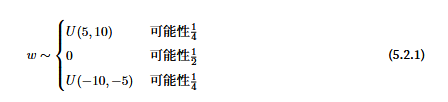

# PyTorch

PyTorch是当今最重要且最受欢迎的深度学习框架之一。它基于Meta的Lua语言Torch库构建，并于2017年开源。自发布以来，该库已被用于构建几乎所有重要的现代AI创新，从特斯拉的自动驾驶汽车到OpenAI的ChatGPT。

# 核心概念

## Tensor 张量

张量（Tensor）是PyTorch的核心数据结构和计算单元。PyTorch张量是多维数组，包含相同数据类型的值。它们可被视为NumPy数组，但经过高度优化且兼容GPU。

- 张量可从Python列表创建，如下所示：
- 使用`torch.empty(shape)`创建未初始化的张量

```python
# Create a 3x2 tensor with uninitialized values
x = torch.empty(3,2)
```

- 使用`torch.zeros(shape)`或`torch.ones(shape)`创建初始化为零或一的张量

```python
# Create a 3x2 tensor with zeros
x = torch.zeros(3, 2)

print(x)

"""
tensor([[0., 0.],
        [0., 0.],
        [0., 0.]])
"""
# Create a 3x2 tensor with ones
x = torch.ones(3, 2)

print(x)

"""
tensor([[1., 1.],
        [1., 1.],
        [1., 1.]])

"""
```

- 使用`torch.rand(shape)`创建从区间`0`到`1`（不包括`1`）的均匀分布中随机初始化的张量

```python
# Create a 2x2 tensor with random values from the uniform distribution
x = torch.rand(2,2)

print(x)

"""
tensor([[0.6051, 0.0569],
        [0.7959, 0.0452]])
"""
```

- 使用`torch.randn(shape)`创建从均值为`0`、方差为`1`的正态分布中随机初始化的张量

```python
# Create a 2x2 tensor with random values from the standard normal distribution
x = torch.randn(2,2)

print(x)

"""
tensor([[ 0.7346, -0.3198],
        [ 0.9044,  0.0995]])
"""
```

- `torch.arange(start, end, step)`用于创建在指定区间内具有均匀间隔值的一维张量

```python
# Create a 1-D tensor
x = torch.arange(0, 10, 2)

print(x)
# tensor([0, 2, 4, 6, 8])
```

### 张量的算术运算

张量的逐元素算术运算如下所示。

```python
x = torch.tensor([3, 2, 1])
y = torch.tensor([1, 2, 3])

# Element-wise arithmetic operations
add = x + y         # Addition
subtract = x - y    # Subtraction
multiply = x * y    # Multiplication
divide = x / y      # Division
```

上述所有操作均会创建新的张量。

原地操作（修改原始张量）通过以下带有`_`后缀的方法执行，如下所示。

```python
# In-place operations (modifies x)
x = torch.tensor([10, 20, 30], dtype=torch.float32)

x.add_(2)    
x.sub_(3)    
x.mul_(5)   
x.div_(2)
```

## Broadcasting 广播机制

广播机制（Broadcasting）允许PyTorch对不同形状的张量执行操作。

这是通过自动扩展较小的张量以匹配较大的张量来实现的，而无需在内存中实际复制/重复其数据。

```python
# Without broadcasting (manual)
a = torch.tensor([1, 2, 3])
b = torch.tensor([10])

b_repeated = b.repeat(3) # [10, 10, 10]
result = a + b_repeated  # [11, 12, 13]

# With broadcasting (automatic)
a = torch.tensor([1, 2, 3])
b = torch.tensor([10])

result = a + b  # [11, 12, 13]
```

### 张量重塑

`reshape`和`view`是PyTorch中用于重塑张量的两个重要方法。

- `view`返回一个重塑后的张量，但要求原始张量在内存中是连续的。

```python
# Create tensor
x = torch.randn(2, 3, 4)

# Check if the tensor is contiguous in memory
print(x.is_contiguous()) # True 

# Reshape using view
y = x.view(6, 4)
# Transpose the tensor, which returns a non-contiguous tensor
x_t = x.transpose(1, 2)

print(x_t.is_contiguous())  # False

# Reshape using view
y_2 = x_t.view(6, 4) #Throws an error
```

- `reshape`即使原始张量在内存中不连续，也能返回重塑后的张量

```python
# Reshape using 'reshape'
y_2 = x_t.reshape(6, 4)
```

除此之外，在PyTorch代码中还会经常遇到其他方法，具体如下：

- `unsqueeze`和`squeeze`分别用于向张量添加或移除大小为`1`的维度。

```python
# Create tensor of shape (3, 4)
x = torch.randn(3, 4)

# Add a new dimension at the front (dim=0)
x_unsq0 = x.unsqueeze(0)
# shape: (1, 3, 4)

# Add a new dimension in the middle (dim=1)
x_unsq1 = x.unsqueeze(1)
# shape: (3, 1, 4)

# Add a new dimension at the end (dim=2)
x_unsq2 = x.unsqueeze(2)
# shape: (3, 4, 1)
# Create a tensor
x = torch.randn(1, 3, 1, 4, 1)

# Remove all size-1 dimensions
x_sq_all = x.squeeze()
# shape: (3, 4)

# Remove only a specific dimension of size 1
x_sq0 = x.squeeze(0)   # remove dim 0 → shape: (3, 1, 4, 1)
x_sq2 = x.squeeze(2)   # remove dim 2 → shape: (1, 3, 4, 1)
```

- `flatten`用于将张量或其选定维度展平为一维，而`unflatten`则将一个维度拆分为多个维度。

```python
# Create a tensor
x = torch.randn(2, 3, 4)

# Flatten into 1-D
y = x.flatten() 
# shape: (24,)

# Flatten into 1-D starting from dim 1
y = x.flatten(start_dim=1)   # shape: (2, 12)
# Create a 1-D tensor
x = torch.arange(24)
# shape: (24,)

# Unflatten the first dimension into (2, 3, 4)
y = torch.unflatten(x, dim=0, sizes=(2, 3, 4))
# shape: (2, 3, 4)
```

- `transpose`交换张量的两个指定维度，而`permute`以任意顺序重新排列张量的所有维度。

```python
# Create a tensor
x = torch.randn(2, 3, 4) # shape: (2, 3, 4)

# Transpose dim 1 and dim 2
y = x.transpose(1, 2) # shape: (2, 4, 3)
# Create a 2D tensor
m = torch.randn(3, 4) # shape: (3, 4)

# Shorthand for transpose applicable only to 2D tensors
m_t = m.t() # shape: (4, 3)
# Use 'permute' to reorder all dims as required 
y = x.permute(2, 0, 1)    # shape: (4, 2, 3)
```

- `expand`在不复制数据的情况下将张量广播到更大的尺寸，而`repeat`则通过复制值来实现。

```python
# Create a tensor
x = torch.randn(1, 3)

y = x.expand(4, 3) # # x's single row is broadcasted 4 times
# shape: (4, 3)

#'repeat' works by repeating each dimension by the given factor
y = x.repeat(4, 1) # x's dim 0 is duplicated 4 times in memory, dim 1 is duplicated once
# shape: (4, 3)
```

- `stack`通过创建新维度来组合张量，而`cat`沿现有维度连接或拼接张量。

```python
# Create tensors
a = torch.tensor([1, 2, 3])
b = torch.tensor([4, 5, 6])

# Stack along a new dimension 0
out = torch.stack([a, b], dim=0)

print(out.shape)
# torch.Size([2, 3])
# Concatenate along dimension 0
out = torch.cat([a, b], dim=0)

print(out.shape)
# torch.Size([6])
```

## Autograd 自动微分

Autograd是PyTorch的自动微分引擎。它用于自动计算张量相对于其他张量的梯度。

这是训练深度学习神经网络的重要操作，涉及计算[损失函数](https://zhida.zhihu.com/search?content_id=266786435&content_type=Article&match_order=1&q=损失函数&zhida_source=entity)相对于模型参数的梯度。

- 为了跟踪张量上的操作以进行梯度计算，我们设置`requires_grad=True`。

如下例所示，当我们设置`requires_grad=True`时，PyTorch将跟踪张量`x`上的所有操作。

```python
# Create a tensor that requires gradients
x = torch.tensor(2.0, requires_grad=True)
```

对设置了`requires_grad=True`的张量进行的操作会被记录在动态计算图上，该图是一个有向无环图（directed acyclic graph, DAG）。

如下例所示，PyTorch在后台为以下函数构建计算图。

```python
# Define a function (y = x^2 + 2x + 2)
y = x**2 + 2*x + 2
```

调用`y.backward()`会触发自动微分，PyTorch会反向遍历计算图以计算导数`dy/dx`。

```python
# Compute derivative (dy/dx = 2x + 2)
y.backward()
```

结果存储在`x.grad`中。

```text
# Print the derivative at x=2 → 2*2 + 2 = 6
print(x.grad) 

# tensor(6.)
```

- `torch.no_grad()`是一个上下文管理器，用于禁用其代码块内所有操作的梯度计算。

在下面的示例中，由于`z`的梯度跟踪已关闭，没有与其相连的计算图，调用`z.backward()`将引发运行时错误。

```python
# Create a tensor that requires gradients
x = torch.tensor([1.0, 2.0, 3.0], requires_grad=True)

# With gradient tracking
y = x * 2
print(y.requires_grad)  # True

y.backward() # Works fine

# Without gradient tracking
with torch.no_grad():
    z = x * 2
    print(z.requires_grad)  # False

z.backward() # Throws error
```

## nn.Module 神经网络

PyTorch 中所有神经网络模块的基类是 `nn.Module`。它规定了神经网络层如何构建、组织与执行。

使用者在自定义网络时必须继承 `nn.Module`，并实现 `forward` 方法，以定义输入数据在网络中的前向传播过程。

```python 
import torch 
import torch.nn as nn 

class NeuralNet(nn.Module):
    def __init__(self):
        super().__init__()
        self.linear = nn.Linear(3, 3)

    def forward(self, x):
        return self.linear(x) 

neural_network = NeuralNet()
print(neural_network)

"""
NeuralNet(
  (linear): Linear(in_features=3, out_features=3, bias=True)
)
"""

#########################
# d2l
class MLP(nn.Module):
    def __init__(self):
        super().__init__()
        self.hidden = nn.Linear(20, 256)
        self.out   = nn.Linear(256, 10)

    def forward(self, x):
        return self.out(F.relu(self.hidden(x)))

net = MLP()
net(X)
```

### 线性层（Linear Layers）

线性层又称全连接（dense / fully-connected）层，用于对输入进行线性变换。

```python
# 创建线性层
linear = nn.Linear(in_features=10, out_features=5)

# 输入
x = torch.randn(32, 10)  # 批次大小 32，每样本 10 维

# 线性层输出
output = linear(x)  # 形状：(32, 5)
```

### 激活函数（Activation Functions）

激活函数对网络层的输出进行非线性变换，使模型能够学习超越线性关系的复杂模式。

```python
# 1-D 张量
x = torch.randn(10)

# ReLU：max(0, x)
relu = nn.ReLU()(x)

# Sigmoid：将数值压缩到 (0, 1)
sigmoid = torch.sigmoid(x)

# Tanh：将数值压缩到 (-1, 1)
tanh = torch.tanh(x)

# Leaky ReLU：负轴斜率 0.1
leaky_relu = nn.LeakyReLU(0.1)(x)

# GELU：基于高斯误差函数的平滑激活
gelu = nn.GELU()(x)
```

### 损失函数（Loss Functions）

损失函数度量模型预测值与真实目标之间的差距。

对于[回归](https://link.zhihu.com/?target=https%3A//en.wikipedia.org/wiki/Regression_analysis)任务，常用损失函数如下：

```python
# 均方误差：平均值 (pred - target)²
criterion = nn.MSELoss()

# 平均绝对误差（L1 Loss）：平均值 |pred - target|
criterion = nn.L1Loss()
# 计算损失
pred   = torch.tensor([2.5, 3.0, 4.5])
target = torch.tensor([3.0, 3.0, 5.0])
loss   = criterion(pred, target)
```

对于[分类](https://link.zhihu.com/?target=https%3A//en.wikipedia.org/wiki/Statistical_classification)任务，常用损失函数如下：

```python
# 交叉熵损失（多类分类）
criterion = nn.CrossEntropyLoss()

# 计算损失
pred   = torch.tensor([[1.2, 0.3, -0.5]])  # 1 个样本，3 类
target = torch.tensor([0])                 # 正确类别索引为 0
loss   = criterion(pred, target)
# 二元交叉熵损失（二分类）
criterion = nn.BCELoss()

# 计算损失
pred   = torch.tensor([0.7, 0.2, 0.9])  # 经过 sigmoid 的概率
target = torch.tensor([1., 0., 1.])     # 真实标签 0 或 1
loss   = criterion(pred, target)
```

### 优化器（Optimizers）

优化器依据计算出的梯度更新模型参数，以最小化损失函数。

常用优化器示例如下：

```python
import torch.optim as optim

# 带动量的随机梯度下降（SGD）
optimizer = optim.SGD(model.parameters(), lr=0.01, momentum=0.9)

# Adam：结合动量与自适应学习率
optimizer = optim.Adam(model.parameters(), lr=0.001)

# RMSprop：基于近期梯度自适应学习率
optimizer = optim.RMSprop(model.parameters(), lr=0.001)

# Adadelta：无需手动调节初始学习率
optimizer = optim.Adadelta(model.parameters(), lr=1.0)

# Adagrad：逐参数自适应学习率
optimizer = optim.Adagrad(model.parameters(), lr=0.01)

# AdamW：带权重衰减解耦的 Adam
optimizer = optim.AdamW(model.parameters(), lr=0.001)
```

### 训练神经网络

PyTorch 训练流程将上述概念整合：

```python
model = NeuralNet()
criterion = nn.MSELoss()
optimizer = optim.Adam(model.parameters(), lr=0.001)

# 训练 100 个 epoch
for epoch in range(100):
    # 前向传播
    outputs = model(train_data)
    loss = criterion(outputs, targets)
    
    # 反向传播
    optimizer.zero_grad()  # 清零旧梯度
    loss.backward()
    optimizer.step()
    
    # 每 10 个 epoch 打印一次损失
    if epoch % 10 == 0:
        print(f'Epoch {epoch}, Loss: {loss.item()}')
```

PyTorch 默认累积梯度；调用 `backward()` 时新梯度会累加到旧梯度上，导致权重更新方向错误、无法收敛。因此必须在每次反向传播前使用 `zero_grad()` 清零梯度。

## Sequential 容器

`nn.Sequential` 可将多个模块（层与激活函数）按顺序堆叠。前向传播时，上一模块的输出自动作为下一模块的输入，最终返回最后一个模块的结果。

```python
# 使用 Sequential 定义模型
model = nn.Sequential(
    nn.Linear(10, 50),
    nn.ReLU(),
    nn.Linear(50, 20),
    nn.ReLU(),
    nn.Linear(20, 1)
)

# 输入
x = torch.randn(32, 10)

# 输出
output = model(x)

###########################
# d2l
net = nn.Sequential(nn.Linear(20, 256), nn.ReLU(), nn.Linear(256, 10))
x = torch.rand(2, 20)
net(x)

class MySequential(nn.Module): # 内部实现
    def __init__(self, *args):
        super().__init__()
        for block in args:
            self._modules[str(block)] = block

    def forward(self, x):
        for block in self._modules.values():
            x = block(x)
        return x


net = MySequential(nn.Linear(20, 256), nn.ReLU(), nn.Linear(256, 10))
output = net(X)

# 也可以自定义，不用Sequential,为的是可以在__init__和forward加更多的处理
class FixedHiddenMLP(nn.Module):
    def __init__(self):
        super().__init__()
        self.rand_weight = torch.rand((20, 20), requires_grad=False)
        self.linear = nn.Linear(20, 20)

    def forward(self, x):
        x = self.linear(x)
        x = F.relu(torch.mm(x, self.rand_weight) + 1)
        x = self.linear(x)
        while x.abs().sum() > 1:
            x /= 2
        return x.sum()

net = FixedHiddenMLP()
net(x)

# 嵌套实现
class NestMLP(nn.Module):
    def __init__(self):
        super().__init__()
        self.net = nn.Sequential(
            nn.Linear(20, 64),
            nn.ReLU(),
            nn.Linear(64, 32),
            nn.ReLU()
        )
        self.linear = nn.Linear(32, 16)

    def forward(self, x):
        return self.linear(self.net(x))


chimera = nn.Sequential(
    NestMLP(),
    nn.Linear(16, 20),
    FixedHiddenMLP()
)

chimera(X)
```

### 访问参数

在选择了架构并设置了超参数后,我们就进入了训练阶段。此时,我们的目标是找到使损失函数最小化的模  型参数值。经过训练后,我们将需要使用这些参数来做出未来的预测。此外,有时我们希望提取参数,以便  在其他环境中复用它们,将模型保存下来,以便它可以在其他软件中执行,或者为了获得科学的理解而进行检查。

```python
net = nn.Sequential(nn.Linear(4, 8), nn.ReLU(), nn.Linear(8, 1))  
X = torch.rand(size=(2, 4))  
net(X)

'''
tensor([[-0.0619],  [-0.0489]], grad_fn=<AddmmBackward0>)
'''

# 
print(net[2].state_dict())
'''
OrderedDict([('weight', tensor([[ 0.3016, -0.1901, -0.1991, -0.1220, 0.1121, -0.1424, -0.3060, 0.3400]])), ('bias', tensor([-0.0291]))])
'''

print(type(net[2].bias))  
print(net[2].bias)  
print(net[2].bias.data)
```

#### 一次性访问所有参数

当我们需要对所有参数执行操作时,逐个访问它们可能会很麻烦。当我们处理更复杂的块(例如,嵌套块)  时,情况可能会变得特别复杂,因为我们需要递归整个树来提取每个子块的参数。下面,我们将通过演示来  比较访问第一个全连接层的参数和访问所有层。

```python
# 只访问第一个子块（序号 0）的参数
print(*[(name, param.shape) for name, param in net[0].named_parameters()])

# 一次性访问整个网络的全部参数
print(*[(name, param.shape) for name, param in net.named_parameters()])

# 通过 state_dict 直接读写指定张量
net.state_dict()['2.bias'].data
```

#### 从嵌套块收集参数

让我们看看,如果我们将多个块相互嵌套,参数命名约定是如何工作的。我们首先定义一个生成块的函数(可  以说是“块工厂”),然后将这些块组合到更大的块中。

```python
import torch
import torch.nn as nn

def block1():
    return nn.Sequential(
        nn.Linear(4, 8),
        nn.ReLU(),
        nn.Linear(8, 4),
        nn.ReLU()
    )

def block2():
    net = nn.Sequential()
    for i in range(4):
        net.add_module(f'block{i}', block1())
    return net

rgnet = nn.Sequential(block2(), nn.Linear(4, 1))

# 示例前向
x = torch.randn(2, 4)
out = rgnet(x)          
# tensor([[-0.3078], [-0.3078]], grad_fn=<AddmmBackward0>)
```

设计了网络后,我们看看它是如何工作的。

```python
print(rgnet)
'''
Sequential(
  (0): Sequential(
    (block0): Sequential(
      (0): Linear(in_features=4, out_features=8, bias=True)
      (1): ReLU()
      (2): Linear(in_features=8, out_features=4, bias=True)
      (3): ReLU()
    )
    (block1): Sequential(
      (0): Linear(in_features=4, out_features=8, bias=True)
      (1): ReLU()
      (2): Linear(in_features=8, out_features=4, bias=True)
      (3): ReLU()
    )
    (block2): Sequential(
      (0): Linear(in_features=4, out_features=8, bias=True)
      (1): ReLU()
      (2): Linear(in_features=8, out_features=4, bias=True)
      (3): ReLU()
    )
    (block3): Sequential(
      (0): Linear(in_features=4, out_features=8, bias=True)
      (1): ReLU()
      (2): Linear(in_features=8, out_features=4, bias=True)
      (3): ReLU()
    )
  )
  (1): Linear(in_features=4, out_features=1, bias=True)
)
'''
```

### 参数初始化

默认情况下,PyTorch会根据一个范围均匀地初始化权重和偏置矩阵,这个范围是根据输入和输出维度计算  出的。PyTorch的nn.init模块提供了多种预置初始化方法。

#### 内置初始化

让我们首先调用内置的初始化器。下面的代码将所有权重参数初始化为标准差为0.01的高斯随机变量,且将  偏置参数设置为0。

```python
import torch.nn as nn

# 自定义初始化函数：权重 N(0, 0.01)，偏置 0
def init_normal(m):
    if type(m) == nn.Linear:
        nn.init.normal_(m.weight, mean=0, std=0.01)
        nn.init.zeros_(m.bias)

net.apply(init_normal)          # 一键应用到整个网络

# 抽查结果
net[0].weight.data[0], net[0].bias.data[0]
# (tensor([-0.0128, -0.0141, 0.0062, 0.0028]), tensor(0.))
```

我们还可以对某些块应用不同的初始化方法。例如,下面我们使用Xavier初始化方法初始化第一个神经网络  层,然后将第三个神经网络层初始化为常量值42。

```python
import torch.nn as nn

def init_xavier(m):
    if type(m) == nn.Linear:
        nn.init.xavier_uniform_(m.weight)

def init_42(m):
    if type(m) == nn.Linear:
        nn.init.constant_(m.weight, 42)

# 仅对指定层应用不同初始化
net[0].apply(init_xavier)   # 第一个层用 Xavier
net[2].apply(init_42)       # 第三个层全部权重置为 42

print(net[0].weight.data[0])
print(net[2].weight.data)
# tensor([ 0.3809, 0.5354, -0.4686, -0.2376])
# tensor([[42., 42., 42., 42., 42., 42., 42., 42.]])
```

#### 自定义初始化

有时,深度学习框架没有提供我们需要的初始化方法。在下面的例子中,我们使用以下的分布为任意权重参  数w定义初始化方法,



同样,我们实现了一个my_init函数来应用到net。

```python
def my_init(m):
    if type(m) == nn.Linear:
        print("Init", *[(name, param.shape)
                         for name, param in m.named_parameters()][0])
        nn.init.uniform_(m.weight, -10, 10)
        m.weight.data *= m.weight.data.abs() >= 5   # 绝对值<5的置0

net.apply(my_init)
net[0].weight[:2]
# Init weight torch.Size([8, 4])
# Init weight torch.Size([1, 8])
# tensor([[-0.8000,  0.0000, -0.0000,  0.0000],
#         [-0.0800,  9.3464,  5.5061,  6.8197]], grad_fn=<SliceBackward0>)

# 你也可以手动继续改值
net[0].weight.data[:] += 1
net[0].weight.data[0, 0] = 42
net[0].weight.data[0]
# tensor([42., 1., 1., 1.])
```

### 参数绑定

有时我们希望在多个层间共享参数:我们可以定义一个稠密层,然后使用它的参数来设置另一个层的参数。

```python
import torch
import torch.nn as nn

# 定义一个共享层，并给它一个名字以便引用
shared = nn.Linear(8, 8)

net = nn.Sequential(
    nn.Linear(4, 8),
    nn.ReLU(),
    shared,          # 第 2 层（索引 2）
    nn.ReLU(),
    shared,          # 第 4 层（索引 4）与上面共享参数
    nn.ReLU(),
    nn.Linear(8, 1)
)

X = torch.randn(2, 4)
out = net(X)

# 检查参数是否相同（同一 Tensor）
print(net[2].weight.data[0] == net[4].weight.data[0])
# tensor([True, True, True, True, True, True, True, True])

# 修改其中一个，另一个同步变化
net[2].weight.data[0, 0] = 100
print(net[2].weight.data[0] == net[4].weight.data[0])
# tensor([True, True, True, True, True, True, True, True])
```

### 自定义层

深度学习成功背后的一个因素是神经网络的灵活性:我们可以用创造性的方式组合不同的层,从而设计出适  用于各种任务的架构。例如,研究人员发明了专⻔用于处理图像、文本、序列数据和执行动态规划的层。有时  我们会遇到或要自己发明一个现在在深度学习框架中还不存在的层。在这些情况下,必须构建自定义层。本  节将展示如何构建自定义层。

#### 不带参数的层

首先,我们构造一个没有任何参数的自定义层。下面的CenteredLayer类要从其输入中减去均值。要构建它,我们只需继承基础层类并实现前向传播功能。

```python
import torch
import torch.nn.functional as F
from torch import nn

class CenteredLayer(nn.Module):
    def __init__(self):
        super().__init__()

    def forward(self, X):
        return X - X.mean()

# 验证
layer = CenteredLayer()
print(layer(torch.FloatTensor([1, 2, 3, 4, 5])))
# tensor([-2., -1.,  0.,  1.,  2.])

# 嵌入更大网络
net = nn.Sequential(nn.Linear(8, 128), CenteredLayer())

Y = net(torch.rand(4, 8))
print(Y.mean())          # 浮点误差级 0
# tensor(-1.3970e-09, grad_fn=<MeanBackward0>)
```

#### 带参数的层

以上我们知道了如何定义简单的层,下面我们继续定义具有参数的层,这些参数可以通过训练进行调整。我  们可以使用内置函数来创建参数,这些函数提供一些基本的管理功能。比如管理访问、初始化、共享、保存  和加载模型参数。这样做的好处之一是:我们不需要为每个自定义层编写自定义的序列化程序。  

现在,让我们实现自定义版本的全连接层。回想一下,该层需要两个参数,一个用于表示权重,另一个用于  表示偏置项。在此实现中,我们使用修正线性单元作为激活函数。该层需要输入参数:in_units和units,分别表示输入数和输出数。

```python
import torch
import torch.nn.functional as F
from torch import nn

class MyLinear(nn.Module):
    def __init__(self, in_units, units):
        super().__init__()
        self.weight = nn.Parameter(torch.randn(in_units, units))
        self.bias   = nn.Parameter(torch.randn(units,))

    def forward(self, X):
        linear = torch.matmul(X, self.weight) + self.bias   # 无需 .data，保持梯度
        return F.relu(linear)

# 实例化并查看参数
linear = MyLinear(5, 3)
print(linear.weight)

# 自定义层前向
print(linear(torch.rand(2, 5)))

# 像内置层一样拼成网络
net = nn.Sequential(MyLinear(64, 8), MyLinear(8, 1))
print(net(torch.rand(2, 64)))
# tensor([[7.5465],  [4.6817]])
```


## ataset & DataLoader 高效数据处理

PyTorch 提供 `Dataset` 与 `DataLoader` 两个数据原语，用于高效地在训练与评估阶段管理数据。

- `Dataset` 为抽象基类，表示数据集并定义如何访问单个样本。

```python
from torch.utils.data import Dataset

class CustomDataset(Dataset):
    def __init__(self, data, labels):
        self.data = data
        self.labels = labels
    
    def __len__(self):
        # 返回样本总数
        return len(self.data)
    
    def __getitem__(self, idx):
        # 返回索引对应的样本与标签
        return self.data[idx], self.labels[idx]
```

- `DataLoader` 为迭代器，封装 `Dataset` 并提供按批次高效加载数据的能力。

```python
from torch.utils.data import DataLoader

# 创建数据集
dataset = CustomDataset(data, labels)

# 创建 DataLoader
dataloader = DataLoader(
    dataset,
    batch_size=32,  # 每批 32 个样本
    shuffle=True,
    num_workers=4   # 多进程数据加载
)

# 训练循环
for epoch in range(5):
    for batch_idx, (x_batch, y_batch) in enumerate(dataloader):
        optimizer.zero_grad()
        pred = model(x_batch)
        loss = criterion(pred, y_batch)
        loss.backward()
        optimizer.step()
```


## nn.Convnd 卷积层 

CNN本质就是做了限制的全联接层，共享参数，限制感受域。

卷积层用于构建[卷积神经网络（CNN）](https://link.zhihu.com/?target=https%3A//en.wikipedia.org/wiki/Convolutional_neural_network)，处理图像等网格状数据。

```python
# 1D 卷积层
conv1d_layer = nn.Conv1d(
    in_channels=2,   # 输入通道数
    out_channels=32, # 1D 卷积核（滤波器）数量
    kernel_size=5,   # 卷积核大小（覆盖 5 个时间步）
    stride=2,        # 步长 2
    padding=2        # 零填充
)

# 2D 卷积层
conv_layer = nn.Conv2d(
    in_channels=3,   # 输入通道（RGB 图像）
    out_channels=64, # 卷积核数量
    kernel_size=3,
    stride=1,
    padding=1        # 边框零填充以保持尺寸
)

# 3D 卷积层
conv3d_layer = nn.Conv3d(
    in_channels=1,
    out_channels=16, # 3D 卷积核数量
    kernel_size=3,   # 3×3×3 立体卷积核
    stride=1,
    padding=1        # 六面零填充
)
```

## nn.RNN 循环层

循环层用于构建 RNN、LSTM 和 GRU，处理时间序列、文本、音频等序列数据，通过隐藏状态记忆先前时间步的信息。

```python
# 简单 RNN
rnn = nn.RNN(
    input_size=10,   # 每时间步特征数
    hidden_size=20,  # 隐藏状态维度
    num_layers=2,    # 堆叠 2 层
    batch_first=True # 输入/输出形状为 (batch_size, seq_len, features)
)

# LSTM
lstm = nn.LSTM(
    input_size=10,
    hidden_size=20,
    num_layers=2,
    batch_first=True,
    dropout=0.2      # 层间 Dropout
)

# GRU
gru = nn.GRU(
    input_size=10,
    hidden_size=20,
    num_layers=2,
    batch_first=True
)
```

## Dropout

[Dropout](https://link.zhihu.com/?target=https%3A//www.cs.toronto.edu/~rsalakhu/papers/srivastava14a.pdf) 是一种正则化技术，通过在训练时随机“丢弃”（置零）部分神经元，防止模型过拟合。

```python
dropout = nn.Dropout(p=0.2)  # 训练阶段随机丢弃 20% 神经元

# 输入
x = torch.randn(32, 100)

# 输出
x_dropped = dropout(x)
```

## 批归一化与层归一化

[批归一化（Batch Normalization，BatchNorm）](https://link.zhihu.com/?target=https%3A//intoai.pub/i/171070883/to-start-with-what-really-is-normalization) 将每层的输入归一化为零均值和单位方差，稳定训练过程并加速收敛。
BatchNorm 沿批次维度独立地对每个特征进行归一化，在 CNN 中尤为常用。# 带有批量归一化的神经网络

```python
# Neural network with Batch Norm
class ModelWithBatchNorm(nn.Module):
    def __init__(self):
        super().__init__()
        self.fc1 = nn.Linear(784, 256)
        self.bn1 = nn.BatchNorm1d(256) 
        self.fc2 = nn.Linear(256, 10)
    
    def forward(self, x):
        x = F.relu(self.bn1(self.fc1(x)))
        return self.fc2(x)
```

层归一化（Layer Normalization，简称 LayerNorm）的作用与批量归一化（BatchNorm）类似，区别在于它对每个样本的**特征维度**独立做归一化。该机制广泛应用于循环神经网络（RNN）和 Transformer 等序列模型。

```python
# Neural network with Layer Norm
class ModelWithLayerNorm(nn.Module):
    def __init__(self):
        super().__init__()
        self.fc1 = nn.Linear(784, 256)
        self.ln1 = nn.LayerNorm(256) 
        self.fc2 = nn.Linear(256, 10)
    
    def forward(self, x):
        x = F.relu(self.ln1(self.fc1(x)))
        return self.fc2(x)
```

## train & eval 切换模型模式

PyTorch 中模型具有两种模式，用以控制在训练与评估 / 推理阶段特定层的行为差异：

- 训练模式：通过 `model.train()` 启用
- 评估 / 推理模式：通过 `model.eval()` 启用

在调用 `model.eval()` 后，下列层的行为将发生改变：

- Dropout 被禁用，所有神经元均保持激活，不再随机丢弃
- 批量归一化使用**滑动平均统计量**（running statistics）而非当前批次统计量

```python
model = NeuralNetWithDropout()

# Training mode (enables dropout, batch norm updates)
model.train()

output = model(train_data)

# Evaluation mode (disables dropout, uses running stats)
model.eval()

with torch.no_grad():  # Disable gradient computation
    predictions = model(test_data)
```

## 在 PyTorch 中使用 GPU

PyTorch 支持 GPU 加速的张量运算，可将模型训练速度提升数倍。

- 以下操作用于检查机器是否具备 GPU：

```python
# Check if CUDA (NVIDIA GPU) is available
print(torch.cuda.is_available()) 

# Get number of GPUs
print(torch.cuda.device_count()) 

# Get current GPU name
print(torch.cuda.get_device_name(0))
```

- 可直接在 GPU 上创建张量：

```python
# Create tensor on GPU
x = torch.randn(2, 2, device='cuda')
```

- 也可先在 CPU 创建张量，再迁移至 GPU：

```python
# METHOD 1

# Create tensor on CPU
x = torch.randn(3, 4)

# Move to GPU
x = x.to('cuda') 

print(x.device) #cuda:0
# METHOD 2

# Use the 'device' object
device = torch.device('cuda' if torch.cuda.is_available() else 'cpu')

# Move the tensor
x = torch.randn(3, 4, device=device)

print(x.device) #cuda:0
```

- 同理，可将张量从 GPU 迁回 CPU：

```python
# Move tensor from CPU to GPU
x_cpu = torch.randn(3, 4)
x_gpu = x_cpu.to('cuda')

# Move tensor from GPU to CPU
x_cpu = x_gpu.to('cpu')

# Check device
print(x_gpu.device) #cuda:0
print(x_cpu.device) #cpu
```

- 与单个张量类似，可将整个模型迁移至 GPU：

```python
model = nn.Sequential(
    nn.Linear(10, 50),
    nn.ReLU(),
    nn.Linear(50, 1)
)

# Move entire model to GPU
model = model.to('cuda')

# Or
device = torch.device('cuda')
model = model.to(device)
```

- 在 GPU 上训练模型时，可采用如下训练循环：

```python
# Setup device
device = torch.device('cuda' if torch.cuda.is_available() else 'cpu')
print(f'Using device: {device}')

# Define Model, Loss function, and Optimizer
model = MyModel().to(device)
criterion = nn.CrossEntropyLoss()
optimizer = torch.optim.Adam(model.parameters(), lr=0.001)

# Training loop
for epoch in range(num_epochs):
    for data, target in train_loader:
        # Move data to GPU
        data = data.to(device)
        target = target.to(device)
        
        # Forward pass
        optimizer.zero_grad()
        output = model(data)
        loss = criterion(output, target)
        
        # Backward pass
        loss.backward()
        optimizer.step()
```

## save & load 模型的保存与加载

- 若需保存并加载**整个模型**（含网络结构与参数），可采用以下方式：

```python
# Save entire model
torch.save(model, 'full_model.pth')

# Load entire model
model = torch.load('full_model.pth')

# Switch to eval model
model.eval()
```

- 若只需保存模型参数（权重与偏置），而不保存网络结构，可采用以下方式：
    该方法需保存模型的 `state_dict`，它是一个 Python 字典，将模型每一层映射到对应的参数张量。

```python
# Saving the model

# Define model
model = nn.Sequential(
    nn.Linear(10, 50),
    nn.ReLU(),
    nn.Linear(50, 1)
)

# Save model state_dict
torch.save(model.state_dict(), 'model_weights.pth')
# Loading the model

# Define model
model = nn.Sequential(
    nn.Linear(10, 50),
    nn.ReLU(),
    nn.Linear(50, 1)
)

# Load model state_dict
model.load_state_dict(torch.load('model_weights.pth'))

# Switch to eval model
model.eval()
```