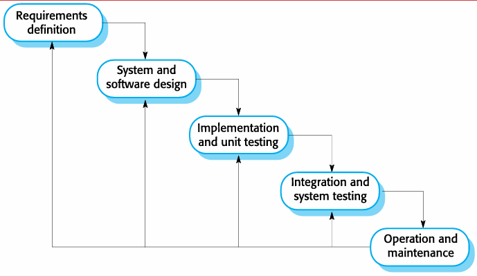
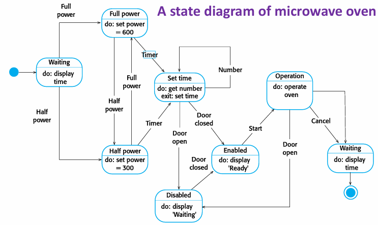
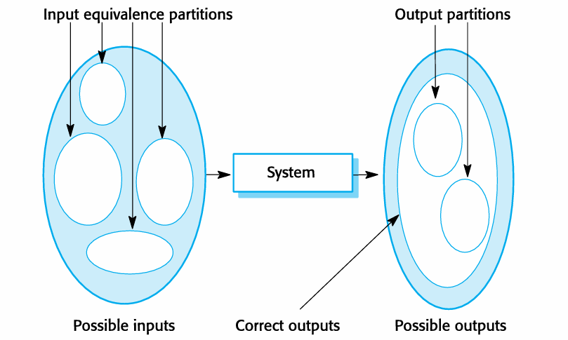
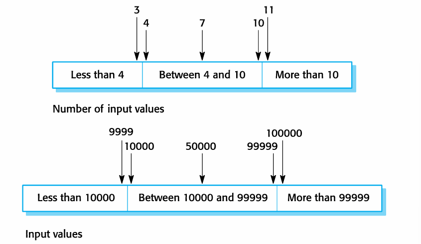

# Software Engineering Principles

[TOC]

# Introduction

## Professional Software Development

- **Importance of Software Engineering (SE)**

    We need to be able to produce reliable and trustworthy  systems economically and quickly

- **What is software Engineering?** 
  
    All aspects of software production.

    - Software costs
    - Software project failure
    
- **Software Process Activities**

    | 活动                                   | 描述                                     |
    | :------------------------------------- | :--------------------------------------- |
    | **软件规格说明**Software specification | 客户和工程师定义要生产的软件及其操作约束 |
    | **软件开发Software development**       | 软件设计和编程                           |
    | **软件验证**Software validation        | 检查软件是否满足客户需求                 |
    | **软件演化**Software evolution         | 修改软件以反映变化的客户和市场需求       |

- **Software Products**
    - Generic products 独立系统，面向任何愿意购买的客户 [开发人员拥有]
    - Customized products 由特定客户委托开发以满足自身需求 [客户拥有]

- **Essential attributes of good software**

    | 属性                                         | 描述                                                         |
    | :------------------------------------------- | :----------------------------------------------------------- |
    | **可维护性**Maintainability                  | 能够演进以满足客户变化的需求                                 |
    | **可靠性和安全性**Dependability and security | 包括可靠性、安全性和防护性reliability, security and safety   |
    | **效率** Efficiency                          | 不浪费系统资源（内存、处理器周期）memory&time                |
    | **可接受性**Acceptability                    | 目标用户可理解、可使用且兼容understandable, usable and compatible |

- **General issues that affect software**
    - **异构性** Heterogeneity：需要在包含不同类型计算机和移动设备的网络上作为分布式系统运行
    - **业务和社会变化**Business and social change：需要能够更改现有软件并快速开发新软件 functionality, ethics
    - **安全与信任**Security and trust ：软件与生活的各个方面交织，必须可信
    - **规模**Scale：从便携或可穿戴设备中的非常小的嵌入式系统到服务全球社区的互联网规模、基于云的系统 eg. ERP, CIMS

- **Software engineering diversity**
    - 存在许多不同类型的软件系统
    - 没有适用于所有系统的通用软件技术集
    - 使用的软件工程方法和工具取决于：
        - 开发的应用程序类型
        - 客户需求
        - 开发团队的背景

- **Application types**
    1. **独立应用程序** - 在本地计算机上运行
    2. **交互式事务处理应用** - 远程执行，用户通过PC访问 eg.淘宝
    3. **嵌入式控制系统** - 控制和管理硬件设备 eg.wearable device
    4. **批处理系统** Batch processing systems- 处理大批量数据
    5. **娱乐系统** - 主要用于个人娱乐
    6. **建模和仿真系统**  Systems for modeling and simulation - 模拟物理过程或情况
    7. **数据收集系统**Data collection systems - 从环境收集数据并发送处理
    8. **系统之系统** - 由许多其他软件系统组成
    
- **Software engineering fundamentals**

    - 适用于所有类型软件系统的基本原则：
        - 使用**受管理且被理解的开发过程**。
        - **可靠性和性能**对所有系统都很重要。
        - 理解和管理**软件规格和需求**很重要。
        - 在适当情况下，应**重用已有软件**，而不是编写新软件。

- **Internet software engineering**

    - Web已成为运行应用程序的平台，组织越来越多地开发基于Web的系统。
    - **Web服务**允许通过Web访问应用程序功能。
    - **云计算**是一种提供服务的方式，应用程序在“云”上远程运行。

- **Web-based software engineering**

    - **软件重用**是构建Web系统的主要方法。 dominant approach 
    - **增量与敏捷开发**适用于Web系统。
    - **面向服务的系统**Service-oriented systems使用独立的Web服务作为软件组件。
    - **丰富的界面**Rich interfaces技术（如AJAX、HTML5）支持在浏览器中创建丰富的用户界面。

- **Frequently asked questions about software engineering**

    - **什么是软件？**
        计算机程序及相关文档。Computer programs and associated documentation.
    - **良好软件的属性是什么？**
        应具备所需功能与性能，且可维护、可靠、可用。
    - **软件工程与计算机科学的区别？**
        计算机科学关注理论与基础，软件工程关注开发与交付实用软件的实践。 the practicalities of developing and delivering useful software.
    - **软件工程与系统工程的区分？**
        系统工程涉及包括硬件、软件和过程工程在内的所有方面，软件工程是其一部分。
    - **软件工程面临的主要挑战？**
        应对日益增长的多样性、缩短交付时间、开发可信赖软件。 increasing diversity, demands for reduced delivery times and developing trustworthy software
    - **软件工程的成本？**
        约60%为开发成本，40%为测试成本。定制软件的演化成本常超过开发成本。

## Software engineering ethics

> - 软件工程涉及的责任**远不止**技术技能的应用。
> - 软件工程师必须**诚实**且**道德负责**地行事，才能被视为专业人士。
> - 道德行为不仅仅是遵守法律，还涉及遵循一套**道德上正确**的原则。

- **Issues of professional responsibility**

    **1. 保密性Confidentiality**

    - 工程师通常应尊重其雇主或客户的**保密性**，无论是否签署了正式的保密协议。

    **2. 胜任能力**Competence

    - 工程师不应**歪曲**其能力水平。
    - 他们不应明知故犯地接受**超出其能力**的工作。

    **3. 知识产权** Intellectual property rights 

    - 工程师应了解当地关于使用**知识产权**（如专利、版权等）的法律。
    - 他们应小心确保雇主和客户的**知识产权得到保护**。

    **4. 计算机滥用** Computer misuse 

    - 软件工程师不应利用其技术技能**滥用**他人的计算机。
    - 计算机滥用的范围从相对琐碎（如在雇主的机器上玩游戏）到极其严重（如传播病毒）。

- **ACM/IEEE Code of Ethics**

    - 软件工程涉及的责任**远不止**技术技能的应用。
    - 软件工程师必须**诚实**且**道德负责**地行事，才能被视为专业人士。
    - 道德行为不仅仅是遵守法律，还涉及遵循一套**道德上正确**的原则。

- **Rationale for the code of ethics**

    - 简短版本的规范在**高层次**上总结了愿望。
    - 完整版本中的条款给出了这些愿望如何改变我们作为软件工程专业人员行为的**示例和细节**。
    - 愿望与细节共同构成一个**连贯的规范**。

    软件工程师应致力于使软件的分析、规格说明、设计、开发、测试和维护成为一个**有益且受尊重**的职业。

## Lab 1

1. why software is soft?

    ans: untouchable, not physical substance

# Software processes

## Software process models

- **What is software process?**
    - 软件过程是导致软件系统生产的一系列相关活动。
    - 所有软件过程都必须包含4个基本活动：
        1. **规格说明** - 定义系统应该做什么
        2. **设计与实现** - 定义系统组织并实现系统
        3. **验证** - 检查系统是否符合客户需求
        4. **演化** - 根据变化的客户需求改变系统

- **What is software process model?** 
    - 也称为**软件开发生命周期模型** Aka: Software  Development Life Cycle (SDLC)，是过程的抽象表示
    - 过程描述包括：
        - **产品** - 过程活动的结果
        - **角色** - 参与过程人员的职责
        - **前置和后置条件** - 活动执行前后的状态陈述
- **Plan-driven and agile processes**
    - **计划驱动过程**：所有过程活动都提前计划，进度按计划衡量
    - **敏捷过程**：计划是增量的，更容易响应变化的客户需求
    - 实践中，大多数过程包含两种方法的元素
- **General process models** 
    - The waterfall model
    - Incremental development
    - Integration and configuration

### Waterfall model

- **5 Phases in the waterfall model**

    **1. 需求分析与定义**Requirements analysis and definition

    - **目标**：明确系统需要做什么
    - **活动**：收集用户需求，分析系统功能和非功能需求
    - **产出**：需求规格说明书

    **2. 系统与软件设计**System and software design

    - **目标**：设计系统的整体架构和组件结构
    - **活动**：
        - 系统架构设计
        - 数据库设计
        - 接口设计
        - 组件设计
    - **产出**：系统设计文档

    **3. 实现与单元测试**Implementation and unit testing

    - **目标**：将设计转换为可执行代码
    - **活动**：
        - 编写程序代码
        - 进行单元测试（测试单个组件）
    - **产出**：可执行的软件单元

    **4. 集成与系统测试** Integration and system testing

    - **目标**：确保整个系统正常工作
    - **活动**：
        - 集成各个软件单元
        - 进行系统级测试
        - 验证系统是否符合规格说明
    - **产出**：经过测试的完整系统

    **5. 运行与维护**Operation and maintenance

    - **目标**：系统投入使用并持续改进
    - **活动**：
        - 部署系统到生产环境
        - 监控系统运行
        - 修复发现的缺陷
        - 根据用户反馈进行改进
    - **产出**：稳定运行的系统

- The waterfall model is suitable for developing **embedded  systems**, **critical systems**, or **large software systems**.

- **The waterfall model problems**

    **1. 难以适应变化**

    - **核心问题**：过程开始后难以容纳变更
    - **原因**：每个阶段必须完成后才能进入下一阶段
    - **后果**：需求变更成本极高

    **2. 阶段划分不灵活**

    - 将项目严格划分为不同阶段
    - 难以响应变化的客户需求

    **3. 适用性有限**

    - **仅适用于**：
        - 需求被充分理解
        - 设计过程中变更相当有限的情况
    - **现实问题**：很少有业务系统具有稳定的需求

### Incremental development

- **Definition**

    **增量开发**是一种将软件开发过程组织为一系列**交织进行**的增量的模型。与瀑布模型的顺序阶段不同，增量开发将**规格说明、开发和验证**这三个核心活动并行且迭代地进行。

    其核心思想是：**先构建一个系统的简化版本（初始版本），然后通过不断添加功能，逐步发展出中间版本，最终形成完整的最终版本。**

- **Working Principles**

    - **并发活动**：规格说明、开发、验证活动不是分离的，而是在每个增量中同时进行。
    - **版本演进**：
        1. **初始版本**：实现最核心的功能。
        2. **中间版本**：在每个后续增量中添加新的功能。
        3. **最终版本**：经过多个增量的迭代后，形成满足所有需求的完整系统。

- **Advantages**
    1. **降低变更成本** The cost of accommodating changing customer  requirements is reduced. 
        - 由于每个增量的周期短，当客户需求变化时，只需要调整当前或后续的增量，而无需推翻重来。
        - 需要重新进行分析和文档化的工作量远小于瀑布模型。
    2. **更容易获得客户反馈**It is easier to get customer feedback on the development  work that has been done.
        - 客户可以定期看到并试用已开发的软件（演示版），从而提供更具体、更及时的反馈。
        - 这种持续的沟通确保了软件最终能更好地满足客户的真实需求。
    3. **更快速地交付有价值软件**More rapid delivery and deployment of useful software  to the customer is possible.
        - 客户能够更早地使用软件（即使功能不完整），并从中获得商业价值。
        - 与瀑布模型必须等到项目末期才能交付完整系统相比，这大大加快了价值实现的时间。
- **Problems**
    1. **过程可见性低**not visible
        - **问题**：项目经理需要明确的交付物（如大量文档）来衡量项目进度。但在快速迭代的增量开发中，为每个版本都生成详细的文档是**不经济**的。
        - **挑战**：这使得管理层难以像在瀑布模型中那样，通过检查文档来清晰地掌控项目状态。
    2. **系统结构易退化**System structure tends to degrade as new increments are  added. 
        - **问题**：随着新增量的不断添加，如果不加注意，系统的整体架构和代码结构可能会因为快速的修改而逐渐变得混乱（即“代码腐化corrupt  its structure.”）。
        - **后果**：除非投入额外的时间和资金进行**代码重构**来优化结构，否则后续的软件变更会变得越来越困难和昂贵，最终导致系统难以维护。

### Integration and Configuration

- **Definition**

    **集成与配置**模型是一种基于**软件重用**的软件开发方法。其核心思想不是从零开始编写所有代码，而是通过**集成现有的软件组件**或应用系统来组装成新的系统。

    这些可重用的元素通常可以进行**配置**，以使其行为和功能适应用户的特定需求。这种方法（有时也称为**面向复用的开发**）已成为构建许多类型业务系统的标准方法。

- **Three types of frequently reused software components**

    1. **独立应用系统**
        - 也称为 **COTS**。这些是独立的、商业现成的软件产品，可以通过配置在特定环境中使用。
        - **示例**：配置一个现成的客户关系管理（CRM）系统或企业资源规划（ERP）系统来满足企业需求。
    2. **对象集合包**
        - 作为软件包开发的一组对象或组件，可以集成到某个组件框架中。
        - **示例**：用于 .NET 或 J2EE（现在常称为 Java EE）框架的第三方控件、类库或组件。
    3. **Web服务**
        - 根据服务标准（如SOAP, REST）开发的、可通过网络进行远程调用的软件功能。
        - **示例**：调用第三方提供的在线支付服务、地图服务或天气数据服务。

- **Key process stages**

    

    1. **需求规格说明**Requirements specification
        - 定义系统需要做什么。但此时的规格说明需要考虑到重用的可能性，可能更灵活。
    2. **软件发现与评估** Software discovery and evaluation
        - 寻找可能满足全部或部分需求的现有软件组件或系统，并评估其适用性。
    3. **需求精化**Requirements refinement
        - 根据找到的可重用组件，调整和细化需求。通常需要在此阶段做出**需求妥协**。
    4. **应用系统配置**Application system configuration
        - 如果选择了现成的应用系统（COTS），则根据用户需求对其进行配置。
    5. **组件适配与集成**Component adaptation and integration
        - **组件适配**：修改或包装现有组件，使其能够在新系统中协同工作。
        - **集成**：将配置好的应用系统、适配后的组件以及必要时**新开发的组件**组装成一个完整的系统。

- **Advantages and disadvantages**

    **优点**

    - **降低成本和风险**
        - 因为减少了从零开始的软件开发工作量，从而降低了开发成本和项目风险。
    - **加快交付和部署速度**
        - 利用现有组件可以显著缩短开发周期，使系统能更快投入使用。

    **缺点**

    - **不可避免的需求妥协** requirements compromises are inevitable 
        - 系统可能无法完全满足用户的真实需求，因为必须迁就可重用组件的功能。
    - **失去对演进的控制** Loss of control over evolution
        - 如果重用的系统元素（如COTS产品）由第三方供应商控制，那么其未来的升级、定价策略或停产决定都可能对您的系统造成巨大影响，导致失去控制权。

## Process activities

- **Key Concepts**
    - **真实软件过程**是**技术、协作和管理活动**交织在一起的序列，其总体目标是**规格说明、设计、实现和测试**一个软件系统。
    - 四个基本过程活动（规格说明、开发、验证和演化）在不同的开发过程中以**不同的方式组织**。
        - **例如**：在瀑布模型中，它们按**顺序**组织；而在增量开发中，它们是**交织**进行的。
    - 现代软件过程普遍得到**软件工具**的支持。

### Software specification

- **Requirements engineering process**

    这是确定系统需要提供哪些**服务**以及系统运行和开发的**约束条件**的过程。这个过程也称为**需求工程**。包含三个主要活动，通常迭代进行：

    1. **需求获取与分析**Requirements elicitation and analysis
        - **核心问题**：系统的**利益相关者**（用户、客户等）对系统有什么要求或期望？
        - **活动**：通过访谈、观察、研讨会等方式收集需求，并进行分析以发现冲突、歧义或不一致性。
    2. **需求规格说明**Requirements specification
        - **活动**：将收集和分析后的需求以清晰、一致、无歧义的方式**详细定义**和文档化。
        - **产出**：通常包括**用户需求**和**系统需求**文档。
    3. **需求验证**Requirements validation
        - **活动**：检查所定义的需求的**有效性**，确保它们准确反映了客户意图，并且是现实、可测试和可实现的。

### Software design and implementation

- **Definition**

    这是将**系统规格说明**转换为**可执行系统**的过程。

    - **软件设计**：设计出一个能够实现规格说明的**软件结构**。
    - **实现**：将这个结构**转换**成可执行的程序。
    - 这两个活动关系紧密，经常**交织进行**。design and implementation are closely  related and may be inter-leaved

- **Software design**

    设计过程将**设计输入**（如需求规格、平台信息、数据描述）通过一系列设计活动，转化为**设计输出**：

    - **架构设计**：识别系统的**整体结构**、主要组件（子系统或模块）、它们之间的关系以及分布方式。
    - **接口设计**：定义系统组件之间的**接口**。
    - **组件设计与选择**：搜索可重用的组件。如果找不到，则设计新的组件及其操作方式。
    - **数据库设计**：设计系统的**数据结构**及其在数据库中的表示方式。

    

- **System Implementation**

    - 通过**开发程序**或**配置应用系统**来实现软件。
    - **编程**：更多是一种**个人活动**，没有标准化的过程。 an individual activity with no standard  process
    - **调试**：**查找并修复程序缺陷**的活动，即发现程序故障并纠正它们。

### Software validation

- **Definition**

    **验证与确认**旨在表明一个系统**符合其规格说明**，并满足系统客户的**需求**。

    - 涉及**检查和评审**过程以及**系统测试**。
    - **系统测试**：使用从系统要处理的真实数据规格说明中衍生出的**测试用例**来执行系统。
    - **测试**是最常用的V&V活动。Testing is the most commonly used V & V activity.

    

- **Testing**

    1. **组件测试**（单元测试） Component testing/Unit testing
        - 独立测试**单个组件**。
        - 组件可以是函数、对象或这些实体的连贯组合。
    2. **系统测试**System testing
        - 将系统作为一个**整体**进行测试。
        - 对**涌现属性**（如性能、安全性、可靠性）的测试尤为重要。
    3. **客户测试**（验收测试）Customer/Acceptence testing
        - 使用**客户数据**进行测试，以检查系统是否满足客户需求。
        - **例如**：**Beta测试**，将软件交给一组真实用户试用。**Alpha测试**，由公司组织。

- **V model**

    在**计划驱动PD**的过程中，**测试活动与开发活动并行规划**，形成V模型，展示了测试阶段与开发阶段的对应关系。

    

### Software evolution

- **Key Idea**

    - 软件天生具有**灵活性**，可以改变。
    - 当业务环境变化导致需求改变时，支持业务的软件**也必须随之演化和发展**。
    - 虽然传统上区分**开发**和**演化（维护）**，但随着完全全新的系统越来越少，这种区分正变得越来越无关紧要。大多数软件开发工作都是在现有系统上进行的演化。

- **Process**

    这是一个持续循环的过程：

    1. **定义系统需求**（基于新的需求）。
    2. **评估现有系统**。
    3. **提出系统修改需求**。
    4. **修改系统**，从而产生新版本的**现有系统**。

    

## Coping with change

- **Change is inevitable**

    在所有大型软件项目中，**变化是不可避免的**。主要原因包括：

    - **业务变化**：导致新的和变化的系统需求。
    - **新技术**：为改进实现开辟了新的可能性。
    - **平台变更**：要求应用程序随之改变。Changing platforms require application changes

    变化会导致**返工** rework，因此变化的成本既包括返工的成本（例如重新分析需求），也包括实现新功能的成本。 both rework (e.g. re-analysing  requirements) as well as the costs of  implementing new functionality

- **Two approaches to reduce the costs of rework**

    1. **变化预期**Change anticipation
        - **核心思想**：在需要进行重大返工之前，**预先估计**可能发生的变化。
        - **方法**：例如，使用**原型系统**向客户展示系统的某些关键特性，以尽早确认需求和设计的可行性。这旨在**避免**后期因误解而产生的昂贵变更。
    2. **变化容忍**Change tolerance
        - **核心思想**：将过程设计成能够以相对较低的**成本适应**变化。
        - **方法**：这通常涉及某种形式的**增量开发**，通过小步快跑的方式，使变更更容易被吸收。

- **Two ways of coping with change and changing requirements**

    1. **系统原型** System prototyping. This approach supports change anticipation.
    2. **增量交付** Incremental delivery. This supports both change avoidance  and change tolerance.

- **Purpose of process improvement**

    许多软件公司已经转向**软件过程改进**，将其作为提高软件质量、降低成本或加速开发过程的一种途径。

    过程改进意味着**理解现有过程**，并**改变这些过程**，以提高产品质量和/或降低成本和开发时间。

- **Two quite different approaches to process improvement**

    1. **过程成熟度方法** The process maturity approach
        - **焦点**：侧重于改进**过程和项目管理**，并引入**良好的软件工程实践**。
        - **核心思想**：过程成熟度的水平反映了在组织软件开发过程中采纳良好技术和管理实践的程度。它是一种**结构化、标准化**的改进路径。
    2. **敏捷方法**
        - **焦点**：侧重于**迭代开发**和减少软件过程中的**开销**。
        - **主要特征**：快速交付功能和响应变化的客户需求。它通过简化流程、减少不必要的文档来寻求改进。

- **The process improvement cycle**

    

- **Process improvement activities**

    该循环具体体现为三项主要活动：

    1. **过程测量**
        - **活动**：测量软件过程或产品的一个或多个属性。
        - **目的**：这些测量值构成了一个**基线**，帮助你判断过程改进是否有效。baseline,
    2. **过程分析**
        - **活动**：评估当前过程，识别过程弱点和瓶颈。可能会开发描述过程的**过程模型**。Process  models (sometimes called process maps)
        - **目的**：找出需要改进的关键点。
    3. **过程变更**
        - **活动**：提出过程变更以解决已识别的过程弱点。引入变更后，循环重启以收集关于变更有效性的数据。
        - **目的**：实际执行改进。

- **Process measurement**

    - **重要性**：应尽可能收集**定量过程数据**。
    - **挑战**：如果组织没有明确的过程标准，测量会非常困难。有时必须**先定义过程**，然后才能进行测量。
    - **正确用途**：过程测量应用于**评估过程改进**的效果，但**不应由测量来驱动改进本身**。改进的驱动力应该是**组织的目标**。

- **Software Engineering Institute (SEI)  capability of maturity model**

    

    这是过程成熟度方法的经典框架，由美国软件工程研究所提出。它将组织的过程能力划分为五个成熟度等级：

    **软件工程研究所能力成熟度模型**

    1. **初始级** Initial 
        - 过程基本上是无序的，缺乏明确定义。成功依赖个人英雄主义。
    2. **可重复级**Repeatable 
        - 建立了基本的**项目管理**规程，能跟踪成本、进度和功能。能重复早期成功的项目。
    3. **已定义级**Defined
        - 软件过程已经**文档化、标准化**，并集成到组织的标准软件过程中。所有项目都使用统一的过程。
    4. **已管理级**Managed
        - 为过程和产品建立了**定量的质量目标**。通过统计技术对过程和产品进行**定量控制**。
    5. **优化级**Optimising
        - 专注于**持续的过程改进**。能够利用来自过程和新技术的定量反馈，持续改进过程。

### Software prototyping

- **Prototyping**

    一个系统的初始版本，用于**演示概念**和**尝试设计选项**。

    **原型的用途**

    - **在需求工程中**：帮助进行需求获取和验证。
    - **在设计过程中**：探索选项并开发用户界面设计。UI
    - **在测试过程中**：进行背对背测试。back-to-back testing

- **Benefits of prototyping**

    - 提高系统可用性。
    - 更贴近用户的真实需求。
    - 提高设计质量。
    - 提高可维护性。
    - 减少开发工作量。

- **The process of prototype development**

    这是一个系统的循环：

    1. **确立原型目标**
    2. **定义原型功能**
    3. **开发原型**
    4. **评估原型**
    5. 根据评估结果，重新定义或优化，进入下一个循环。

    

- **Features**

    - 原型可能基于快速原型语言或工具构建。
    - 可能会**省略某些功能**，专注于理解不清晰的产品领域。focus on areas of the product that  are not well-understood;
    - 通常不包含完整的错误检查和恢复机制。 Error checking and recovery 
    - 侧重于**功能性需求**，而非可靠性、安全性等非功能性需求。 Focus on functional

- **Throw away prototypes**

    - **抛弃式原型**：原型在开发后**应被丢弃**，不应作为生产系统的基础。因为它们通常无法调整以满足非功能性需求、缺乏文档、结构因快速变更而退化，且不符合组织的质量标准。

### Incremental delivery

- **Key Idea**

    不是一次性交付整个系统，而是将开发和交付分解为多个**增量**，每个增量交付部分所需功能。

- **Incremental development**

    - **确定需求优先级**：用户需求被优先排序，最高优先级的需求包含在早期的增量中。
    - **需求冻结**：一旦某个增量的开发开始，其需求就被**冻结**，但后续增量的需求可以继续演变。
    - **评估与部署**：每个增量都会被评估，并可以部署给最终用户使用，从而获得关于软件实际使用的更现实的反馈。

- **Incremental delivery**

    

- **Advantages**
    - **早期价值**：每个增量都能为客户带来价值，功能更早可用。
    - **作为原型**：早期增量可作为原型，帮助获取后续增量的需求。
    - **满足关键需求**：第一个增量满足客户最迫切的需求。
    - **易于变更**：相对容易将变更纳入系统。
    - **降低风险**：整体项目失败的风险较低。
    - **重点测试**：最高优先级的服务得到最充分的测试。
- **Problems**
    - **通用设施难识别**：由于需求在增量实现前未详细定义，很难识别所有增量都需要的基础设施。
    - **与采购模型冲突**：迭代过程的本质是与软件共同完善规格说明，但这与许多组织的采购模型（要求在合同中明确完整系统规格）相冲突。

# Agile Software Development

- **Comparison of plan-driven and agile development**

    

- **Purpose of agile software development**

    应对快速交付的需求，减少流程开销（如文档），**快速响应需求变更(主要目的)**。

- **Characteristics of agile software development**

    - 程序规格说明、设计和实现交织在一起。
    - 系统通过一系列版本或增量进行开发，利益相关者参与版本规范和评估。
    - 频繁交付新版本进行评估。
    - 广泛使用工具支持（如自动化测试工具）。
    - 最小化文档 limiting documentation，专注于可工作的代码。

## Agile methods

- **Key Idea**

    敏捷方法的诞生源于对1980年代和1990年代软件设计方法中**过高开销**（如繁重的文档、严格的流程）的不满。其根本目标是**快速交付有价值的软件**，并能够**灵活响应需求变更**。

    **三大核心特征**

    1. **以代码为中心，而非设计**
        - 强调可工作的软件是衡量进度的主要标准，而不是详尽的设计文档。
    2. **基于迭代的开发模式**
        - 软件被分解为一系列小的、可管理的部分，并通过连续的短周期（迭代）进行开发和完善。
    3. **快速交付与演进**
        - 旨在迅速交付可用的软件，并在此基础上快速迭代，以适应不断变化的需求。

- **The principles of agile methods**

    | 原则                                | 描述                                                         |
    | :---------------------------------- | :----------------------------------------------------------- |
    | **客户参与** (Customer Involvement) | 客户应**密切参与**整个开发过程。他们的职责是**提供并优先排序**新的系统需求，并**评估**每个系统迭代版本。 |
    | **增量交付** (Incremental Delivery) | 软件以**增量**方式进行开发，由客户指定每个增量中需要包含的需求。 |
    | **人而非过程** (People not Process) | 应认可并利用开发团队的**技能**。团队成员应被允许**形成自己的工作方式**，而不受规定流程的束缚。 |
    | **拥抱变化** (Embrace Change)       | **预期系统需求会发生变化**，并据此设计系统，使其能够适应这些变化。 |
    | **保持简洁** (Maintain Simplicity)  | 专注于**简化**正在开发的软件和开发过程本身。尽可能主动地**消除系统中的复杂性**。 |

- **Agile methods have been particularly successful for** 

    敏捷方法在以下两种典型环境中取得了显著成功：

    1. **商业产品开发**
        - 适用于软件公司开发**中小型规模的销售产品**。
        - **现状：** 目前，几乎所有的软件产品和应用程序都采用敏捷方法进行开发。
    2. **组织内部定制系统开发**
        - 成功的关键前提是：
            - 客户有**明确的承诺**并**深入参与**开发过程。
            - 软件受**外部规则和法规的约束较少**，灵活性高。

## Agile development techniques

- **Extreme Programing (XP)**

    - **核心理念：** 将敏捷的**迭代开发**原则做到“**极致**”。
    - **典型节奏：**
        - 新版本可能**每天构建多次**。
        - 可工作的增量版本每 **2 周**交付给客户一次。
    - **质量基石：** 所有测试必须为每次构建运行，**只有所有测试都通过，构建才被接受**。

- **The XP release cycle**

    

- **Extreme programming practices**

    1. **增量计划**Incremental planning
        - **流程：** 需求记录在**用户故事卡**上 -> 根据时间和优先级选择要纳入发布的用户故事 -> 开发者将故事分解为具体的开发“**任务**”。
    2. **小版本发布**Small releases
        - **做法：** 首先开发能提供业务价值的**最小可用功能集**，然后频繁发布，逐步增加功能。
    3. **简单设计**Simple design
        - **焦点：** 只专注于满足**当前迭代**需求的设计，不过度设计未来可能需要的功能。
    4. **测试先行开发**Test-first development
        - **流程：** 在编写某个功能的代码**之前**，先为该功能编写自动化测试。
        - **好处：** 澄清需求、确保代码可测试、提供安全网。
        - **工具：** 依赖自动化测试框架（如 **JUnit**）。
    5. **重构**Refactoring
        - **定义：** 在不改变代码外部行为的前提下，持续改进代码的**内部结构**，使其更清晰、易于理解和维护。
        - **理由：** XP认为无法可靠预测所有变化，因此通过持续重构使代码**随时准备迎接变化**。
        - **示例：** 重组类层次以消除重复代码、重命名方法使其更易懂、用库方法调用替换内联代码。
    6. **结对编程**Pair programming
        - **做法：** 所有产品代码都由**两名程序员**在同一台计算机前共同完成。
        - **好处：**
            - 实时代码审查，提高质量。
            - 促进知识在团队内传播，避免“信息孤岛”。
            - 鼓励重构。
        - **效率：** 研究表明，结对编程的长期效率可能高于两名程序员单独工作。
    7. **集体代码所有权**Collective ownership
        - **规则：** 任何结对开发者都可以修改系统中的**任何代码**。
        - **目标：** 打破技术壁垒，让所有开发者对全部代码负责。
    8. **持续集成** Continuous integration
        - **要求：** 一旦完成某个任务，就立即**集成到整个系统**中。
        - **规则：** 每次集成后，**所有单元测试必须100%通过**。
    9. **可持续节奏** Sustainable pace
        - **理念：** 不鼓励大量加班。认为过度加班会降低代码质量和中长期生产率。
    10. **现场客户** On-site customer
        - **要求：** 团队中应包含一名**全职的、能代表最终用户**的客户。
        - **职责：** 负责解答问题、制定需求（用户故事）并验收功能。

### Key Practices

- **User stories for requirements**
    - **用户故事** 是一种轻量级、非正式的自然语言描述，用于表达一个软件功能或需求。它从**用户视角**出发，描述用户希望通过系统**完成什么**以及**为什么**。
    - 用户故事是需求流程的起点，其生命周期如下：
        1. **故事创建：**
            - **由谁创建：** **客户**或**产品负责人**是需求的主要来源，他们负责编写用户故事。
            - **物理形式：** 传统上写在**索引卡**或便利贴上，强调简洁和可讨论性。
        2. **故事分解：**
            - **由谁执行：** **开发团队**。
            - **做什么：** 团队共同分析每个用户故事，并将其分解成更小、更具体的**开发任务**。
            - **目的：** 任务成为工作计划的基础，便于理解和实现。
        3. **估算与计划：**
            - **估算：** 团队对每个任务（或整个故事）进行**工作量估算**（如用时点数）。
            - **选择：** **客户**根据故事的**业务优先级**和团队的**估算**，选择哪些故事将被纳入下一个开发周期（如Sprint）。
    
- **Test-first development**

    XP has developed an  approach where the program is tested after every change  has been made.

    - **测试优先开发** 是指在编写实现代码**之前**，先编写对应的自动化测试代码的开发实践。
    - **特点**：
        1. 测试澄清需求  
        2. 自动化测试框架 e.g. Jnuit
        3. 持续回归测试

- **Refactoring**

    - **重构**是指对代码进行持续的小幅度改进，以提升其可读性、可维护性和简洁性。
    - **目的**：
        - 使代码更容易理解和修改。
        - 减少对文档的依赖。
        - 为未来可能的需求变化做准备。
    - **例子**：
        - 重组类层次结构以消除重复代码（C++重复继承）
        - 整理和重命名属性和方法，使其更易于理解
        - 将内联代码替换为对程序库中包含的方法的调用（模块化）

- **Pair programming**

    1. **知识传播与风险降低**

    2. **更高质量的代码**

    3. **更高的整体效率**

    4. **团队协作增强**

## Agile project management

- **敏捷项目管理** 是一种以**迭代、增量式交付**和**快速响应变化**为核心的项目管理方法。它强调**人员协作**和**可工作的软件**胜过繁琐的流程和文档。

### Scrum

- 敏捷项目管理的典型框架是**Scrum**

- **Three Phases in Scrum**

    - **初始规划阶段：** 确定**项目总体目标**与**软件架构**，建立**产品待办列表**。
    - **冲刺循环阶段：** 进行一系列固定周期的迭代开发，每个冲刺sprint交付一个**可用的软件增量**。
    - **项目收尾阶段：** 完成**文档**、**用户手册**并进行项目总结。

- **Scrum terminology**

    - **Scrum**
        - **Scrum** 是一个轻量级的敏捷项目管理框架，用于帮助团队通过迭代和增量方式开发复杂产品。
        - **核心特点**：
            - 基于固定周期的迭代（称为Sprint）
            - 强调团队自组织和持续改进
            - 通过频繁的检视和调整来适应变化
    - **Daily Scrum**
        - **每日站会** 是开发团队每天进行的15分钟时间盒内的同步会议，用于检视进展并规划接下来24小时的工作。
        - **会议焦点**：
            1. 昨天为达成Sprint目标完成了什么
            2. 今天计划完成什么
            3. 遇到什么障碍
    - **Scrum Master**
        - **Scrum主管** 是负责确保团队正确理解和执行Scrum过程的角色，服务于产品负责人、开发团队和组织。
        - **主要职责**：
            1. **流程引导**：确保Scrum价值观和实践得到遵循
            2. **障碍清除**：帮助团队移除阻碍进展的障碍
            3. **团队保护**：保护团队免受外部干扰
            4. **教练辅导**：指导团队自组织和持续改进
    - **Sprint**
        - **Sprint** 是Scrum中的核心开发迭代单元，一个固定的时间周期（通常为2-4周），在此期间团队完成一个可交付的产品增量。
        - **关键要素**：
            1. **时间盒固定**：长度在开始后不允许改变
            2. **目标明确**：每个Sprint都要达成一个明确的业务目标
            3. **成果可用**：结束时必须产生一个潜在可发布的产品增量
    - **Sprint Backlog**
        - **冲刺待办列表** 是从产品待办列表中选出的、要在当前Sprint中完成的任务集合，包括具体的实施计划。
        - **组成要素**：
            - 选出的产品待办项
            - 团队制定的具体实施任务
            - 达成Sprint目标的计划
    - **Velocity**
        - **速率** 是开发团队在一个Sprint中完成的工作量的测量指标，通常用于预测团队未来的交付能力。
        - **使用方式**：
            - 基于历史数据估算未来Sprint的交付能力
            - 帮助产品负责人进行发布规划
            - 反映团队的持续改进趋势
    - **Product Owner**
        - **产品负责人** 是负责最大化产品价值和开发团队工作成果的角色，代表利益相关者的利益。
        - **关键责任**：
            - 管理和优化产品待办列表
            - 明确表达产品待办项并确定优先级
            - 确保团队对产品待办项有清晰的理解
    - **Product Backlog**
        - **产品待办列表** 是一个有序的需求列表，包含产品需要实现的所有功能、改进、修复等事项。
        - **管理方式**：
            - 由产品负责人负责管理和排序
            - 持续演进，不断细化和更新
            - 事项按业务价值、依赖关系和风险进行优先级排序

- **Scrum Sprint Cycle**

    

### Scrum benefits

| 好处类别               | 具体说明                                                     |
| :--------------------- | :----------------------------------------------------------- |
| **对产品与管理**       | 1. **可管理的产品分解** - 将复杂产品分解为一系列小而清晰的“增量”（产品待办列表项），使项目更易于理解和管理。 |
|                        | 2. **不因需求不稳定而阻塞** - 欢迎变化，即使需求在项目后期发生变化，也能通过后续的冲刺来容纳，不会阻碍当前进度。 |
| **对开发团队**         | 3. **提升团队透明度和沟通** - 每日站会等活动让所有团队成员对项目进展、遇到的问题都一目了然，极大地改善了团队内部的沟通。 |
| **对客户与利益相关者** | 4. **按时交付与快速反馈** - 客户能定期（每2-4周）看到一个可工作的软件增量，从而获得实际的使用反馈，确保产品方向正确。 |
| **对项目文化**         | 5. **建立信任与积极文化** - 持续的交付和透明的流程在客户和开发者之间建立了信任。所有人都能看到进展，从而形成一个期望项目成功的积极文化。 |

### Distributed Scrum

分布式 Scrum 是指 **Scrum 团队不在同一个物理地点工作**，而是分布在不同的地理位置、城市甚至国家，通过协作工具和流程来进行敏捷开发的模式。

| 实践类别           | 具体方法与工具                                               |
| :----------------- | :----------------------------------------------------------- |
| **沟通与协作**     | 1. **每日站会**：通过**视频会议**（如 Zoom, Teams）进行，确保跨地域同步。 2. **即时消息**：使用 Slack、Teams 等工具进行实时、快速的日常沟通。 3. **共享工作空间**：使用 Confluence、SharePoint 等平台共享文档和知识。 |
| **开发与集成**     | 1. **统一的开发环境**：所有团队使用相同的开发、构建和测试工具链。 2. **持续集成**：搭建自动化 CI/CD 流水线，确保所有代码变更能快速集成并被所有成员感知。 |
| **流程与角色适配** | 1. **ScrumMaster 同地办公**：ScrumMaster 应**与开发团队在同一地点**，以便更好地感知团队日常状态并解决问题。 2. **产品负责人的关系建设**：产品负责人应**定期拜访**各个开发团队，与他们建立**牢固的信任关系**。 |
| **跨团队协调**     | 1. **Scrum of Scrums**：在多个团队协作时，各团队派代表参加此会，同步进度和协调依赖。 2. **发布对齐**：协调所有团队的发布计划，确保在特定时间点能集成出一个完整的、可演示的系统。 |

## Scaling agile methods

- **核心概念：两种扩展维度**

    扩展敏捷方法旨在将适用于小型、集中团队的敏捷实践，应用于更宏大和复杂的场景。它主要包含两个维度：

    - **向上扩展**：指的是将敏捷方法用于开发**单个大型软件系统**。这类系统的规模和复杂度超出了一个小型团队的能力范围，需要多个团队协同构建。
    - **向外扩展**：指的是在整个大型组织范围内引入和推广敏捷方法。这类组织通常拥有多年的传统软件开发经验，存在固有的流程和文化。

- **Practical problems with agile methods**

    将敏捷方法扩展到大型组织或项目中时，会面临几个根本性的实际问题：

    1. **合同与法律的不兼容性**
        - **问题**：大型公司通常采用的法律合同是基于**详细的需求规格说明书**的，它明确规定了要交付的功能。
        - **冲突**：这与敏捷开发中**规格说明与开发交织进行**、需求逐步演进的非正式性本质相冲突。
        - **解决方案的困境**：虽然一种按开发时间付费而非按功能付费的合同更合适，但这被客户视为**高风险**，因为无法保证最终交付物的范围。
    2. **对软件维护的适用性不足**
        - **现实**：大多数大型公司的软件成本主要来自**对现有系统的维护**，而非新系统开发。
        - **问题**：敏捷方法最初是为**新的软件开发**而设计的。
        - **关键疑问**：
            - 在缺乏正式文档的情况下，用敏捷方法开发的系统是否易于维护？
            - 敏捷方法能否有效用于响应客户变更请求的系统演化？
            - 如果原始的开发团队无法保留，系统维护将面临巨大挑战。
    3. **分布式团队的挑战**
        - **设计初衷**：敏捷方法是为**小型、集中办公的团队**设计的。
        - **现实趋势**：如今许多软件开发涉及**全球分布的团队**。
        - **冲突**：分布式团队的地理隔阂、时区差异和文化差异，与敏捷强调的紧密、非正式沟通和协作原则相悖。

- **Agile and plan-driven methods**

    由于上述问题的存在，纯粹敏捷在实践中常常遇到阻力，因此**混合方法**成为更现实的选择。

    - **核心观点**：大多数项目实际上**同时包含计划驱动和敏捷过程的元素**。
    - **如何抉择**：决定偏向哪种方法取决于具体项目的上下文：
        - **选择计划驱动的情况**：
            - 在进入实现阶段前，**详细的需求规格和设计至关重要**（例如，安全攸关系统、有严格合规要求的系统）。
            - 需要开发**大型系统**且**集中办公的团队不现实**时。
        - **选择敏捷方法的情况**：
            - 能够通过**增量交付**从客户那里获得**快速反馈**时。

-  **Agile principles and organizational practice**

    **1. 客户参与**

    - **敏捷原则**：客户应全程紧密参与，提供需求并评估迭代。
    - **组织实践冲突**：
        - **客户代表的时间限制**：理想的客户代表往往有其他本职工作，无法在软件开发中投入全部时间。
        - **难以代表所有利益相关者**：单个客户代表很难全面代表所有用户和外部利益相关者（如监管机构）的多样化和潜在冲突的视图。

    **2. 拥抱变化**

    - **敏捷原则**：欢迎需求变更，即使是在开发后期。
    - **组织实践冲突**：
        - **优先级排序困难**：在拥有众多利益相关者的系统中，每个利益相关者都会对不同的变更给出不同的优先级，导致**决策过程变得复杂和政治化**，难以达成共识。

    **3. 增量交付**

    - **敏捷原则**：频繁地交付可工作的软件，周期从几周到几个月不等。
    - **组织实践冲突**：
        - **与长期业务规划不匹配**：敏捷的快速迭代和短期计划，与业务规划、市场营销和预算制定所需的**长期、稳定的路线图**相矛盾。例如，市场经理可能需要提前数月了解产品特性以准备有效的市场活动。

    **4. 保持简洁**

    - **敏捷原则**：持续关注软件和过程的简洁性。
    - **组织实践冲突**：
        - **交付进度的压力**：在紧张的交付时间表压力下，团队成员可能**没有足够的时间进行必要的代码重构和系统简化**，导致技术债的积累。

    **5. 人员重于流程**

    - **敏捷原则**：依靠团队成员的才能和自我管理，而非规定性的流程。
    - **组织实践冲突**：
        - **团队成员个性的不适配**：并非所有团队成员都具备适合敏捷高强度协作的个性。一些人可能更习惯于结构化的流程，从而导致**团队内部互动不良和协作效率低下**。

- **Agile and plan-based factors**

    

- **Agile methods for large systems**

    

    **1. 系统集成与团队协作复杂**

    - **系统结构复杂**：大型系统通常是多个独立子系统的集合，这些子系统相互通信，并由**不同的团队独立开发**。
    - **团队分布广泛**：这些开发团队常常分布在不同的地点，甚至不同的时区，这为**实时沟通和紧密协作**带来了巨大挑战。

    **2. 棕地开发与增量限制**

    - **棕地系统**：绝大多数大型系统是“**棕地系统**”brownfield systems，即它们需要与大量现有（遗留）系统进行交互和集成。
    - **需求刚性**：许多系统需求正是关于这些交互接口的，这使得系统在设计和需求上**缺乏灵活性**，难以进行真正意义上的增量开发。

    **3. 开发重心转移**

    - **配置重于编码**：在集成多个系统以创建新功能时，相当大一部分的开发工作重心在于**系统配置和集成**，而非编写全新的原始代码。

    **4. 外部约束与合规要求**

    - **法规限制**：大型系统及其开发过程常常受到**外部规则和法规**的严格约束，这限制了团队选择开发方法和流程的自由度。

    **5. 项目周期与团队延续性**

    - **周期漫长**：大型系统的采购和开发周期非常长。
    - **知识流失**：在漫长的周期中，很难维持一个了解系统全貌的、稳定的核心团队。**人员的流动**不可避免地会导致**系统知识的严重流失**。

    **6. 利益相关者管理困难**

    - **利益相关者众多且多样**：大型系统通常涉及大量不同背景和诉求的利益相关者（如用户、客户、监管机构、运维团队等）。a diverse set of stakeholders
    - **参与度不足**：在实践中，**几乎不可能让所有利益相关者都充分参与到开发过程**中，这导致需求收集和优先级排序变得异常困难。

- **Scaling up to large systems**
    1. **无法完全采用增量式需求工程** A completely incremental approach
        - **挑战**：对于庞大且相互关联的复杂系统，无法在项目开始时对所有需求一无所知，完全依赖增量方式来发现需求。
        - **适应**：必须进行相当程度的**前期需求分析和架构设计**，以识别核心模块、关键接口和系统间的依赖关系。
    2. **不存在单一的产品负责人**There cannot be a single product owner or customer  representative.
        - **挑战**：没有一个“超级用户”能够理解和代表所有子系统、所有用户群体以及外部监管机构等多样化的利益相关者。
        - **适应**：需要建立**分层的产品负责人结构**或**产品负责人团队**，共同协作来管理和权衡全局需求。
    3. **不能只关注代码** it is not possible to focus  only on the code of the system.
        - **挑战**：大型系统的成功严重依赖于**系统架构、设计文档、接口规范**和**部署配置**等。仅靠可工作的代码不足以支撑系统的理解、集成和长期演化。
        - **适应**：必须重视并创建**必要的架构文档和设计工件**，确保不同团队对系统有一致的理解。
    4. **必须设计跨团队沟通机制**
        - **挑战**：多个团队并行开发时，信息孤岛和沟通不畅是主要风险。依赖关系若管理不当，会导致集成失败和项目延迟。
        - **适应**：需要刻意设计并实施**正式的沟通协调机制**，例如**Scrum of Scrums**、架构评审委员会、共享的接口文档库等。
    5. **持续集成在实践中难以实现，但频繁构建至关重要**Continuous integration is practically impossible. 
        - **挑战**：由于子系统众多、依赖复杂，实现所有代码提交后立即完成全系统的“真正”持续集成，在技术和组织上都极为困难。
        - **适应**：虽然完美的持续集成不现实，但必须坚持**高频率的系统构建和定期发布**。这包括建立 nightly build，以及固定的系统集成周期，以便尽早发现集成问题。

- **Multi-team Scrum**

    **1. 角色复制**

    - **实践**：每个开发团队都配备自己专属的**产品负责人**和**ScrumMaster**。
    - **目的**：
        - **产品负责人**：负责管理本团队所负责组件的工作优先级和需求细节，确保团队与整体产品目标一致。
        - **ScrumMaster**：专注于服务本团队，确保Scrum流程顺利执行，并移除团队面临的障碍。

    **2. 产品架构师**Product architects

    - **实践**：每个团队推选一名**产品架构师**，所有这些架构师共同协作。
    - **目的**：通过协作来**设计和演进整体系统架构**，确保各团队开发的组件能够有效集成，并维持技术愿景的一致性。

    **3. 发布对齐**Release alignment

    - **实践**：协调所有团队的发布周期，将他们的产品发布日期进行**对齐**。
    - **目的**：在特定的时间点，能够将各个团队的成果集成起来，形成一个**统一的、可演示的、功能完整的系统**，从而为利益相关者提供有意义的增量价值。

    **4. Scrum of Scrums**

    - **实践**：建立一个**每日Scrum of Scrums会议**，每个团队派一名代表（通常是开发人员或ScrumMaster）参加。
    - **目的**：
        - 跨团队同步进度，识别依赖和风险。
        - 协调跨团队的工作计划，共同解决阻碍多个团队的问题。
        - 确保信息在团队间高效流动。

- **Agile methods across organizations**

    将敏捷方法“向外扩展”至整个大型组织时，会遇到来自**管理、流程、人员和文化**四个层面的深层阻力。

    **1. 管理层的认知与风险规避**

    - **挑战**：缺乏敏捷经验的项目经理可能不熟悉这种高度协作和自适应的方法，因此**不愿承担采用新方法所带来的感知风险**。
    - **影响**：管理层可能更倾向于坚持他们所熟知的、传统的计划驱动方法，即使这些方法效率较低，从而阻碍敏捷的引入。

    **2. 现有流程与标准的僵化**

    - **挑战**：大型组织通常建立了完善但**官僚化的质量保证程序、标准和阶段评审流程**。
    - **冲突**：这些流程要求大量的前期文档和严格的阶段控制，与敏捷方法的**轻量级、迭代式和拥抱变化**的核心原则直接冲突，导致敏捷实践难以合规。

    **3. 团队成员技能水平参差不齐**

    - **挑战**：敏捷方法在**成员具备较高技能和自组织能力**的团队中效果最佳。
    - **现实**：在大型组织中，员工的技能水平和经验存在**巨大差异**。并非所有成员都具备在没有严格流程指导的情况下高效工作和协作的能力，这会影响敏捷团队的整体效能。

    **4. 根深蒂固的文化阻力**

    - **挑战**：在长期使用传统系统工程流程的组织中，已经形成了**命令与控制、遵循计划**的深层文化。
    - **冲突**：敏捷所倡导的**授权团队、透明、协作和适应变化**的文化，与这种传统文化背道而驰，会遭遇来自各层级员工的**惯性、怀疑甚至直接的抵制**。

# Requirement Engineering

- **Types of requirements**

    

    1. 用户需求User requirements
        - **定义**： 从用户视角出发，用他们能理解的语言（自然语言、图表）描述系统“做什么”，以及它在操作上有什么限制。
        - **目标读者**： 客户、最终用户、领域专家（通常是非技术人员）。
        - **特点**：
            - **抽象**： 关注目标和整体能力，不涉及技术细节。
            - **非形式化**： 可能存在歧义，依赖于共同的理解。
            - **聚焦价值**： 描述系统能为用户带来什么价值。
        - **示例**：
            - “系统应允许用户通过书名、作者或ISBN号搜索图书。”
            - “用户成功登录后，应能在5秒内看到其个人主页。”

    2. 系统需求 System requirements
        - **定义**： 一个结构严谨、内容详细的文档，精确定义系统“必须实现什么”。它是开发团队的技术蓝图，甚至可以成为法律合同的一部分。 A structured document setting out detailed  descriptions of the system’s functions, services and  operational constraints.
        - **目标读者**： 系统架构师、软件开发人员、测试工程师（技术人员）。
        - **特点**：
            - **具体**： 必须清晰、无歧义，避免多种解释。
            - **详细**： 包含足够的技术细节，以便于设计、实现和测试。
            - **可验证**： 每一条需求都应该是可以测试和验证的。
        - **示例**（对应上面的用户需求）：
            - “系统应提供一个搜索接口，接收包含以下至少一个字段的查询：书名（字符串）、作者（字符串）、ISBN（13位数字）。系统应在数据库中执行查询，并返回匹配的图书列表。”
            - “在用户认证成功后，系统应在小于等于5秒的时间内，从其用户配置文件中加载并呈现主页仪表板组件。”

## Functional and non-functional requirements

1. 功能需求

- **核心是“做什么”**：它描述了系统应该执行的**具体行为**或提供的**服务**。
- **关注输入与响应的关系**：它明确规定了在特定输入或条件下，系统必须如何反应。
- **通常与系统的特定功能相关**：可以映射到具体的特性或用例上。
- **举例说明：**
    - **用户场景**：用户登录
    - **功能需求**：
        1. 系统应允许用户通过邮箱和密码登录。
        2. 当用户点击“登录”按钮后，系统应验证凭证。
        3. 如果凭证正确，系统应将用户重定向到个人主页。
        4. 如果凭证错误，系统应显示错误消息：“邮箱或密码无效”。
        5. 系统应允许用户重置忘记的密码。

2. 非功能需求

- **核心是“做得怎么样”**：它描述了系统在运行其功能时的**质量属性**和**整体特性**。
- **是“约束”和“标准”**：它对功能实现的方式提出了限制和要求。
- **通常是系统级的**：它影响整个系统，而不仅仅是某个单一功能。一个糟糕的非功能需求可能导致整个系统无法使用，即使所有功能都已实现。
- **举例说明（对应登录功能）：**
    - **性能**：登录请求的平均响应时间应小于2秒。
    - **安全性**：密码在数据库中必须以加密形式存储。
    - **可用性**：新用户应能在不超过1分钟内成功完成首次登录。
    - **可靠性**：系统应保证99.9%的可用性，即登录服务全年宕机时间不超过8.76小时。

## Requirements engineering process

## Requirements elicitation

1. **需求发现**： 这是最核心的一步，即通过各种技术去“收集”需求。
2. **需求分类与组织**： 将收集到的零散需求进行分组（如功能需求、非功能需求、用户需求等），并理清它们之间的关系。
3. **需求优先级排序与协商**： 并非所有需求都同等重要。需要与利益相关者协商，确定哪些是核心功能（必须实现），哪些是增强功能（可以后续实现）。这个过程不可避免地需要处理不同利益相关者之间的**需求冲突**。
4. **需求规约**： 将达成一致的需求以清晰、结构化的方式记录下来（如使用用例、用户故事等）。
5. **（再次）需求优先级排序与协商**： 在规约过程中可能会发现新的问题或冲突，因此需要回到第3步进行再次协商和确认。

- **Interviewing**

    这是最直接、最常见的方法，即与利益相关者进行一对一的对话。

    - **类型**：
        - **封闭式访谈**： Closed interviews 基于预先准备好的**问题清单**进行，效率高，但可能限制思路。
        - **开放式访谈**：  Open interviews 没有固定结构，围绕几个核心话题自由交流，有助于发现深层和未预料到的需求。
    - **技巧**：
        - **保持开放心态**： 不要预先假设答案，认真倾听。
        - **有效引导**： 使用“弹簧板问题” a springboard question（例如：“如果……你会怎么想？”）、需求提案或原型来激发讨论。

- **Ethnography**

    这种方法强调“沉浸式观察”，分析师像人类学家一样，深入到用户的实际工作环境中，观察他们是如何完成任务的。

    - **适用场景**： 特别适用于流程复杂、隐含知识多、用户自己也难以清晰表述的领域（例如，股票交易员的操作、医院的急诊流程）。
    - **优势**： 能发现用户“实际怎么做”与“嘴上说怎么做”之间的差异，揭示潜在的真实需求。
    - **过程**： 包括现场观察、记录、分析，并可能结合**原型评估**来验证理解。

- **Stories and scenarios**

    这是一种非常用户友好且高效的方法。

    - **定义**： 通过讲述一个具体的、真实的故事或描述一个使用场景，来阐明系统应如何与用户交互。
    - **优势**：
        - **易于理解**： 所有利益相关者（包括非技术人员）都能看懂并参与讨论。
        - **聚焦上下文**： 在一个具体的情境中讨论需求，避免了抽象的空谈。
        - **激发反馈**： 用户很容易基于故事提出“在我的情况下，它会如何工作？”的反馈。
    - **与现代开发的联系**： 这是 **用户故事** 和 **用例** 的基础。一个典型的用户故事格式：“作为一个<角色>，我想要<完成某个活动>，以便于<实现某个价值>”就是场景的浓缩。

## Requirements specification

**需求规约**是将用户和系统需求清晰、精确地记录在需求文档中的过程。

- **目标**： 创建一个**单一、权威**的信息源，作为所有项目参与者（客户、经理、开发人员、测试人员）之间的共识和合同基础。
- **关键区别**：
    - **用户需求**： 写给**客户和最终用户**看，需要**易于理解**，通常使用自然语言和图表。
    - **系统需求**： 写给**系统架构师、开发人员和测试人员**看，需要**精确、无歧义、详细**，可能包含技术信息。

- **Ways of writing a system requirements specification** 

    | 方式               | 描述                                                | 优点                                       | 缺点                                | 适用场景                                       |
    | :----------------- | :-------------------------------------------------- | :----------------------------------------- | :---------------------------------- | :--------------------------------------------- |
    | **自然语言**       | 用编号的句子书写，每句一个需求。                    | 易于编写，所有人都能看懂。                 | **极易产生歧义**，不精确。          | 用户需求、早期沟通。                           |
    | **结构化自然语言** | 使用标准模板或表格来填写需求。                      | 减少了歧义，确保了完整性，比纯文本更易读。 | 仍然存在一些不精确性。              | **最常用的方式之一**，特别适用于系统需求规约。 |
    | **图形化模型**     | 使用UML图（如用例图、序列图、活动图）辅以文字说明。 | 直观，显示数据和控制的流程，易于发现遗漏。 | 可能无法描述复杂规则，读者需懂UML。 | 描述系统功能、用户交互、工作流程。             |
    | **形式化规约**     | 使用基于数学的逻辑、集合或状态机来定义。            | **绝对精确、无歧义**，可进行数学验证。     | 难学难写，客户完全无法理解。        | 安全至上的系统（如航空、医疗）。               |

- **User Cases**

    用例是一种**描述系统功能**的技术，它通过**图形化模型**和**结构化文本(Unified Modelling Language  UML)**，从**用户视角**出发，描述用户（或其他系统）与待开发系统之间为达成特定目标而进行的一系列**交互**。

    - **核心思想**：它回答的是“**谁**使用系统？”以及“**系统为他们做什么？**”
    - **不是流程图**：它不描述系统内部如何工作，只描述外部的可见交互。

- **UML Diagram**

    1. 定义功能需求（行为）
        - **用例图**： 描述系统与外部参与者（用户、其他系统）之间的**功能边界**。它回答了“系统为谁提供什么服务？”
            - **作用**： 高层次的功能概述，是理解系统范围的绝佳起点。
        - **活动图**： 描述一个**业务流程或工作流**。它展示了活动的顺序和并行流程。
            - **作用**： 适用于建模业务规则和复杂的工作流程。
        - **状态机图**： 描述一个对象在响应事件时，其**状态如何变化**。
            - **作用**： 对于具有明确状态变迁的系统（如订单状态：待支付、已支付、已发货）非常有用。
        - **序列图**： 描述对象之间**交互的时序关系**，强调消息的时间顺序。
            - **作用**： 为单个用例提供详细的实现级视角，展示不同组件如何协作来完成一个功能。

    2. 定义系统结构
        - **类图**： 描述系统的**静态结构**，展示系统中的类、类的属性、方法以及类之间的关系（如关联、继承）。
            - **作用**： 是面向对象分析和设计的核心，定义了系统的“骨架”。

- **Requirements documentation**

    一份完整的需求文档（如IEEE标准）通常包含以下章节，你的PDF中提供了很好的概述：

    | 章节                                                   | 目的与内容                                     |
    | :----------------------------------------------------- | :--------------------------------------------- |
    | **前言** Preface                                       | 定义读者、版本历史。                           |
    | **引言**                                               | 说明系统目标、范围、如何与其它系统协作。       |
    | **术语表**                                             | **极其重要！** 定义所有专业术语，避免歧义。    |
    | **用户需求定义** User requirements definition          | 用非技术语言描述服务和非功能需求，面向客户。   |
    | **系统架构** Systemarchitecture                        | 高层架构图，展示模块划分。                     |
    | **系统需求规格说明** System requirements specification | **核心章节**，详细描述功能和性能等非功能需求。 |
    | **系统模型**Systemmodels                               | 放置各种UML图（用例图、类图等）。              |
    | **系统演进**                                           | 描述未来可能的变化，为设计留出扩展性。         |
    | **附录**                                               | 硬件、数据库需求等具体信息。                   |
    | **索引**                                               | 方便查阅。                                     |

## Requirements validation

- **Standards**

    1. **有效性** Validity

    - **问题**： “我们正在解决正确的问题吗？”、“这些功能是否最好地支持了客户的真实需求？”
    - **检查内容**： 确保每一条需求都确实贡献于业务目标，并且准确地反映了利益相关者的意图。
    - **示例**： 客户需要一个“一键生成报告”功能（有效性），但需求文档只写了“系统应能生成报告”，没有具体说明如何生成，这可能无法**最好地**支持客户需求。

    2. **一致性** Consistency

    - **问题**： “需求之间是否存在冲突？”
    - **检查内容**： 确保需求之间没有逻辑矛盾。例如，一个需求规定所有页面响应时间<2秒，而另一个需求规定某个复杂计算功能必须在同一时间内完成，但技术上无法同时满足。
    - **类型**： 功能与功能之间、功能与非功能需求之间的一致性。

    3. **完整性** Completeness

    - **问题**： “是否包含了客户需要的所有功能？”、“所有场景和异常情况都考虑到了吗？”
    - **检查内容**：
        - 所有已知的功能都被描述。
        - 对所有输入的响应都已定义。
        - 所有图表、表格和术语都被正确标记和引用。
        - 非功能需求（性能、安全等）已被完整定义。

    4. **现实性** Realism

    - **问题**： “在现有的预算、技术和时间约束下，需求是否可实现？”
    - **检查内容**： 评估需求在技术上的可行性，以及实现它们所需的成本和资源是否在项目预算范围内。
    - **示例**： 要求一个移动应用在2G网络下实现4K视频的实时流媒体传输，这在当前技术下是**不现实**的。

    5. **可验证性** Verifiability

    - **问题**： “我们能否在系统完成后测试这个需求？”、“验收时能否判断它是否被满足？”
    - **检查内容**： 需求必须被定义得足够清晰和具体，以便可以设计测试来证明其被实现。这是**最重要的标准之一**，因为无法测试的需求本质上毫无意义。
    - **示例**：
        - **不可验证**： “系统应该用户友好。”
        - **可验证**： “有过图形界面使用经验的用户，应能在平均不超过30分钟的培训后，独立完成创建新订单的任务。”

- **Requirements validation techniques**

    1. **需求评审** Requirements reviews

    - **描述**： 一种系统化的**人工检查**过程。项目相关人员（包括客户、用户、分析师、开发人员、测试人员）召开会议，逐行审查需求文档。
    - **形式**： 可以是正式会议（如Fagan检查），也可以是非正式的同行评审。
    - **优势**： 能发现深层次的歧义、不一致和遗漏，尤其依赖于领域专家的经验。
    - **关键**： 参与者需要从不同角度（用户、开发者、测试者）来审视需求。

    2. **原型法** Prototyping

    - **描述**： 构建一个系统的**可执行模型**（可能是用户界面的可点击Demo，或核心算法的简单实现），让用户和客户进行体验和反馈。
    - **优势**：
        - **澄清模糊需求**： 对于“用户友好”这类模糊需求，一个原型比十页文档更有效。
        - **验证有效性**： 用户可以直观地判断原型是否满足他们的真实需求。
        - **早期发现遗漏**。
    - **类型**： 快速原型（用于探索和验证，之后丢弃）和进化原型（逐步完善成最终产品）。

    3. **测试用例生成** Test-case generation

    - **描述**： 在需求阶段就尝试为关键需求**设计测试用例**。
    - **优势**：
        - **检查可验证性**： 如果一个需求无法写出测试用例，说明它定义得不够明确，需要重新编写。
        - **前置测试设计**： 让测试人员早期介入，有助于理解需求，并为后续测试阶段做好准备。
        - **验证完整性**： 思考如何测试一个需求，常常能暴露出被忽略的场景或异常情况。

- **Requirements evolution**

    

- **Requirements change management**

    

## Requirements  Investigation

**SQIRO**

- Sample Documents
- Questionary
- Interviews
- Reading
- Observation

**Week 1**
Mon 1  Sample – export current attendance data & screenshots of legacy system → baseline understanding.
Mon 2  Sample – collect/uni-form anonymous opt-in list + consent before term ends → secure student contact pool.
Tue 3  Reading – rapid literature scan: 10 recent papers on student attendance drivers/mental-health sensitivities → framing risks.
Tue 4  Quick Storyboards – draft one-page UI mock-ups / user-stories for Options A(QR), B(face), C(GPS), D(do-nothing) → clear explanation pack.
Wed 5  Interviews – 5 online semi-structured (Teams/WeChat, 30 min) with diverse students → refine language & uncover new concerns.
Thu 6  Questionnaire build – translate interview insights into 15-item survey (Likert + ranking + free-text) + ethics anonymity statement.
Fri 7  Pilot – send draft questionnaire to 3 interviewees for cognitive walk-through → revise wording / length.

**Week 2**
Mon 8  Launch – distribute survey link via uni-forum, WeChat groups, email; reminder after 48 h → target ≥100 responses.
Tue 9  Focus Group – run 1-h online session (8 students) with storyboards; anonymous poll at end → qualitative depth + quick vote.
Wed 10 Analysis – collate survey stats, focus-group themes, interview quotes; produce 2-page summary: pros/cons & preference ranking for A-D + risk notes (privacy, mental-health) → feeds final requirements report.

**MoSCoW**

The MoSCoWmethod is  a task prioritisation  framework.

# System Modeling

- **What is system modeling**

    1. 什么是系统建模？

        系统建模是**创建系统抽象模型的过程**，其中每个模型都展示了该系统的一个不同**视图**或**视角**。

        - **核心是“抽象”**：模型会忽略繁琐的细节，专注于系统的关键特征。就像建筑蓝图，它不会画出每一块砖，但会明确承重墙、管道和电路的位置。
        - **多视角原则**：没有一个模型能展示整个系统的全貌。因此，我们需要创建多个模型，从不同角度（如结构、行为、交互）来描绘系统，这些视角相互补充，共同构成对系统的完整理解。

    2. 建模语言：UML

        如今，系统建模几乎等同于使用**统一建模语言（UML）** 的图形化符号来表示系统。

        - **UML是一种“工程图纸”的标准**：它提供了一套通用的、标准化的视觉元素，就像建筑师和工程师都识别的图纸符号一样，确保所有项目成员对模型的理解是一致的。

    3. 建模的核心目的
        1. **帮助分析师理解系统功能**：通过创建模型，分析师可以系统地梳理、分解和理清系统的各项功能与它们之间的关系。
        2. **用于与客户沟通**：图形化的模型比纯文字或代码更直观，是与非技术背景的客户、用户确认需求、验证设计的绝佳工具。它是连接业务领域和技术实现的**桥梁**。

- **UML diagram types**

    | 建模视角          | UML图类型  | 核心问题                                       | 通俗解释                                                     |
    | :---------------- | :--------- | :--------------------------------------------- | :----------------------------------------------------------- |
    | **行为/功能视角** | **用例图** | 系统为谁提供什么服务？                         | **系统功能的“目录”或“服务菜单”**。展示外部用户（演员）能使用系统的哪些功能。 |
    | **动态/交互视角** | **序列图** | 完成一个功能时，对象之间如何按时间顺序协作？   | **功能执行的“时间线剧本”**。清晰展示消息传递的顺序和对象间的调用关系。 |
    | **动态/流程视角** | **活动图** | 业务流程或数据处理的具体步骤是什么？           | **系统工作的“流程图”**。描述从开始到结束的完整活动流程，包括并行、判断等。 |
    | **静态/结构视角** | **类图**   | 系统的构成模块是什么？它们之间有什么关系？     | **系统的“建筑设计图”**。展示构成系统的核心构件（类）以及它们之间的静态关系（关联、继承等）。 |
    | **动态/状态视角** | **状态图** | 一个对象在它的生命周期内，会经历哪些状态变化？ |                                                              |

## Context models

**上下文模型**用于说明系统的**运行上下文**——它清晰地展示了哪些部分位于**系统边界之外**。system boundaries.

- **核心任务**：划定边界，明确“系统内”和“系统外”。
- **关键问题**：我们的系统与哪些外部实体交互？
- **主要产出**：一张界定系统环境的图。

**简单来说，上下文模型回答了：“我们的系统处在怎样的生态系统中？它需要和谁打交道？”**

- **Process perspective**
    - 上下文模型仅显示环境中的其他系统，而**不展示**待开发系统在该环境中**如何被使用**。 not how the system being developed is  used in that environment.
    - 过程模型则揭示了待开发系统在**更广泛的业务流程**中是如何被使用的。
    - **UML活动图 Activity diagrams**可用于定义业务过程模型。 business  process models.

### Activity diagrams

## Interaction models

- 对用户交互进行建模非常重要，因为它有助于**识别用户需求**。
- 对系统与系统之间的交互进行建模，可以**凸显出可能出现的通信问题**。
- 对组件交互进行建模，能帮助我们理解所提议的系统结构是否**有可能实现所需的系统性能和可靠性**。
- **用例图 Use case diagrams**和**序列图 Sequence diagrams**可用于交互建模。

### Use case diagrams

- 用例最初是为了**支持需求获取**而开发的，现在已被纳入UML标准。
- 每个用例代表一个**离散的任务** Each use case represents a discrete task ，该任务涉及与系统的**外部交互**。
- 用例中的**参与者**可以是人，也可以是其他系统。
- 用例通过**图示法**来提供其概览，并辅以**更详细的文本形式**进行描述。

### Sequence diagrams

- 序列图是统一建模语言的一部分，用于**对参与者与系统内部对象之间的交互进行建模**。
- 序列图显示了在**一个特定的用例或用例实例**期间所发生的一系列交互的顺序。
- 所涉及的**对象和参与者**沿图表顶部列出，并从它们向下垂直画出**一条虚线（生命线）**。
- 对象之间的**交互**通过带注解的箭头来标示。

## Structural Models

- 软件的结构模型从**构成系统的组件及其相互关系**的角度，来展示系统的组织方式。
- 结构模型可以是**静态模型**（显示系统设计的结构），也可以是**动态模型**（显示系统在执行时的组织方式）。
- 当你正在**讨论和设计系统架构**时，就需要创建系统的结构模型。

### Class diagrams

- 在开发面向对象的系统模型时，使用类图来**显示系统中的类以及这些类之间的关联**。
- 一个**对象类**可以被视为对某一种系统对象的通用定义。
- **关联**是指类之间的一种连接，它表明这些类之间**存在着某种关系**。
- 当你在软件工程过程的早期阶段开发模型时，对象代表的是现实世界中的事物，例如**病人、处方、医生**等。

## Behavioral models

- 行为模型是系统在执行时所表现的**动态行为的模型**。它们展示了当系统响应来自其环境的**刺激**时，会发生什么或应该发生什么。
- 你可以将这些刺激视为两种类型：
    - **数据**：某些数据到达，必须由系统进行处理。
    - **事件**：某个事件发生，**触发**了系统的处理过程。事件可能带有相关联的数据，但情况并非总是如此。

### Data-driven modeling

- 许多业务系统都是**数据处理系统**，它们主要由数据驱动。这些系统由输入到系统中的数据控制，**外部事件处理相对较少**。
- 数据驱动模型展示了**处理输入数据并生成相关输出**所涉及的一系列动作的顺序。
- 它们在**需求分析阶段**特别有用，因为它们可以用来展示系统中的**端到端处理流程**。

### Event-driven modeling

- 实时系统通常是事件驱动的，只进行**最少量的数据处理**。例如，一个固定电话交换系统响应“听筒摘机”之类的事件，其方式是生成拨号音。
- 事件驱动建模展示了系统如何响应**外部和内部事件**。
- 它基于这样一个假设：系统拥有**有限数量的状态**，并且**事件（刺激）** 可能导致从一个状态到另一个状态的**转换**。

###  State machine models

- 这些（状态机）模型描述了系统为响应**外部和内部事件**而表现出的行为。the behaviour of the system in response to  external and internal events.

- 它们展示了系统对刺激的响应，因此常被用于为**实时系统**建模。modelling real-time systems.

- 状态机模型将**系统状态**显示为节点，将**事件**显示为这些节点之间的弧。当某个事件发生时，系统从一种状态转移到另一种状态。

- **状态图**是UML不可或缺的一部分，用于表示状态机模型。

    

## Model-driven engineering

- 模型驱动工程是一种软件开发方法，在该方法中，**模型**而非程序是开发过程的主要产出物。
- 在硬件/软件平台上执行的**程序**随后从这些模型中**自动生成**。
- MDE的支持者认为，这**提高了软件工程的抽象层次**，使得工程师不再需要关心编程语言的细节或执行平台的具体特性。

- 模型驱动工程仍处于发展的早期阶段，尚不清楚它是否会对软件工程实践产生重大影响。
- **优势**
    - 允许在**更高的抽象层次**上考虑系统。
    - 自动生成代码意味着使系统**适配新平台的成本更低**。
- **劣势**
    - 模型是为了**抽象**而构建的，并不一定适用于直接实现。
    - 自动生成代码所节省的成本，可能会被为新平台**开发转换器（翻译器）的成本所抵消**。

## Lab

1. **User Case Diagram**

    Relationship: <\<include>> <\<extend>>

    Case: verb 一般是代码实现

2. **Class Diagram**

    实心菱形 - Composition 部分与整体具有**相同的生命周期**

    空心菱形 - Aggregation

3. **Sequence Diagram**

4. **State Diagram - use adj**

5. **Activity Diagram - use verb**

6. Component Diagram

7. Deployment Diagram

# Architectural Design

- **What is architectural design?**
    - 架构设计关注的是理解一个软件系统应**如何被组织**，并设计该系统的**整体结构**。
    - 架构设计是设计与需求工程之间的**关键桥梁**，因为它识别系统中的**主要结构组件**及它们之间的**关系**。
    - 架构设计过程的输出是一个**架构模型**，该模型描述了系统如何被组织成一组**相互通信的组件**。
- **Purpose**
    - **利益相关者沟通**
        - 架构可以作为系统利益相关者进行讨论的焦点。
    - **系统分析**
        - 这意味着可以分析系统是否能够满足其非功能性需求。
    - **大规模复用**
        - 该架构可以在多个系统中复用。
        - 可以开发产品线架构。
- **How to represent architecture？**
    - 展示实体与关系的**简单、非正式框图**，是记录软件架构最常用的方法。informal block diagrams
    - 但这些图表一直受到批评，因为它们**缺乏语义**，既没有展示实体间的关系类型，也没有展示架构中实体的可见属性。
    - （如何描述）取决于架构模型的**用途**。对模型语义的要求取决于模型将如何被使用。

## Architectural design decisions

架构风格和结构的选择应**取决于**系统的**非功能需求**：

- **性能**Performance
- **安全性**Security
- **可靠性**Safety
- **可用性**Availability
- **可维护性**Maintainability

## Architectural views

- 在设计和记录系统架构时，哪些**视图或视角**是有用的？
- 应该使用何种**标记法**来描述架构模型？
- 每个架构模型仅展示系统的一个**视图或视角**。

- 一些人认为**统一建模语言**是描述和记录系统架构的合适标记法。
- 本教材的作者并不同意此观点，因为他认为UML**不包含**适用于**高层次系统描述**的抽象概念。
- **架构描述语言** Architectural description languages (ADLs)已被开发出来，但并未被广泛使用。

## Architectural patterns

- 模式是一种**表示、共享和复用知识**的手段。
- 一个架构模式是对良好设计实践的**规范化描述**，它已在不同环境中经过**试验和测试**。
- 模式应包含关于其**在何时适用**与**在何时不适用**的信息。

### MVC pattern

描述：
将系统数据的呈现与用户交互分离开来。系统被划分为三个逻辑组件，彼此协作：

- Model（模型）：管理系统数据及对数据的相关操作。
- View（视图）：定义并管理数据如何呈现给用户。
- Controller（控制器）：处理用户交互（按键、鼠标点击等），并将这些交互传递给视图和模型。见图 6.3。

示例：
图 6.4 展示了一个使用 MVC 模式组织的 Web 应用系统架构。

使用场景：

- 当数据需要多种查看和交互方式时。
- 当未来对数据交互与展示的需求尚不明确时。

优点：

- 数据变化可独立于其表示，反之亦然。
- 支持同一数据的不同展示方式，且一处修改可同步到所有表示。

缺点：

- 若数据模型和交互本身较简单，MVC 会引入额外代码和复杂性。

### Repository pattern

| 名称     | 仓库模式                                                     |
| :------- | :----------------------------------------------------------- |
| 描述     | 系统中的所有数据都在一个中央仓库中管理，所有系统组件均可访问该仓库。组件不直接交互，仅通过仓库进行交互。 |
| 示例     | 图6.9展示了一个集成开发环境（IDE）的例子，其中各组件使用系统设计信息的仓库。每个软件工具生成的信息随后可供其他工具使用。 |
| 适用场景 | 当系统需要长期存储生成的大量信息时，应使用此模式。也可用于数据驱动系统，其中数据存入仓库会触发某个操作或工具。 |
| 优点     | 组件可以独立——它们无需知道其他组件的存在。一个组件所做的更改可以传播到所有组件。所有数据可以保持一致地管理（例如，在同一时间进行备份），因为所有数据都位于同一位置。 |
| 缺点     | 仓库是单点故障，因此仓库出现问题会影响整个系统。通过仓库组织所有通信可能导致效率低下。将仓库分布到多台计算机可能很困难。 |

### The client-server (C/S) pattern

| 名称     | 客户端-服务器模式                                            |
| :------- | :----------------------------------------------------------- |
| 描述     | 在客户端-服务器架构中，**系统功能被组织成多个服务**，**每个服务由独立的服务器提供**。客户端是这些服务的使用者，通过访问服务器来使用服务。 |
| 示例     | 图6.11展示了一个按客户端-服务器系统组织的影视/DVD资料库的示例。 |
| 适用场景 | 当需要从多个位置访问共享数据库中的数据时使用。由于服务器可以复制，也可在系统负载变化时使用。 |
| 优点     | 该模式的主要优点是服务器可以分布在网络上。通用功能（如打印服务）可对所有客户端可用，且无需所有服务都实现此功能。 |
| 缺点     | 每个服务都是单点故障，容易受到拒绝服务攻击或服务器故障的影响。性能可能不可预测，因为它取决于网络和系统。如果服务器属于不同组织，可能会产生管理问题。 |

### Pipe and filter pattern

| 名称     | 管道-过滤器模式                                              |
| :------- | :----------------------------------------------------------- |
| 描述     | 系统数据处理被组织为：每个处理组件（过滤器）都是离散的，执行一种数据转换。数据在组件间流动（通过管道）进行处理。 |
| 示例     | 图6.13展示了一个使用管道-过滤器系统处理发票的示例。          |
| 适用场景 | 通常用于数据处理应用（包括**批处理**和基于事务的处理），其中输入在独立阶段被处理以生成相关输出。 |
| 优点     | 易于理解并支持转换重用。工作流风格与许多业务流程的结构相匹配。通过添加转换来实现系统演进很直接。可以实现为顺序系统或并发系统。 |
| 缺点     | 数据传输格式必须在通信的转换之间达成一致。每个转换必须解析其输入并将输出反解析为约定格式。这会增加系统开销，且可能无法重用使用不兼容数据结构的函数转换。 |

## Application architectures

- **Use of application architectures**
    - 作为架构设计的**起点**
    - 作为**设计检查清单**
    - 作为组织开发团队工作的**方式**
    - 作为评估组件可复用性的**手段**
    - 作为讨论应用类型的**通用词汇表**
- **Examples of application architectures**
    - **数据处理应用**Data processing applications
        - 数据驱动的应用程序，以批处理方式处理数据，在处理过程中无需用户显式干预。
    - **事务处理应用**Transaction processing applications
        - 以数据为中心的应用程序，处理用户请求并更新系统数据库中的信息。
    - **事件处理系统**Event processing systems
        - 此类应用的系统动作取决于对来自系统环境的事件的解释。
    - **语言处理系统**Language processing systems
        - 此类应用中用户的意图通过形式化语言指定，并由系统进行处理和解释。

- **Information system architecture**
    - 信息系统具有通用架构，可组织为**分层架构**。
    - 这些系统是基于事务的系统，因为与这些系统的交互通常涉及数据库事务。
    - 包含的层次有：
        - **用户界面层**
        - **用户通信层**
        - **信息检索层**
        - **系统数据库层**

# Design and implementation

## Object-oriented design using UML

- **System context and interactions**
    - **理解所设计软件与其外部环境之间的关系至关重要**，这决定了如何提供所需的系统功能，以及如何构建系统以与其环境进行通信。
    - **对上下文的理解还能帮助确定系统的边界**。设定系统边界有助于决定哪些功能在正在设计的系统中实现，哪些功能在其他关联系统中实现。

- **Context and interaction models** class + use case
    - **系统上下文模型**是一种**结构模型**，它展示了正在开发的系统所处环境中的其他系统。
    - **交互模型**是一种**动态模型**，它显示了系统在使用时如何与其环境进行交互

### Architecture design

### Object class identification

**识别对象类通常是面向对象设计中的一个难点。**

- **对象识别没有“万能公式”**。它依赖于系统设计者的**技能、经验**和**领域知识**。
- **对象识别是一个迭代过程**。你不太可能第一次就做对。

### Design models

- **设计模型分为两种**：
    - **结构模型**从对象类和关系的角度描述系统的**静态结构**。 Structural models
    - **动态模型**描述对象之间的**动态交互**。Dynamic models

- **Categroy**
    - **子系统模型**：显示对象如何被**逻辑分组**为内聚的子系统。Subsystem models
    - **序列模型**：显示对象交互的**顺序**。Sequence models
    - **状态机模型**：显示单个对象如何响应事件而改变其**状态**。State machine models
    - **其他模型**还包括用例模型、聚合模型、泛化模型等。use-case models, aggregation  models, generalisation models

### Interface specification

- 必须对**对象接口进行规范**，以便能够**并行设计**对象及其他组件。
- 设计者应避免设计接口的**具体实现方式**，而应将其**隐藏在对象内部**。
- 一个对象可能拥有**多个接口**，这些接口是对其所提供方法的**不同视角**。
- **UML使用类图**进行接口规范，但**也可使用Java语言**进行定义。

## Design patterns

> - 设计模式是一种**复用关于问题及其解决方案的抽象知识**的方法。A design pattern is a way of reusing abstract knowledge  about a problem and its solution.
> - 模式是对**问题及其解决方案本质**的描述。
> - 它应当**足够抽象**，以便能够在**不同的场景中复用**。
> - 模式描述通常利用面向对象的特性，如**继承和多态**。
> - 模式与模式语言是描述**最佳实践**和**优秀设计**的方式，并能**捕获经验**，使他人能够**复用这些经验**。

###  Pattern elements

> - **名称**
>     - 一个有意义的模式标识符。
> - **问题描述**
> - **解决方案描述**
>     - 并非一个具体的设计，而是一个**设计解决方案的模板**，可以**通过不同方式实例化**。
> - **后果**
>     - 应用该模式带来的**结果和权衡**。

- **Example**

    - **名称**
        - 观察者模式
    - **描述**
        - 将**对象状态的显示**与**对象本身**分离。
    - **问题描述**
        - 在需要**多个状态显示**时使用。
    - **解决方案描述**
        - 参见包含UML描述的幻灯片。
    - **后果**
        - 旨在**增强显示性能的优化**可能不切实际。

    

- **More Example**

    - 通知多个对象，某个其他对象的状态已发生改变**（观察者模式）**
    - 整理一系列通常以增量方式开发的相关对象的接口**（外观模式）Façade  pattern**
    - 提供一种标准方式来访问集合中的元素，而无需关心该集合的具体实现方式**（迭代器模式）**Iterator pattern
    - 允许在运行时扩展现有类的功能**（装饰器模式）**Decorator pattern

## Implementation issues

- **Reuse**
    - **抽象层次**
        - 在这个层次上，你不是直接复用软件，而是在软件设计中**复用成功抽象的知识**。architechture and design patterns
    - **对象层次**
        - 在这个层次上，你直接从库中**复用对象**，而不是自己编写代码。lib
    - **组件层次**
        - **组件**是对象和对象类的集合，你在应用系统中复用这些组件。framework
    - **系统层次**
        - 在这个层次上，你复用**整个应用系统**。app, COTS

- **Configuration management**
    - 配置管理是对**不断变化的软件系统**进行管理的通用过程的统称。
    - 配置管理的目标是**支持系统集成过程** support the  system integration process，使得所有开发人员能够以**受控的方式**访问项目代码和文档，**查明已进行了哪些更改**，并编译和链接组件以创建系统。
        - **版本管理**：提供支持以**跟踪软件组件的不同版本**。版本管理系统包含**协调多个程序员开发**的功能。git
        - **系统集成**：提供支持以帮助开发者**定义使用哪些版本的组件来构建系统的每个版本**。该描述随后被用于通过**编译和链接所需组件**来自动构建系统。
        - **问题跟踪**：提供支持以允许用户**报告缺陷和其他问题**，并允许所有开发者**查看谁正在处理这些问题以及何时修复**。Wiki，Kanban

- **Host-target development**
    - 大多数软件是在一台计算机（**主机**）上开发，但在另一台独立的机器（**目标机**）上运行的。
    - 更一般地说，我们可以称之为**开发平台**和**执行平台**。
        - **平台**不仅仅是硬件。
        - 它包括**安装的操作系统**以及其他**支撑软件**，例如数据库管理系统，或者对于开发平台而言，还包括**交互式开发环境**。

- **Development platform tools**
    - **集成编译器与语法导向编辑系统**：允许您创建、编辑和编译代码。
    - **语言调试系统**。
    - **图形化编辑工具**，例如用于编辑UML模型的工具。
    - **测试工具**，例如Junit，可以在程序的新版本上自动运行一组测试。
    - **项目支持工具**，帮助您为不同的开发项目组织代码。

## Open source development

- 开源开发是一种软件开发方法，其中软件系统的**源代码被公开**，并邀请志愿者参与开发过程。
- 其根源在于**自由软件基金会**，该基金会主张源代码不应是专有的，而应始终可供用户**检查并按意愿修改**。
- 开源软件通过利用互联网**招募大量志愿者开发者**扩展了这一理念。其中许多人也是代码的用户。

- 最著名的开源产品当然是 **Linux 操作系统**，它被广泛用作服务器系统，并且越来越多地用作桌面环境。
- 其他重要的开源产品包括 **Java**、**Apache网页服务器**和 **MySQL数据库管理系统**。

- **Open source business**
    - 越来越多的产品公司开始采用开源方法进行开发。
    - 它们的商业模式**不再依赖于销售软件产品本身**，而是依赖于**为该产品提供支持服务**来盈利。
    - 它们相信，让开源社区参与进来，能够以**更低的成本、更快的速度**开发软件，并为该软件**创建一个用户社区**。

- **Open source license models**
    - **GNU通用公共许可证**：这是一种所谓的“**互惠**”许可证，意味着如果你使用了基于GPL许可证的开源软件，那么**你必须将该软件开源**。GPL
    - **GNU宽通用公共许可证**是GPL许可证的一个变体，允许你编写**链接到开源代码的组件**，而**无需发布这些组件的源代码**。LGPL
    - **BSD伯克利标准发行版许可证**。这是一种**非互惠**许可证，这意味着你**没有义务**重新发布对开源代码所做的任何更改或修改。你可以将代码包含在**专有系统中进行销售**。

# Software Testing

- **Testing process goals**

    - **验证测试**（Validation Testing）
        - 目的：向开发人员和客户证明软件符合其需求。
        - 成功标准：若测试成功，则表明系统按预期运行。
    - **缺陷测试**（Defect Testing）
        - 目的：发现软件中的故障或缺陷。
        - 成功标准：若测试成功，则表明该测试使系统运行异常，从而暴露了系统中的缺陷。

- **Verification vs validation**

    - **验证（Verification）**
        - 核心问题：“我们是否正确地构建了产品？”
        - 核心要求：软件应符合其既定的功能需求和非功能需求。
    - **确认（Validation）**
        - 核心问题：“我们是否构建了正确的产品？”
        - 核心要求：软件应满足用户的期望。

- **Inspections and testing**

    - **软件审查（Software Inspections）**侧重于分析系统的静态表示形式以发现问题（即静态验证）。static verification
        - 可借助基于工具的文档和代码分析作为补充。
        - 第 15 章将对其进行详细探讨。
    - **软件测试（Software Testing）**侧重于运行并观察产品行为（即动态验证）。dynamic verification
        - 会使用测试数据执行系统，并对其运行行为进行观察

    > - 审查与测试是互补的验证技术，而非对立关系。
    > - 二者均应在验证与确认（V&V）过程中使用。
    > - 审查可检查（软件）是否符合规范要求，但无法检查其是否符合客户的真实需求。
    > - 审查无法检查性能、可用性等非功能特性。

- **Stages of Testing**

    - **开发测试（Development Testing）**：在系统开发过程中对其进行测试，目的是发现漏洞和缺陷。
    - **发布测试（Release Testing）**：在系统发布给用户前，由独立的测试团队对系统的完整版本进行测试。
    - **用户测试（User Testing）**：由系统的用户或潜在用户在自身环境中对系统进行测试。

## Development testing

> 开发测试包含由系统开发团队执行的所有测试活动，具体分为以下三类：
>
> - **单元测试（Unit Testing）**：针对单个程序单元或对象类进行测试。单元测试应重点验证对象或方法的功能是否正确。
> - **组件测试（Component Testing）**：将多个独立单元集成以形成复合组件后进行的测试。组件测试应重点验证组件接口的正确性。
> - **系统测试（System Testing）**：将系统中的部分或全部组件集成后，对整个系统进行的测试。系统测试应重点验证组件之间的交互是否正常。

- **Automated unit testing**
    - **只要条件允许，单元测试就应实现自动化**，以便在无需人工干预的情况下运行测试并检查结果。
    - 在自动化单元测试中，需借助测试自动化框架（如 JUnit）来编写和运行程序测试。
    - 单元测试框架会提供通用测试类，开发者可通过扩展这些类来创建特定的测试用例；随后，框架能运行所有已实现的测试，并通常会通过某种图形用户界面（GUI）报告测试是否成功。

- **Automated component testing**

    - **初始化阶段（setup part）**：在此阶段，需使用测试用例（即输入数据和预期输出）对系统进行初始化。
    - **调用阶段（call part）**：在此阶段，调用待测试的对象或方法。
    - **断言阶段（assertion part）**：在此阶段，将调用（对象或方法）得到的实际结果与预期结果进行对比。若断言结果为 “真”（true），则测试成功；若为 “假”（false），则测试失败。

- **Unit Testing**

    单元测试用例分为两类：

    - 第一类用例应能反映程序的正常运行情况，且需验证组件是否按预期工作。normal operation
    - 第二类用例应基于常见问题发生场景的测试经验来设计，需使用异常输入验证组件能否对其进行正确处理，且不会因异常输入导致组件崩溃。use abnormal inputs

- **Choosing unit case cases**

    - **分区测试（Partition Testing）**：首先识别出具有共同特征、且应按相同方式处理的输入组，随后从每个输入组中选取测试用例进行测试。

        

    - **指南驱动测试（Guideline-based Testing）**：依据测试指南来选择测试用例。这些指南反映了以往的经验，即程序员在开发组件时经常会犯的各类错误（可基于这些错误场景设计用例）。

        

- **Box Testing**

    - **黑盒测试（Black-box Testing）**
        - 进行黑盒测试时，需依据系统规格说明来识别等价分区，并基于这些等价分区设计测试用例。在此过程中，无需了解程序的内部工作原理。注重 requirement

    - **白盒测试（White-box Testing）**
        - 白盒测试通常作为黑盒测试的**补充手段 supplement**。开展白盒测试时，需查看程序内部结构，并根据程序所有可能的逻辑流程设计测试用例。测试用例中的程序输入应能覆盖程序所有分支的可能性，因此，需要详细了解程序的内部实现。 all possible logical flows 

- **Testing guidelines (sequences)**

    该指南适用于测试包含序列、数组或列表的程序，具体要求如下：

    - 使用仅含单个值的序列对软件进行测试。
    - 在不同测试中采用不同长度的序列。
    - 设计测试用例时，需确保能访问到序列的第一个元素、中间元素和最后一个元素。
    - 使用长度为零的序列进行测试。

- **More general guidelines for the design of test-cases**

    - 选择能迫使系统生成所有错误信息的输入。
    - 设计会导致输入缓冲区溢出的输入。
    - 多次重复输入相同的内容或同一组输入序列。
    - 迫使系统生成无效的输出。
    - 迫使计算结果过大或过小。

- **Component testing**
    - 软件组件通常是由多个相互作用的对象构成的复合组件。
    - 需通过已定义的组件接口来调用这些对象的功能。
    - 因此，对复合组件的测试应重点验证组件接口是否符合其规格说明的要求。
    
- **Interface testing**
    - **目标**：检测由接口错误或对接口的无效假设所导致的故障。
    - **接口类型**
        - **参数接口（Parameter Interfaces）**：数据从一个方法或过程传递到另一个方法或过程的接口。
        - **共享内存接口（Shared Memory Interfaces）**：供多个过程或函数共享一块内存的接口。
        - **过程接口（Procedural Interfaces）**：子系统封装一组过程，供其他子系统调用的接口。
        - **消息传递接口（Message Passing Interfaces）**：子系统向其他子系统请求服务的接口。
    
- **Interface errors**
    - **接口误用（Interface Misuse）**：调用组件在调用另一个组件时，使用其接口的方式存在错误，例如参数顺序颠倒。
    - **接口误解（Interface Misunderstanding）**：调用组件对被调用组件的行为做出了错误假设，并将该假设嵌入到调用逻辑中。
    - **时序错误（Timing Errors）**：被调用组件与调用组件的运行速度不同，导致调用组件访问到过期的信息。

- **Some Interface testing guidelines**
    - 设计测试用例时，应确保被调用过程的参数取其取值范围的极值。
    - 务必使用空指针对指针类型参数进行测试。
    - 设计能导致组件运行失败的测试用例。
    - 在消息传递系统中采用压力测试（stress testing）的方式进行测试。
    - **在共享内存系统中，改变组件的激活顺序进行测试。**

- **System testing**
    - 开发过程中的系统测试需先将组件集成以构建**一个系统版本**，随后对该集成系统进行测试。
    - 系统测试的核心重点是测试组件之间的交互。
    - 系统测试会验证组件是否兼容、交互是否正常，以及是否能在正确的时间通过接口传递正确的数据。
    - 系统测试还会对系统的涌现行为（组件集成后产生的新行为）进行测试。

- **Use-case testing**
    - 为识别系统交互而设计的用例，可作为系统测试的基础。
    - 每个用例通常涉及多个系统组件，因此对用例进行测试能强制触发这些组件间的交互。
    - 与该用例相关联的时序图（sequence diagrams）会记录下正在测试的组件及其交互过程。

- **Testing policies**
    - 对系统进行穷尽测试（全面覆盖所有可能场景的测试）是不可能的，因此可制定测试策略来明确系统测试所需达到的覆盖范围。
    - 测试策略示例：
        - 所有通过菜单访问的系统功能都应进行测试。
        - 通过同一菜单访问的功能组合（如文本格式化功能组合）必须进行测试。
        - 在涉及用户输入的场景中，所有功能都必须同时使用正确输入和错误输入进行测试。

## Test-driven development

测试驱动开发（TDD）是一种程序开发方法，在该方法中，开发者会将测试与代码开发过程交错进行。

- **Regression testing**
    - 回归测试指对系统进行测试，以验证代码变更未 “破坏” 之前可正常运行的代码。
    - 在手动测试流程中，回归测试成本较高；但借助自动化测试，回归测试会变得简单直接 —— 每当程序发生变更，所有测试用例都会重新执行。
    - 在代码变更提交前，所有测试用例必须 “成功通过”。

## Release testing

- 发布测试是系统测试的一种形式，由**需求测试**、**场景测试**和**性能测试**三部分构成。
- 与系统测试的核心区别：
    1. 发布测试应由未参与系统开发的独立团队负责执行。
    2. 开发团队开展的系统测试，核心目标是发现系统中的漏洞（即缺陷测试）；而发布测试的目标是验证系统是否满足需求，且是否足以供外部使用（即验证测试）。

## User testing

- **Alpha 测试（Alpha Testing）**：由软件的用户与开发团队协作，在开发者的场地对软件进行测试。
- **Beta 测试（Beta Testing）**：向用户发布软件版本，允许用户实际试用，用户发现问题后需反馈给系统开发者。
- **验收测试（Acceptance Testing）**：由客户对系统进行测试，判断系统是否可从开发者处接收，并部署到客户自身环境中。该测试主要针对定制化系统。

# Software Evolution

- **Importance of software evolution**
    - 企业在其软件系统上投入巨大，这些软件系统是至关重要的业务资产。
    - 要维持这些资产对企业的价值，就必须对其进行变更和更新。
    - 在大型企业的软件预算中，**大部分资金**用于**现有软件的变更与演化**，而非新软件的开发。
- **Software change is inevitable**
    - 软件投入使用后，会涌现出新的需求；
    - 业务环境发生变化；
    - 必须修复软件中存在的错误；
    - 系统中新增了计算机及相关设备；
    - 可能需要提升系统的性能或可靠性。
- **Three Phase**
    - **演化阶段（Evolution）**：软件处于运行使用状态，随着新需求的提出和在系统中的落地实现，软件不断演化。
    - **维护阶段（Servicing）**：软件仍具备使用价值，但仅进行维持其正常运行所必需的变更，即修复漏洞以及根据软件运行环境的变化进行调整，不新增任何功能。
    - **淘汰阶段（Phase-out）**：软件可能仍在使用，但不再对其进行任何进一步的变更。

## Evolution processes

> - 开发过程的迭代，在此过程中，需对系统的修订内容进行设计、实现与测试。
> - 一个关键差异在于，变更实施的第一阶段可能涉及程序理解，尤其是当原系统开发人员不负责变更实施时。
> - 在程序理解阶段，你必须了解程序的结构、程序如何实现功能，以及拟议的变更可能对程序产生何种影响。
>
> 
>
> - 紧急变更可能无需经过软件工程流程的所有阶段即可实施，例如以下情况：
>
>     – 当必须修复严重的系统故障以确保系统继续正常运行时；
>
>     – 当系统运行环境发生变更（如操作系统升级）并产生意外影响时；
>
>     – 当业务层面出现变更，需要系统做出快速响应时（例如竞争对手推出新产品）。

## Legacy systems

- **What are legacy systems?**

    - 遗留系统指那些依赖已不再用于新系统开发的语言和技术的老旧系统。

    - 遗留软件可能依赖老旧硬件（如大型计算机），并且可能关联着相应的遗留流程与规程。

    - 遗留系统并非仅指软件系统，而是范围更广的**社会技术系统**，其中包含硬件、软件、程序库、其他支撑软件以及业务流程。

- **Legacy system replacement**
    - 遗留系统的替换既存在风险，成本又高，因此企业会选择继续使用这些系统。
    - 系统替换存在风险，原因包括以下几点：
        - 缺乏完整的系统规格说明；
        - 系统与业务流程之间存在紧密的集成关系；
        - 遗留系统中嵌入了未形成文档记录的业务规则；
        - 新软件开发工作可能会出现延期，或者超出预算（也可能既延期又超预算）。

- **Legacy system change**
    - 遗留系统的变更成本较高，原因包括以下几点：
        - 缺乏统一的编程风格；
        - 使用过时的编程语言，而掌握这些语言技能的人员稀缺；
        - 系统文档不充分；
        - 系统结构退化；
        - 程序优化可能导致其难以理解；
        - 存在数据错误、数据重复及数据不一致的问题。
- **Legacy system management**
    - 依赖遗留系统的组织必须为这些系统的演化选择合适的策略，具体包括以下几种：
        - 彻底废弃该系统，并调整业务流程，使其不再被需要；
        - 继续对该系统进行维护；
        - 通过再工程对系统进行改造，以提升其可维护性；
        - 用新系统替换该系统。
    - 所选择的策略应取决于系统的质量及其业务价值。
- **Example**
    - **低质量、低业务价值**：此类系统应予以废弃。
    - **低质量、高业务价值**：这类系统能为业务做出重要贡献，但维护成本较高。若存在合适的替代系统，应对其进行再工程改造或替换。
    - **高质量、低业务价值**：可用商用现成软件（COTS）替换、彻底废弃或继续维护。
    - **高质量、高业务价值**：通过常规系统维护，使其继续运行。
- **Business value assessment**
    - 业务价值评估需考虑不同相关方的视角，包括：
        - 系统终端用户；
        - 业务客户；
        - 部门经理；
        - IT 经理；
        - 高级管理人员。
    - 需与不同利益相关方进行访谈，并对访谈结果进行整理汇总。

- **Issues in business value assessment**
    - **系统的使用情况**：若系统仅偶尔使用，或仅由少数人使用，则其可能具有较低的业务价值。
    - **所支持的业务流程**：若系统强制要求使用低效的业务流程，则该系统可能具有较低的业务价值。
    - **系统的可靠性**：若系统可靠性不足，且由此引发的问题直接影响业务客户，则该系统具有较低的业务价值。
    - **系统的输出**：若业务运营依赖于系统输出，则该系统具有较高的业务价值
- **Business quality assessment**
    - **业务流程评估**：该业务流程对企业当前目标的支持程度如何？
    - **环境评估**：系统运行环境的有效性如何？其维护成本有多高？
    - **应用程序评估**：应用程序软件系统的质量如何？

- **Business process assessment**
    - 采用面向视角的方法，并向系统利益相关方寻求答案，具体需关注以下问题：
        - 是否存在明确的流程模型？该模型是否得到遵循？
        - 组织内不同部门针对同一职能是否采用不同的流程？
        - 该流程已进行了哪些调整？
        - 该流程与其他业务流程存在何种关系？这些关系是否有必要存在？
        - 遗留应用程序软件是否为该流程提供了有效的支持？
- **Collecting Data**
    - 可通过收集定量数据来评估应用系统的质量，具体数据维度及评估逻辑如下：
        - 系统变更请求数量：该数值的累计值越高，系统质量越低。
        - 系统使用的不同用户界面数量：界面数量越多，这些界面中出现不一致性和冗余性的可能性就越大。
        - 系统使用的数据量：随着系统处理的数据量（如文件数量、数据库大小等）增加，数据中的不一致性和错误也会随之增多。
        - 旧数据清理成本：清理旧数据是一个成本极高且耗时的过程。

## Software maintenance

- **Types of maintenance**
    - **故障修复（Fault repairs）**：对系统进行修改，以修复漏洞 / 脆弱性，并纠正系统在满足需求方面存在的不足。
    - **环境适配（Environmental adaptation）**：使软件适配不同运行环境的维护工作，即对系统进行修改，使其能在与初始部署不同的环境（如计算机、操作系统等）中运行。
    - **功能新增与修改（Functionality addition and modification）**：对系统进行修改，以满足新的需求。
- **Maintenance costs**
    - 维护成本通常高于开发成本（根据应用场景不同，约为开发成本的 2 倍至 100 倍）。
    - 维护成本受**技术因素与非技术因素的共同影响**。
    - 随着软件维护工作的持续进行，维护成本会不断增加。这是因为维护过程会破坏软件结构，进而导致后续维护难度加大。
    - 老化软件可能产生高额支持成本（例如，使用过时编程语言、编译器等所带来的成本）。
- **Maintenance prediction**
    - 维护预测旨在评估系统中哪些部分可能出现问题且维护成本较高，具体关联以下要点：
        - 变更的可实施性取决于受变更影响的组件的可维护性；
        - 实施变更会导致系统质量下降，并降低其可维护性；
        - 维护成本取决于变更的数量，而变更成本则取决于（系统的）可维护性。
- **Software reengineering**
    - 软件再工程指在不改变遗留系统功能的前提下，对其部分或全部进行结构重构或重写。
    - 该方法适用于大型系统中仅有部分子系统需要频繁维护的场景。
    - 再工程需投入额外精力以提升系统的可维护性，具体可能包括对系统进行结构重构和文档重新编制。
- **Refactoring**
    - 重构是对程序进行优化改进的过程，目的是减缓因变更导致的系统质量退化。
    - 可将重构理解为一种 “预防性维护”，能够减少未来变更可能引发的问题。
    - 重构包括修改程序以优化其结构、降低复杂度或提升可读性。
    - 重构时不应新增功能，而应专注于程序本身的改进。

# Project Management

> - **Success criteria for software project management**
>     - 按照约定时间向客户交付软件。
>     - 将总成本控制在预算范围内。
>     - 交付符合客户期望的软件。
>     - 维持一个团结协作、运转良好的开发团队。
> - **Software management distinctions**
>     - 产品具有无形性：软件无法被看见或触摸。software is soft
>     - 多数软件项目为 “一次性” 项目：大型软件项目在某些方面通常与以往项目存在差异。
>     - 软件流程具有可变性且因组织而异：我们目前仍无法可靠预测某一特定软件流程何时可能引发开发问题。
> - **Factors influencing project management**
>     - 公司规模
>     - 软件客户
>     - 软件规模
>     - 软件类型
>     - 组织文化
>     - 软件开发流程
>     - 这些因素意味着，不同组织中的项目经理可能会采用截然不同的工作方式。
> - **Universal management activities**
>     - 项目规划Project planning
>     - 风险管理Risk management
>     - 人员管理People management
> - **Management activities**
>     - 报告Reporting：项目经理通常负责汇报项目进展情况。
>     - 提案撰写Proposal writing：软件项目的第一阶段可能涉及撰写提案以赢得合同。

## Risk management

- **Risk classification**
    - 风险类型（如技术风险、组织风险等）；
    - 风险影响对象，具体可分为三类：
        - 项目风险：影响项目进度或资源；
        - 产品风险：影响所开发软件的质量或性能；
        - 业务风险：影响开发或采购该软件的组织。

- **The risk management process**
    - **风险识别**：识别项目风险、产品风险及业务风险；
    - **风险分析**：评估这些风险发生的可能性及其后果；
    - **风险规划**：制定计划以规避风险或最小化风险影响；
    - **风险监控**：在整个项目周期内对风险进行持续监控。
- **What-if questions**
    - 若多名工程师同时生病该怎么办？
    - 若经济下行导致项目预算削减 20% 该怎么办？
    - 若开源软件性能不达标，且唯一熟悉该开源软件的专家离职了该怎么办？
    - 若提供并维护软件组件的供应商倒闭了该怎么办？
    - 若客户未能按预期交付修订后的需求该怎么办？

## Managing people

- **People management factors**
    - **一致性**：以相近方式对待所有团队成员，不偏袒、不歧视。
    - **尊重**：团队成员具备不同技能，这些差异应得到认可与尊重。
    - **包容性**：让所有团队成员参与其中，确保每个人的观点都能被考虑。
    - **诚实**：对项目中进展顺利的部分和存在问题的部分，始终保持坦诚。
- **Personality types**
    - 需求层次理论在实际中对动机的解释几乎可以肯定是过于简化的。
    - 激励还应考虑不同的人格类型：
        - 任务导向型 Task-oriented people：受自身所做工作的激励，在软件工程领域较为常见。
        - 互动导向型 Interaction-oriented people：受同事的存在及行为的激励。
        - 自我导向型 Self-oriented people：主要受个人成功与他人认可的激励。

- **Motivation balance**
    - 个人动机由各类动机要素（任务导向、互动导向、自我导向相关要素）共同构成。
    - 动机的平衡状态会依据个人处境与外部事件发生变化。
    - 然而，人们的动机来源不仅限于个人因素，还包括作为群体与文化一份子的归属感。
    - 人们选择工作，也可能是因为受共事者的影响而产生动机。

##  Teamwork

> - 多数软件工程属于群体活动：大多数非简单软件项目的开发进度安排，决定了此类项目无法由单人独立完成。
> - 优秀的团队具有凝聚力与团队精神：团队成员的动机既源于个人目标，也源于团队的成功。
> - 团队互动是决定团队绩效的关键因素。
> - 团队成员构成的灵活性有限：管理者必须利用现有人员，尽可能实现最优团队配置。

- **Group cohesiveness**
    - 在有凝聚力的团队中，成员会认为团队比团队中的任何个体都更重要。
    - 有凝聚力的团队具有以下优势：
        - 团队成员可共同制定团队质量标准；
        - 团队成员之间相互学习、了解彼此的工作内容，因不了解而产生的顾虑会减少；
        - 知识得以共享，即便有团队成员离开，也能维持工作的连续性；
        - 团队鼓励重构与持续改进，成员会共同协作以交付高质量成果并解决问题，而不考虑（最初负责相关设计或程序的具体个人）。

- **The effectiveness of a team**
    - **团队成员构成**：项目团队需要各类人员的合理搭配，因为软件开发涉及客户沟通、编程、测试、文档编写等多种不同活动，需不同技能的成员各司其职。
    - **团队组织方式**：团队的组织应能让成员充分发挥自身能力，确保各项任务按预期完成。
    - **技术与管理沟通**：团队成员之间、软件工程团队与其他项目相关方（如客户、管理层）之间的良好沟通至关重要。
- **Selecting group members**
    - 管理者或团队领导者的职责是组建一个有凝聚力的团队，并对团队进行组织，确保成员能够高效协作。
    - 这需要组建一个技术技能与人格特质达到合理平衡的团队，同时通过合理组织，让团队成员实现高效协作。
- **Assembling a team**
    - 为项目配备理想人员可能存在现实困难：
        - 项目预算可能无法支撑高薪人员的聘用；
        - 具备相应经验的人员可能难以获取；
        - 组织可能希望借助软件项目培养员工技能。
    - 管理者必须在这些限制条件下开展工作，尤其是在训练有素的人员短缺时。
- **Group composition**
    - 由具有相同动机类型成员组成的团队可能存在问题：
        - 若均为任务导向型：每个人都倾向于按自己的方式行事，易缺乏协作配合；
        - 若均为自我导向型：每个人都想主导决策、担任领导角色，易引发权力争夺；
        - 若均为互动导向型：团队中会出现过多闲聊交流，实际工作推进效率低下。
    - 高效的团队需要平衡各类动机类型的成员。
    - 这种平衡往往难以实现，因为软件工程师通常以任务导向型为主。
    - 互动导向型成员尤为重要，他们能够察觉并化解团队中出现的紧张氛围与矛盾。
- **Group organization**
    - 团队的组织方式会影响团队的决策制定、信息交换方式，以及开发团队与外部项目相关方之间的互动。
    - 核心问题包括：
        - 项目经理是否应同时担任团队的技术负责人？
        - 哪些人会参与关键技术决策的制定？决策将通过何种方式制定？
        - 如何处理与外部相关方及公司高层管理人员的互动？
        - 团队如何整合非集中办公（远程）的成员？
        - 如何在团队内部实现知识共享？
    - 小型软件工程团队通常采用非正式组织形式，不存在僵化的结构。
    - 对于大型项目，可能会采用层级式结构，即不同团队分别负责不同的子项目。
    - 敏捷开发始终以非正式团队为基础，其核心原则是正式结构会阻碍信息的流通与交换。
- **Informal groups**
    - 非正式群体以整体形式运作，在涉及系统的决策上会达成共识。
    - 群体领导者充当群体的对外接口，但不负责分配具体工作任务。
    - 相反，工作由群体全体成员共同讨论，任务会根据成员的能力和经验进行分配。
    - 这种运作方式在所有成员均具备经验和能力的群体中效果显著。
- **Group communications**
    - 良好的沟通是团队高效运作的关键要素。
    - 团队需就工作进展、设计决策及过往决策的变更等内容进行信息交换。
    - 良好的沟通还能增进成员间的理解，进而增强团队凝聚力。
    - **团队规模**：团队规模越大，成员间实现有效沟通的难度越高。
    - **团队结构**：相较于层级式结构的团队，非正式结构的团队沟通效果更佳。
    - **团队构成**：当团队中包含不同人格类型，且成员性别构成多元化（而非单一性别）时，沟通效果会更好。
    - **实际工作环境**：合理的工作场所布局有助于促进团队成员间的沟通。

# Project Planning

> - **What is project plan?**
>
>     - 项目计划在项目启动时制定，用于向项目团队和客户传达工作将如何开展，并有助于评估项目进展。
>     - 项目规划包括将工作分解为多个部分并分配给项目团队成员，预测可能出现的问题，并针对这些问题制定初步解决方案。
>
> - Planning stages
>
>     - **提案阶段** proposal stage：在竞标开发或提供软件系统的合同时进行。
>     - **项目启动阶段** project startup phase：需要规划项目人员安排、项目如何分解为增量、公司内部资源如何分配等。
>     - **项目期间的周期性规划（开发规划）** Periodically throughout the project (development  planning)：根据获得的经验及工作进度监控信息，对计划进行修改。
>
> - Factors affect software pricing
>
>     合同条款
>     成本估算不确定性
>     财务健康状况
>     市场机会
>     需求易变性
>
>     

## Software pricing

> - **低价策略**
>     - 公司可能通过压低系统报价来获取合同，以便保留员工应对未来机遇
>     - 公司可能通过低价策略进入新的市场领域
> - **提价策略**
>     - 当采购方希望签订固定价格合同时，销售方可能会提高报价以应对不可预见的风险
> - 软件定价取决于**开发商对买方支付意愿的判断**。
> - 若该判断价格低于开发成本，则可能相应削减软件功能，后续版本可追加额外功能。
> - 需求变更时可能产生额外费用，此类费用可设定较高定价，以弥补初始定价的缺口。

## Plan-driven development

- **What is plan-driven development?**
    - 计划驱动开发（又称基于计划的开发）是一种软件工程方法，其中开发过程会被进行详细规划。
    - 需制定项目计划，记录待执行工作、执行人员、开发进度及交付成果。
    - 管理人员将该计划用于支持项目决策，并作为衡量项目进度的依据。
    - 在计划驱动开发项目中，项目计划需明确项目可用资源、工作分解结构以及工作执行进度。
    - 计划核心章节包括：
        - 引言（Introduction）
        - 项目组织（Project organization）
        - 风险分析（Risk analysis）
        - 软硬件资源需求（Hardware and software resource requirements）
        - 工作分解（Work breakdown）
        - 项目进度（Project schedule）
        - 监控与报告机制（Monitoring and reporting mechanisms）

- **Project Plan Supplements**

    | 计划类型（Plan）                              | 描述（Description）                                          |
    | --------------------------------------------- | ------------------------------------------------------------ |
    | 配置管理计划（Configuration management plan） | 说明将采用的配置管理流程与架构。                             |
    | 部署计划（Deployment plan）                   | 说明软件及相关硬件（如需）在客户环境中的部署方式，其中应包含现有系统的数据迁移方案。 |
    | 维护计划（Maintenance plan）                  | 预测维护需求、相关成本及所需工作量。                         |
    | 质量计划（Quality plan）                      | 说明项目中将采用的质量流程与标准。                           |
    | 验证计划（Validation plan）                   | 说明用于系统验证的方法、所需资源及执行进度。                 |

- **Planning Assumption**
    - 制定项目计划时，应基于现实情况做出假设，而非秉持乐观预期。
    - 项目执行过程中必然会出现各类问题，这些问题将导致项目延迟。
    - 因此，初始假设与进度安排需充分考虑可能出现的意外情况。
    - 计划中应包含应急预案，以便在出现问题时，交付进度不会受到严重影响。
- **Risk Mitigation**
    - 若开发工作出现可能导致重大延迟的严重问题，需启动风险缓解措施，以降低项目失败的风险。
    - 与此同时，还必须对项目进行重新规划。
    - 这可能涉及与客户重新协商项目约束条件及可交付成果，同时需制定新的工作完成进度表，并与客户达成一致。

- **Project scheduling activities**
    - 将项目拆解为具体任务，并估算完成每项任务所需的时间与资源。
    - 合理安排任务并行执行，以实现人力资源的优化利用。
    - 尽量减少任务间的依赖关系，避免因某项任务等待另一项任务完成而导致的延迟。
    - 该过程依赖项目经理的直觉与过往经验。

## Project scheduling

> - 项目进度通常采用图形化方式进行展示。
> - 这些图形会呈现项目拆解后的各项任务。任务不宜过于琐碎，时长应控制在一周至两周左右。
> - 基于日历的展示方式：
>     - 条形图（Bar charts）是项目进度最常用的呈现形式，它以时间为轴，直观展示各项活动或资源的安排情况。
> - 活动网络图（Activity networks）：
>     - 用于展示任务之间的依赖关系。

##  Agile planning

> - 敏捷软件开发方法是一种迭代式开发模式，软件会以增量形式进行开发并交付给客户。
> - 与计划驱动方法不同，这些增量功能不会预先规划，而是在开发过程中逐步确定。
> - 由于客户的优先级和需求会发生变化，因此制定能够适应这些变化的灵活计划是合理的。
>
> 
>
> - 发布规划（Release planning）：需提前数月进行规划，明确系统某个版本中应包含的功能特性。
> - 迭代规划（Iteration planning）：聚焦短期目标，核心是规划系统的下一个增量功能。通常情况下，团队完成一个迭代的工作周期为 2 至 4 周。
>
> 
>
> - Scrum 中的规划：详见第 3 章内容。
>     - 核心是管理项目待办列表（即需完成的事项），并每日复盘项目进度与存在的问题。
> - 规划博弈（Planning Game）：
>     - 最初是极限编程（Extreme Programming，简称 XP）的核心组成部分；
>     - 依赖 “用户故事” 作为衡量项目进度的核心依据。
>
> 
>
> - 规划博弈（Planning Game）以 “用户故事”（user stories）为核心，这些故事反映了系统应包含的各项功能特性。
> - 项目团队共同研读并讨论这些用户故事，根据团队判断的故事实现所需时间，对其进行优先级排序。
> - 为每个用户故事分配 “工作量点数”（effort points），该点数反映了故事的规模大小与实现难度。
> - 通过统计团队每日完成的工作量点数，可估算出团队的 “交付速度”（velocity）。
> - 借助团队交付速度，能够进一步估算出实现整个系统所需的总工作量。

- **Release and iteration planning**
    - 发布规划（Release Planning）：核心是筛选并细化用户故事，这些故事对应系统某个版本中待实现的功能特性，同时需确定故事的实现顺序。
    - 迭代规划（Iteration Planning）：需选定每个迭代中要实现的用户故事，故事数量需与迭代交付周期（通常为 2 至 3 周）相匹配。
    - 团队的 “交付速度”（Velocity）是选择故事的核心依据，确保所选故事能在一个迭代周期内完成交付。
- **Task allocation**
    - 在任务规划阶段，开发人员需将用户故事拆解为具体的开发任务。
        - 单个开发任务的时长应控制在 4 至 16 小时。
        - 列出完成该迭代内所有用户故事所需执行的全部任务。
        - 随后由开发人员自主认领各自将负责实现的具体任务。
    - 该分配方式的优势：
        - 团队全员可清晰了解迭代期内需完成的所有任务全貌。
        - 开发人员对所认领的任务具有归属感，这有助于激发其完成任务的积极性。
- **Software delivery**
    - 每个项目迭代结束时，必须交付一个软件增量。
    - 若该增量中计划包含的功能无法在规定时间内完成，则需削减工作范围。
    - **交付进度绝不延长。**

## Estimation techniques

> 软件工作量与成本的估算主要有两类技术：
>
> - 基于经验的技术（Experience-based techniques）：未来工作量需求的估算以管理人员过往项目经验及应用领域知识为基础，本质上是管理人员结合已有信息对可能的工作量需求做出合理判断。
> - 算法成本建模（Algorithmic cost modeling）：该方法采用公式化计算方式，基于产品属性（如规模）和过程特征（如相关人员经验）的估算结果，来推导项目工作量。

- **Experience-based approaches**
    - 基于经验的技术依赖于管理人员根据过往项目经验，以及这些项目中软件开发生活动所投入的工作量做出的判断。
    - 通常，需先明确项目中需产出的可交付成果，以及将要开发的各类软件组件或系统。
    - 将这些内容记录在电子表格中，逐一进行估算后，汇总得出项目所需的总工作量。
    - 通常情况下，让一组人员参与工作量估算，并要求每位成员说明自己的估算依据，会有助于提升估算的准确性。

- **Algorithm cost modeling**
    - 成本估算是基于产品、项目及过程属性的数学函数计算得出，这些属性的数值由项目经理估算：
        - 核心公式：工作量（Effort）= $A × Size^B × M$
        - 参数说明：A 是组织相关常数（因不同组织而异）；B 反映大型项目的非比例工作量增长（即项目规模扩大时，工作量增长幅度大于规模增长幅度）；M 是综合乘数，反映产品、过程及人员相关属性的影响。
    - 成本估算中最常用的产品属性是代码规模（Code Size）。
    - 大多数算法成本模型的核心逻辑相似，但所采用的 A、B、M 数值各不相同（需根据组织实际情况或项目特征调整）。

- **Estimation accuracy**
    - 软件系统的规模只有在项目完成后才能被精准确定。
    - 多个因素会影响系统最终规模：
        - 复用系统及组件的使用情况；
        - 所采用的编程语言；
        - 系统的分布架构（如分布式部署、集中式部署等）。
    - 随着开发过程的推进，规模估算会逐渐变得更加准确。
    - 影响参数 B 和 M 的相关因素估算具有主观性，其结果会因估算者的判断不同而存在差异。

## COCOMO II cost modeling

> - 一种基于项目经验的实证模型。
> - 文档记录完善，属于 “独立” 模型，不绑定任何特定软件供应商。
> - 历史悠久，从 1981 年发布初始版本（COCOMO-81），历经多个迭代版本，最终演进至 COCOMO II。
> - COCOMO II 充分考虑了不同的软件开发方法、代码复用等场景因素。
>
> 
>
> COCOMO II 整合了一系列子模型，能够生成愈发详尽的软件估算结果。其包含的子模型如下：
>
> - 应用组合模型（Application composition model）：适用于软件由现有组件构成的场景。
> - 早期设计模型（Early design model）：适用于需求已明确但设计工作尚未启动的阶段。
> - 复用模型（Reuse model）：用于计算集成可复用组件所需的工作量。
> - 架构后模型（Post-architecture model）：适用于系统架构已设计完成，且已获取更多系统相关信息的场景。

- **Application composition model**
    - 适用于原型开发项目以及存在大量复用的项目。
    - 基于开发人员每月应用点（或对象点）产出效率的标准估算数据。
    - 会将软件工具的使用情况纳入考量。
    - 核心公式：
        - PM =$(NAP ×(1 - reuse/ 100))/PROD $
        - 参数说明：PM 指以人月为单位的工作量；NAP 指应用点数量；PROD 指开发人员的生产效率（单位：应用点 / 月）。

- **Early Design Model**

    - 需求达成一致后，即可进行工作量估算。

    - 基于算法模型的标准公式计算。

    - 核心公式：$PM = A \times Size^B \times M$

        其中：

        - $M = PERS \times RCPX \times RUSE \times PDIF \times PREX \times FCIL \times SCED$（综合乘数，由多类因素共同决定）；
        - 初始校准阶段，$A=2.94$；
        - $Size$（软件规模）以千行代码（KLOC）为单位；
        - *B* 的取值范围为 1.1 至 1.24，具体取决于项目的创新性、开发灵活性、风险管理方式以及过程成熟度。

    - 乘数（Multipliers）反映了开发人员的能力水平、非功能需求要求、对开发平台的熟悉程度等因素，具体定义如下：

        - RCPX（产品可靠性与复杂度）：指软件产品所需的可靠性等级及自身设计复杂度；
        - RUSE（复用需求度）：指项目中对已有代码、组件的复用要求；
        - PDIF（平台难度）：指软件开发所依赖的硬件或软件平台带来的技术挑战程度；
        - PREX（人员经验）：指项目团队成员在相关技术、领域或项目类型上的过往经验；
        - PERS（人员能力）：指开发人员的专业技能、问题解决能力等综合素养；
        - SCED（进度要求）：指项目交付的时间约束（如是否需要加速交付）；
        - FCIL（团队支持设施）：指为团队提供的工具、资源、协作环境等支持条件。

- **The reuse model**
    - 该模型同时考量两类复用代码：一类是无需修改即可直接复用的 “黑盒代码”，另一类是为与新代码集成而需进行适配调整的代码。
    - 模型包含两个版本：
        - 黑盒复用（Black-box reuse）：代码无需修改，直接复用。核心是计算此类复用所需的工作量（PM，以人月为单位）。
        - 白盒复用（White-box reuse）：代码需经过修改才能复用。核心是计算等效于新增源代码行数的规模估算值，该数值将用于调整新代码的整体规模估算结果。
    - **Estimate 1**
        - 针对生成式代码（指通过工具自动生成、无需人工修改的代码）的估算：
            - 核心公式：$PM = \frac{ASLOC \times (AT/100)}{ATPROD}$
            - 参数说明：
                - *ASLOC*：生成式代码的行数（即自动生成的源代码总行数）；
                - *AT*：自动生成代码的占比（以百分比表示，例如 “70” 代表 70% 的代码为自动生成）；
                - *ATPROD*：工程师集成此类生成式代码的生产效率（单位：行 / 人月，指工程师每月可完成集成的生成式代码行数）。
    - **Estimate 2**
        - 针对需理解后再集成的代码（指需掌握代码内部逻辑、适配调整后才能与新系统集成的复用代码）的估算：
            - 核心公式：$ESLOC = ASLOC \times (1 - AT/100) \times AAM$
            - 参数说明：
                - *ASLOC*：复用代码的总行数（与估算 1 中定义一致，即待复用的源代码总行数）；
                - *AT*：自动生成代码的占比（与估算 1 中定义一致，以百分比表示，例如 “60” 代表 60% 的复用代码为自动生成）；
                - *AAM*：适配调整乘数（Adaptation Adjustment Multiplier），其数值通过综合以下三类成本计算得出：复用代码的修改成本、理解代码集成逻辑的成本、复用决策过程的成本。

- **Post-architecture level**
    - 采用与早期设计模型相同的核心公式，但关联的乘数数量由 7 个扩展为 17 个（涵盖更全面的项目、产品、人员及硬件因素）。
    - 代码规模估算包含三部分：
        - 待开发的全新代码行数；
        - 通过复用模型计算得出的 “等效新增代码行数”（即复用代码适配修改后折算的新增工作量）；
        - 根据需求变更需修改的代码行数估算值。

- **Project Duration and Staffing**

    - 除工作量估算外，管理人员还需估算完成项目所需的日历时间，以及不同阶段对人员的需求时间节点。

    - 日历时间可通过 COCOMO II 模型的以下公式估算

        $TDEV = 3 \times (PM)^{(0.33 + 0.2 \times (B - 1.01))}$

    - 参数说明：

        - *TDEV*：项目的日历工期（单位：月）；
        - *PM*：通过模型计算得出的工作量（以人月为单位）；
        - *B*：前文所述的规模因子指数（早期原型开发模型中 *B*=1）。

    - 该公式用于预测项目的基准进度（nominal schedule），即无特殊风险或资源约束情况下的预期工期。

    - 项目所需的日历时间与参与项目的人员数量无关（即增加人员不一定能成比例缩短工期）。

- **Staffing Requirements**
    - 所需人员数量不能通过 “开发工作量（人月）÷ 要求工期（月）” 计算得出。
    - 项目参与人数会根据项目所处阶段的不同而变化（例如需求分析阶段人数较少，开发高峰期人数较多）。
    - 参与项目的人员越多，通常所需的总工作量也会相应增加（因沟通协调成本、管理成本上升）。
    - 人员规模的快速扩张往往与项目进度延误相关联（即快速增员可能导致进度滞后）。

